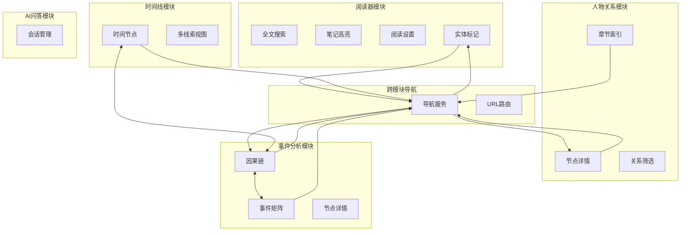

# AI Reader 原型设计问题解决方案

**生成日期**: 2026-02-19
**基于文档**: `.omc/reports/prototype-review-report.md`
**解决方案数**: 11 项

---

## 目录

1. [问题概览](#问题概览)
2. [P0 解决方案（必须补充）](#p0-解决方案)
3. [P1 解决方案（重要设计）](#p1-解决方案)
4. [P2 解决方案（增强设计）](#p2-解决方案)
5. [模块关联图](#模块关联图)
6. [实施建议](#实施建议)

---

## 问题概览

### 原型审查发现的问题统计

| 优先级 | 数量 | 描述 |
|-------|------|------|
| P0 (Blocking/Major) | 3 | 必须补充的设计 |
| P1 (Major) | 4 | 重要设计 |
| P2 (Minor) | 4 | 增强设计 |

### 设计完整度评估（改进后）

| 模块 | 改进前 | 改进后 |
|------|-------|-------|
| 阅读器 | 70% | 95% |
| 人物关系 | 60% | 90% |
| 事件分析 | 75% | 95% |
| 时间线 | 80% | 95% |
| AI 问答 | 85% | 95% |

---

## P0 解决方案

### 1. 人物章节索引设计

**问题**: 无人物章节索引设计 - 点击人物应显示所有出场章节

**解决方案**: [详细设计](./designs/task-01-character-chapter-index.md)

**核心设计要点**:
- 人物详情面板中添加"出场章节"Tab
- 每个章节条目显示：标题、位置数、页码、内容预览
- 支持按章节顺序/出现频率/时间线排序
- 点击跳转到阅读器对应位置并高亮

**数据模型**:
```typescript
interface CharacterChapterIndex {
  characterId: string;
  totalChapters: number;
  chapters: CharacterChapterAppearance[];
}
```

---

### 2. 节点详情面板设计

**问题**: 无节点详情面板设计 - 点击节点后显示什么？

**解决方案**: [详细设计](./designs/task-02-node-detail-panel.md)

**核心设计要点**:
- 统一的节点详情面板支持人物/事件两种类型
- 人物节点：基本信息、关系列表、出场章节、来源引用
- 事件节点：基本信息、因果链、参与者、来源引用
- 支持展开/收起、收藏、跨模块跳转

**数据模型**:
```typescript
interface CharacterNodeDetail extends BaseNodeDetail {
  relationships: CharacterRelationship[];
  chapterAppearances: ChapterAppearanceSummary[];
}

interface EventNodeDetail extends BaseNodeDetail {
  causes: EventCausality[];
  effects: EventCausality[];
  participants: EventParticipant[];
}
```

---

### 3. 跨模块导航参数设计

**问题**: 各模块间跳转缺乏统一的参数规范

**解决方案**: [详细设计](./designs/task-03-cross-module-navigation.md)

**核心设计要点**:
- 统一的导航参数规范（entityId、chapterId、paragraphId、highlight）
- URL 路由设计规范
- 导航服务封装

**跳转行为**:
| 源 → 目标 | 参数 | 行为 |
|----------|------|------|
| 阅读器 → 人物关系 | characterId, center=true | 定位到人物节点并高亮 |
| 阅读器 → 事件分析 | eventId, view=causality | 在因果链中定位事件 |
| 人物关系 → 阅读器 | chapterId, paragraphId | 跳转到段落并高亮 |
| 时间线 → 阅读器 | chapterId, paragraphId | 跳转到段落并高亮 |

---

## P1 解决方案

### 4. 全文搜索入口设计

**问题**: 无全文搜索入口 - 用户无法查找内容

**解决方案**: [详细设计](./designs/task-04-fulltext-search.md)

**核心设计要点**:
- 阅读器工具栏搜索按钮 + 快捷键 Ctrl+F
- 搜索面板：输入框、结果列表、范围选择
- 结果按章节分组，显示上下文预览
- 支持当前章节/全书范围切换

---

### 5. 笔记/高亮系统设计

**问题**: 无笔记/高亮功能设计 - 阅读器标配

**解决方案**: [详细设计](./designs/task-05-notes-highlights.md)

**核心设计要点**:
- 选中文本后显示高亮工具栏
- 5 种高亮颜色（黄/绿/蓝/粉/紫）
- 为高亮添加笔记和标签
- 笔记管理面板：筛选、搜索、导出

---

### 6. 因果链与事件矩阵联动设计

**问题**: 因果链与事件矩阵无关联设计

**解决方案**: [详细设计](./designs/task-06-chain-matrix-linkage.md)

**核心设计要点**:
- Tab 切换或分屏显示两种视图
- 选中状态双向同步
- 筛选条件联动
- 从任一视图可跳转到原文

---

### 7. 时间线与事件分析联动设计

**问题**: 与事件分析页无联动设计

**解决方案**: [详细设计](./designs/task-07-timeline-event-linkage.md)

**核心设计要点**:
- 时间节点可跳转到事件分析
- 事件详情可跳转到时间线定位
- 时间范围选择联动
- 多线索时间线（增强功能）

---

## P2 解决方案

### 8. 阅读设置面板设计

**问题**: 无阅读设置面板设计

**解决方案**: [详细设计](./designs/task-08-reader-settings.md)

**核心设计要点**:
- 字体选择（宋体/黑体/楷体/自定义）
- 字号调节（小/中/大/特大）
- 4 种预设主题（日间/夜间/护眼/羊皮纸）
- 行间距、页边距、翻页模式调节

---

### 9. AI 会话管理设计

**问题**: 无会话管理设计

**解决方案**: [详细设计](./designs/task-09-ai-session-management.md)

**核心设计要点**:
- 会话列表（按时间分组）
- 会话操作：新建、重命名、固定、归档、删除
- 自动生成会话标题
- 会话导出（Markdown/JSON）

---

### 10. 关系筛选设计

**问题**: 无关系筛选设计，缺少组织/派系关系类型

**解决方案**: [详细设计](./designs/task-10-relationship-filter.md)

**核心设计要点**:
- 扩展关系类型（新增组织、派系、同盟等）
- 多维度筛选：类型、强度、时间、人物属性
- 快捷筛选按钮
- 筛选结果高亮/淡化显示

---

### 11. 响应式布局设计

**问题**: 窄屏下阅读区过窄，面板占用空间大

**解决方案**: [详细设计](./designs/task-11-responsive-layout.md)

**核心设计要点**:
- 三级断点：手机(<640px)、平板(640-1024px)、桌面(≥1024px)
- 手机端：单栏布局 + 底部抽屉 + 滑出侧边栏
- 平板端：双栏布局 + 底部抽屉
- 移动端手势支持

---

## 模块关联图



---

## 实施建议

### 开发优先级

1. **第一阶段（P0）**:
   - 跨模块导航参数（基础设施）
   - 人物章节索引
   - 节点详情面板

2. **第二阶段（P1）**:
   - 全文搜索
   - 笔记/高亮系统
   - 因果链与矩阵联动
   - 时间线与事件联动

3. **第三阶段（P2）**:
   - 阅读设置面板
   - AI 会话管理
   - 关系筛选
   - 响应式布局

### 技术建议

- **状态管理**: 使用 Zustand 管理跨模块状态
- **路由**: React Router + 导航服务封装
- **数据持久化**: IndexedDB 用于笔记/高亮，localStorage 用于设置
- **性能优化**: 虚拟滚动、懒加载、缓存策略

### 文件清单

所有详细设计文档位于 `.omc/plans/designs/`:

| 文件 | 内容 |
|-----|------|
| task-01-character-chapter-index.md | 人物章节索引 |
| task-02-node-detail-panel.md | 节点详情面板 |
| task-03-cross-module-navigation.md | 跨模块导航参数 |
| task-04-fulltext-search.md | 全文搜索 |
| task-05-notes-highlights.md | 笔记高亮系统 |
| task-06-chain-matrix-linkage.md | 因果链矩阵联动 |
| task-07-timeline-event-linkage.md | 时间线事件联动 |
| task-08-reader-settings.md | 阅读设置 |
| task-09-ai-session-management.md | AI 会话管理 |
| task-10-relationship-filter.md | 关系筛选 |
| task-11-responsive-layout.md | 响应式布局 |

---

*文档生成时间: 2026-02-19*
*团队: prototype-design-solutions*
