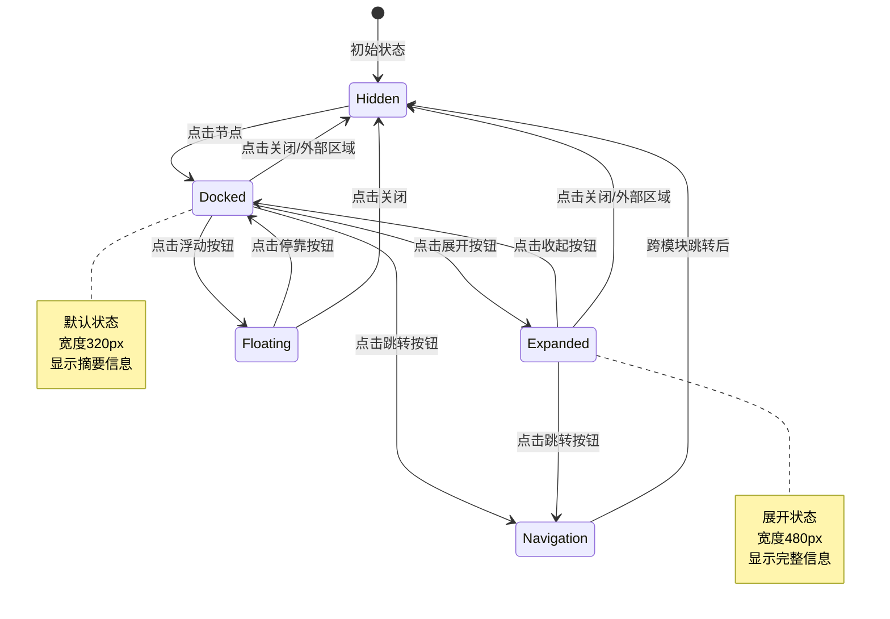

# 节点详情面板设计文档

## 文档信息

- **任务编号**: P0-2
- **创建时间**: 2026-02-19
- **设计者**: designer-2
- **版本**: v1.0

---

## 1. 设计概述

### 1.1 问题背景

当前原型中存在以下问题：
- 阅读器中点击人物/事件标记后，仅在右侧联动面板显示简略信息
- 人物关系图的节点（`characters.html:37`）纯文本显示，无点击交互
- 事件分析页的事件条目（`events.html:29`）无 ID 属性，无法精确定位
- 缺少统一的节点详情展示面板

### 1.2 设计目标

为人物关系图和事件分析模块设计统一的节点详情面板，实现：
1. 点击节点后展开详细信息
2. 支持跨模块导航和跳转
3. 提供收藏/标记功能
4. 统一的数据模型和交互体验

---

## 2. UI 设计

### 2.1 人物节点详情面板

```
┌─────────────────────────────────────────────────────────────┐
│  人物详情                                          [×] [☆] [→] │
├─────────────────────────────────────────────────────────────┤
│  ┌─────────────────────────────────────────────────────────┐ │
│  │  叶文洁                                      [主角标记]   │ │
│  │  ─────────────────────────────────────────────────────  │ │
│  │  别名: 叶老师、叶博士                                   │ │
│  │  身份: 天体物理学教授、红岸基地核心成员                 │ │
│  │  特征: 冷静、决断力强、文明幻灭                        │ │
│  │                                                         │ │
│  │  📍 出场: 第3章 · 离场: 第40章 (共38章)               │ │
│  │  📊 提及次数: 472次 (核心人物)                         │ │
│  │  🎯 置信度: 0.94 (AI提取)                              │ │
│  └─────────────────────────────────────────────────────────┘ │
│                                                             │
│  ┌─────────────────────────────────────────────────────────┐ │
│  │  关系统览                                      [全部12条]│ │
│  │  ─────────────────────────────────────────────────────  │ │
│  │  🤝 伊文斯           合作→冲突  (强度: 0.88)           │ │
│  │     从试探性合作转向公开对抗                             │ │
│  │                                                         │ │
│  │  ⚔️ 申玉菲           冲突        (强度: 0.76)           │ │
│  │     ETO组织目标分歧                                     │ │
│  │                                                         │ │
│  │  👨‍👩‍👧 杨冬             亲属        (强度: 0.95)           │ │
│  │     母女关系                                             │ │
│  └─────────────────────────────────────────────────────────┘ │
│                                                             │
│  ┌─────────────────────────────────────────────────────────┐ │
│  │  出场章节                                              [更多]│ │
│  │  ─────────────────────────────────────────────────────  │ │
│  │  🔖 第3章  疯狂年代 (首次登场)                          │ │
│  │  🔖 第17章 三体游戏 (关键决断)                          │ │
│  │  🔖 第23章 红岸之秘 (真相揭示)                          │ │
│  └─────────────────────────────────────────────────────────┘ │
│                                                             │
│  ┌─────────────────────────────────────────────────────────┐ │
│  │  原文引用                                              [定位]│ │
│  │  ─────────────────────────────────────────────────────  │ │
│  │  "叶文洁在山坡上停下脚步，寒风掠过红岸基地首次响应..." │ │
│  │                              — 第17章第1段              │ │
│  └─────────────────────────────────────────────────────────┘ │
│                                                             │
│  [📖 前往阅读器]  [🔗 查看关系图]  [💬 询问AI]              │
└─────────────────────────────────────────────────────────────┘
```

### 2.2 事件节点详情面板

```
┌─────────────────────────────────────────────────────────────┐
│  事件详情                                          [×] [☆] [→] │
├─────────────────────────────────────────────────────────────┤
│  ┌─────────────────────────────────────────────────────────┐ │
│  │  红岸基地首次响应                            [转折点]     │ │
│  │  ─────────────────────────────────────────────────────  │ │
│  │  类型: TURNING_POINT (转折点)                            │ │
│  │  时间: 约公元1979年 (置信度84%)                          │ │
│  │  地点: 红岸基地，大兴安岭                                │ │
│  │                                                         │ │
│  │  📈 重要性: 0.93 (关键事件)                             │ │
│  │  🎯 置信度: 0.89 (AI提取)                              │ │
│  │  📖 来源: 第17章第1段                                   │ │
│  └─────────────────────────────────────────────────────────┘ │
│                                                             │
│  ┌─────────────────────────────────────────────────────────┐ │
│  │  参与人物                                              [全部]│ │
│  │  ─────────────────────────────────────────────────────  │ │
│  │  👤 叶文洁         [核心触发者]                         │ │
│  │  👤 雷志成         [目击者]                             │ │
│  │  👤 杨卫宁         [技术负责人]                         │ │
│  └─────────────────────────────────────────────────────────┘ │
│                                                             │
│  ┌─────────────────────────────────────────────────────────┐ │
│  │  因果关系                                              [展开]│ │
│  │  ─────────────────────────────────────────────────────  │ │
│  │  ⬆️ 前因 (2个)                                          │ │
│  │     • 叶文洁收到宇宙电波 (第3章)                        │ │
│  │     • 红岸基地完成设备升级 (第12章)                     │ │
│  │                                                         │ │
│  │  ⬇️ 后果 (3个)                                          │ │
│  │     • 递交地球决断 (第17章)                             │ │
│  │     • ETO组织秘密成立 (第23章)                          │ │
│  │     • 作战中心介入调查 (第28章)                         │ │
│  └─────────────────────────────────────────────────────────┘ │
│                                                             │
│  ┌─────────────────────────────────────────────────────────┐ │
│  │  原文引用                                              [定位]│ │
│  │  ─────────────────────────────────────────────────────  │ │
│  │  "叶文洁在山坡上停下脚步，寒风掠过红岸基地首次响应..." │ │
│  │                              — 第17章第1段              │ │
│  └─────────────────────────────────────────────────────────┘ │
│                                                             │
│  [📖 定位原文]  [🕐 查看时间线]  [🔗 查看因果链]            │
└─────────────────────────────────────────────────────────────┘
```

### 2.3 面板状态

#### 收起状态 (Docked)
- 宽度: 320px
- 位置: 人物关系图/事件分析页右侧
- 可拖拽调整宽度

#### 展开状态 (Expanded)
- 宽度: 480px
- 显示完整信息和操作按钮

#### 悬浮状态 (Floating)
- 独立窗口，可拖动位置
- 支持最小化到侧边栏

---

## 3. 交互设计

### 3.1 交互状态图



### 3.2 跨模块导航

```
┌─────────────────────────────────────────────────────────────┐
│                      跨模块导航参数设计                      │
├─────────────────────────────────────────────────────────────┤
│                                                             │
│  人物节点详情 → 阅读器                                      │
│  reader.html?entity=actor_ye&span=s17-01                   │
│                                                             │
│  人物节点详情 → 关系图                                      │
│  characters.html?focus=actor_ye&highlight=relations        │
│                                                             │
│  事件节点详情 → 时间线                                      │
│  timeline.html?focus=event_red_coast&show=causality        │
│                                                             │
│  事件节点详情 → 阅读器                                      │
│  reader.html?entity=event_red_coast&span=s17-01            │
│                                                             │
│  任意节点 → AI问答                                          │
│  chat.html?context=actor_ye&type=character                 │
│                                                             │
└─────────────────────────────────────────────────────────────┘
```

### 3.3 操作交互

| 操作 | 触发方式 | 效果 |
|------|---------|------|
| 打开面板 | 点击图谱节点/事件条目 | 显示节点详情 |
| 收起/展开 | 点击面板顶部按钮 | 切换显示详细程度 |
| 浮动/停靠 | 点击浮动按钮 | 切换面板模式 |
| 收藏/取消 | 点击星标按钮 | 添加/移除收藏 |
| 跳转原文 | 点击"定位原文"按钮 | 跳转到阅读器对应段落 |
| 查看关系 | 点击"查看关系图"按钮 | 在关系图中高亮相关节点 |
| 询问AI | 点击"询问AI"按钮 | 打开AI问答并预填充上下文 |
| 关闭面板 | 点击关闭按钮/点击外部区域 | 隐藏面板 |

---

## 4. 数据模型

### 4.1 人物节点数据模型

```typescript
/**
 * 人物节点详情数据模型
 */
interface CharacterNodeDetail {
  // 基本信息
  id: string;                    // 节点ID，如 "actor_ye"
  name: string;                  // 姓名
  aliases: string[];             // 别名列表
  description?: string;          // 简介描述
  attributes: Record<string, string>; // 属性键值对，如 {身份: "教授", 特征: "冷静"}

  // 出场信息
  firstChapter: ChapterReference; // 首次出场章节
  lastChapter: ChapterReference;  // 最后出场章节
  mentionCount: number;           // 提及次数
  isMainCharacter: boolean;       // 是否主角

  // AI分析信息
  confidence: number;             // AI提取置信度 0-1
  isManual: boolean;              // 是否手动添加

  // 关系信息
  relationships: Relationship[];  // 与其他人物的关系列表

  // 出场章节
  appearances: ChapterAppearance[]; // 出场章节列表（按重要性排序）

  // 原文引用
  citations: TextCitation[];        // 相关原文段落
}

/**
 * 关系信息
 */
interface Relationship {
  characterId: string;           // 关联人物ID
  characterName: string;         // 关联人物名称
  type: RelationshipType;        // 关系类型
  description: string;           // 关系描述
  strength: number;              // 关系强度 0-1
  sourceChapter?: ChapterReference; // 来源章节
  evidenceText?: string;         // 原文证据
}

/**
 * 关系类型枚举
 */
enum RelationshipType {
  FAMILY = 'FAMILY',       // 亲属关系
  FRIEND = 'FRIEND',       // 友好关系
  ENEMY = 'ENEMY',         // 敌对关系
  LOVER = 'LOVER',         // 恋爱关系
  NEUTRAL = 'NEUTRAL',     // 中立关系
  UNKNOWN = 'UNKNOWN',     // 未知关系
}

/**
 * 章节引用
 */
interface ChapterReference {
  id: string;              // 章节ID
  index: number;           // 章节序号
  title: string;           // 章节标题
}

/**
 * 章节出场信息
 */
interface ChapterAppearance {
  chapter: ChapterReference;
  importance: number;      // 重要性评分 0-1
  description?: string;    // 该章节中的人物作用描述
}

/**
 * 文本引用
 */
interface TextCitation {
  chapterId: string;
  chapterIndex: number;
  spanId: string;          // 段落ID，如 "s17-01"
  text: string;            // 引用文本（截取）
  position: {              // 在章节中的位置
    start: number;
    end: number;
  };
}
```

### 4.2 事件节点数据模型

```typescript
/**
 * 事件节点详情数据模型
 */
interface EventNodeDetail {
  // 基本信息
  id: string;                    // 节点ID，如 "event_red_coast"
  title: string;                 // 事件名称
  type: EventType;               // 事件类型
  description?: string;          // 事件描述

  // 时间信息
  storyTime: string;             // 故事内时间（可能模糊，如"三年后"）
  storyTimeNormalized?: string;  // 标准化时间（如可推断）
  storyOrder: number;            // 故事顺序序号

  // 地点信息
  location?: string;             // 事件地点

  // 重要性
  importance: number;            // 重要性 0-1
  confidence: number;            // AI提取置信度 0-1
  isManual: boolean;             // 是否手动添加

  // 参与人物
  participants: EventParticipant[]; // 参与人物列表

  // 因果关系
  causes: EventReference[];      // 前因事件列表
  effects: EventReference[];     // 后果事件列表

  // 原文引用
  citations: TextCitation[];     // 相关原文段落

  // 来源章节
  sourceChapter: ChapterReference; // 主要来源章节
}

/**
 * 事件类型枚举
 */
enum EventType {
  TURNING_POINT = 'TURNING_POINT', // 转折点
  CONFLICT = 'CONFLICT',           // 冲突
  CLIMAX = 'CLIMAX',               // 高潮
  DIALOGUE = 'DIALOGUE',           // 对话
  DEATH = 'DEATH',                 // 死亡
  BIRTH = 'BIRTH',                 // 出生
  OTHER = 'OTHER',                 // 其他
}

/**
 * 事件参与人物
 */
interface EventParticipant {
  characterId: string;
  characterName: string;
  role: EventRole;                // 在事件中的角色
}

/**
 * 事件角色枚举
 */
enum EventRole {
  PROTAGONIST = 'PROTAGONIST',   // 主角
  ANTAGONIST = 'ANTAGONIST',     // 反派
  WITNESS = 'WITNESS',           // 目击者
  VICTIM = 'VICTIM',             // 受害者
  OTHER = 'OTHER',               // 其他
}

/**
 * 事件引用（用于因果链）
 */
interface EventReference {
  eventId: string;
  title: string;
  relationship?: CausalityRelationship; // 因果关系类型
  description?: string;
}

/**
 * 因果关系类型
 */
enum CausalityRelationship {
  DIRECT = 'DIRECT',       // 直接因果
  INDIRECT = 'INDIRECT',   // 间接因果
  CONDITIONAL = 'CONDITIONAL', // 条件因果
}
```

### 4.3 面板状态模型

```typescript
/**
 * 节点详情面板状态
 */
interface NodeDetailPanelState {
  // 面板显示状态
  isVisible: boolean;
  mode: PanelMode;              // 面板模式

  // 当前节点信息
  nodeType: NodeType;           // 节点类型
  nodeId: string;               // 节点ID

  // 面板尺寸
  width: number;                // 当前宽度
  position?: {                  // 浮动模式位置
    x: number;
    y: number;
  };

  // 用户操作
  isFavorite: boolean;          // 是否已收藏
  isExpanded: boolean;          // 是否展开

  // 数据加载状态
  isLoading: boolean;
  error?: string;
}

/**
 * 面板模式枚举
 */
enum PanelMode {
  DOCKED = 'DOCKED',       // 停靠模式
  FLOATING = 'FLOATING',   // 浮动模式
}

/**
 * 节点类型枚举
 */
enum NodeType {
  CHARACTER = 'CHARACTER', // 人物
  EVENT = 'EVENT',         // 事件
}
```

---

## 5. 技术实现要点

### 5.1 组件结构

```typescript
// 组件层次结构
NodeDetailPanel
├── PanelHeader (头部，包含关闭/收藏/浮动按钮)
├── PanelBody (内容区域)
│   ├── CharacterDetailContent (人物详情内容)
│   │   ├── BasicInfoSection (基本信息)
│   │   ├── RelationshipsSection (关系统览)
│   │   ├── AppearancesSection (出场章节)
│   │   └── CitationsSection (原文引用)
│   └── EventDetailContent (事件详情内容)
│       ├── BasicInfoSection (基本信息)
│       ├── ParticipantsSection (参与人物)
│       ├── CausalitySection (因果关系)
│       └── CitationsSection (原文引用)
└── PanelFooter (底部操作按钮)
```

### 5.2 状态管理

使用 Zustand 管理面板状态：

```typescript
// stores/nodeDetailPanelStore.ts
interface NodeDetailPanelStore {
  // 状态
  state: NodeDetailPanelState;

  // 操作
  openPanel: (nodeType: NodeType, nodeId: string) => void;
  closePanel: () => void;
  toggleExpand: () => void;
  toggleMode: () => void;
  toggleFavorite: () => void;
  setWidth: (width: number) => void;
  setPosition: (position: { x: number; y: number }) => void;
}

export const useNodeDetailPanelStore = create<NodeDetailPanelStore>(
  (set, get) => ({
    state: {
      isVisible: false,
      mode: PanelMode.DOCKED,
      nodeType: NodeType.CHARACTER,
      nodeId: '',
      width: 320,
      isFavorite: false,
      isExpanded: false,
      isLoading: false,
    },

    openPanel: (nodeType, nodeId) => set((state) => ({
      state: {
        ...state.state,
        isVisible: true,
        nodeType,
        nodeId,
        isLoading: true,
      },
    })),

    closePanel: () => set((state) => ({
      state: {
        ...state.state,
        isVisible: false,
      },
    })),

    // ... 其他操作
  })
);
```

### 5.3 数据获取

```typescript
// hooks/useNodeDetail.ts
export function useNodeDetail(nodeType: NodeType, nodeId: string) {
  const [data, setData] = useState<CharacterNodeDetail | EventNodeDetail | null>(null);
  const [isLoading, setIsLoading] = useState(true);
  const [error, setError] = useState<string | null>(null);

  useEffect(() => {
    async function fetchNodeDetail() {
      setIsLoading(true);
      setError(null);

      try {
        const result = await ipcInvoke('db:getNodeDetail', { nodeType, nodeId });
        setData(result);
      } catch (e) {
        setError(e.message);
      } finally {
        setIsLoading(false);
      }
    }

    fetchNodeDetail();
  }, [nodeType, nodeId]);

  return { data, isLoading, error };
}
```

### 5.4 跨模块导航实现

```typescript
// utils/navigation.ts
export function buildNavigationParams(
  entityType: 'character' | 'event',
  entityId: string,
  spanId?: string
): string {
  const params = new URLSearchParams();

  if (entityType === 'character') {
    params.set('entity', entityId);
  } else if (entityType === 'event') {
    params.set('entity', eventId);
  }

  if (spanId) {
    params.set('span', spanId);
  }

  return params.toString();
}

// 使用示例
const readerUrl = `reader.html?${buildNavigationParams('character', 'actor_ye', 's17-01')}`;
```

---

## 6. 设计规范

### 6.1 视觉规范

| 元素 | 规范 |
|------|------|
| 面板圆角 | 12px |
| 面板阴影 | `0 4px 20px rgba(0,0,0,0.15)` |
| 标题字号 | 18px, Medium |
| 正文字号 | 14px, Regular |
| 标签圆角 | 6px |
| 按钮高度 | 36px |
| 最小宽度 | 280px |
| 最大宽度 | 560px |
| 默认宽度 | 320px |

### 6.2 动画规范

| 交互 | 动画 | 时长 |
|------|------|------|
| 打开面板 | SlideInRight | 200ms |
| 关闭面板 | SlideOutRight | 150ms |
| 展开/收起 | Width transition | 150ms |
| 浮动/停靠 | Fade + Scale | 200ms |

---

## 7. 与其他模块的集成

### 7.1 与人物关系图集成

```typescript
// characters/graph/GraphNode.tsx
interface GraphNodeProps {
  node: CharacterNode;
  onSelect: (nodeId: string) => void;
}

function GraphNode({ node, onSelect }: GraphNodeProps) {
  return (
    <div
      className="graph-node"
      data-node-id={node.id}
      onClick={() => onSelect(node.id)}
    >
      {node.name}
    </div>
  );
}
```

### 7.2 与事件分析页集成

```typescript
// events/EventListItem.tsx
interface EventListItemProps {
  event: EventNode;
  onSelect: (eventId: string) => void;
}

function EventListItem({ event, onSelect }: EventListItemProps) {
  return (
    <article
      className="event-row"
      data-event-id={event.id}
      onClick={() => onSelect(event.id)}
    >
      <div className="event-head">
        <strong>{event.title}</strong>
        <span className={`tag ${getImportanceClass(event.importance)}`}>
          {getEventTypeLabel(event.type)} {event.importance.toFixed(2)}
        </span>
      </div>
      {/* ... */}
    </article>
  );
}
```

### 7.3 与阅读器集成

```typescript
// reader/ReaderArticle.tsx
// 当从节点详情跳转到阅读器时，高亮对应段落
function useHighlightFromParams() {
  const params = useSearchParams();
  const spanId = params.get('span');
  const entityId = params.get('entity');

  useEffect(() => {
    if (spanId) {
      highlightSpan(spanId);
      scrollToSpan(spanId);
    }
    if (entityId) {
      showEntityLinkPanel(entityId);
    }
  }, [spanId, entityId]);
}
```

---

## 8. 验收标准

- [ ] 点击人物关系图节点可打开详情面板
- [ ] 点击事件分析页条目可打开详情面板
- [ ] 面板支持展开/收起/浮动模式切换
- [ ] 面板支持收藏/取消收藏
- [ ] 点击"定位原文"可跳转到阅读器对应段落并高亮
- [ ] 点击"查看关系图"可在关系图中高亮相关节点
- [ ] 点击"询问AI"可打开AI问答并预填充上下文
- [ ] 面板宽度可拖拽调整（280px-560px）
- [ ] 面板状态在页面切换时保持（使用localStorage）
- [ ] 支持键盘操作（ESC关闭，Tab导航）

---

## 9. 后续优化方向

1. **多节点对比视图**: 支持同时打开两个节点进行对比
2. **时间线集成**: 在详情面板中嵌入迷你时间线
3. **AI分析增强**: 实时生成人物弧光/事件影响分析
4. **自定义标注**: 允许用户为节点添加个人笔记
5. **导出功能**: 导出节点详情为Markdown/PDF

---

*文档结束*
