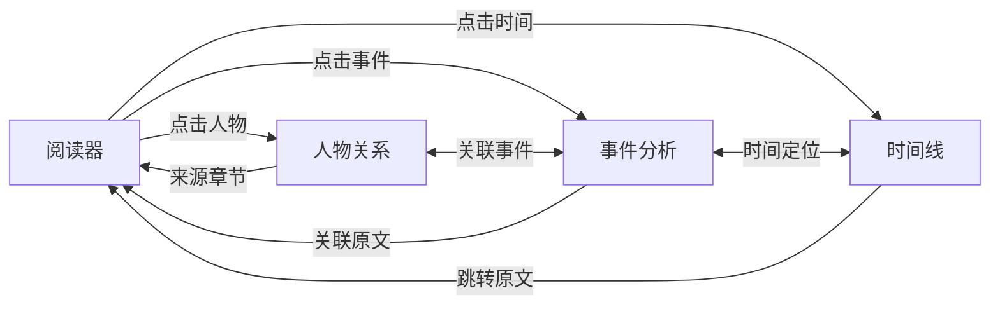

# P0-3: 跨模块导航参数设计

## 问题背景

原型审查报告中指出以下导航问题：
- 阅读器 → 人物关系：实体标记点击后跳转到哪里？
- 阅读器 → 事件分析：事件标记点击后跳转到哪里？
- 人物关系 → 阅读器："来源章节"如何跳转？
- 时间线 → 阅读器："跳转原文"跳到哪里？

---

## 设计方案

### 1. 导航参数规范

```typescript
/**
 * 模块类型枚举
 */
enum ModuleType {
  READER = 'reader',
  CHARACTERS = 'characters',
  EVENTS = 'events',
  TIMELINE = 'timeline',
  AI_CHAT = 'ai-chat',
  LIBRARY = 'library',
}

/**
 * 实体类型枚举
 */
enum EntityType {
  CHARACTER = 'character',
  EVENT = 'event',
  LOCATION = 'location',
  TIME_POINT = 'time_point',
}

/**
 * 基础导航参数
 */
interface BaseNavigationParams {
  module: ModuleType;
  highlight?: {
    enabled: boolean;
    duration?: number;
    animation?: 'pulse' | 'flash' | 'fade';
  };
}

/**
 * 阅读器导航参数
 */
interface ReaderNavigationParams extends BaseNavigationParams {
  module: ModuleType.READER;
  location: {
    bookId: string;
    chapterId: string;
    paragraphId?: string;
  };
  highlightEntity?: {
    type: EntityType;
    id: string;
  };
}

/**
 * 人物关系模块导航参数
 */
interface CharactersNavigationParams extends BaseNavigationParams {
  module: ModuleType.CHARACTERS;
  characterId?: string;
  showDetailPanel?: boolean;
  centerOnNode?: boolean;
}

/**
 * 事件分析模块导航参数
 */
interface EventsNavigationParams extends BaseNavigationParams {
  module: ModuleType.EVENTS;
  eventId?: string;
  viewMode?: 'matrix' | 'causality' | 'list';
  showDetailPanel?: boolean;
}

/**
 * 时间线模块导航参数
 */
interface TimelineNavigationParams extends BaseNavigationParams {
  module: ModuleType.TIMELINE;
  timeNodeId?: string;
  targetTime?: string;
}
```

### 2. URL 路由设计

```
# 格式
/:module?query=params

# 示例
/reader?chapter=ch-001&paragraph=p-042&highlight=character:ye_wenjie
/characters?character=char-001&panel=true&center=true
/events?event=evt-001&view=causality
/timeline?time=1979-10-21
```

### 3. 跨模块跳转流程



### 4. 跳转行为定义

| 源模块 | 目标模块 | 参数 | 行为 |
|-------|---------|------|------|
| 阅读器 | 人物关系 | characterId, center=true | 定位到人物节点，高亮 3 秒 |
| 阅读器 | 事件分析 | eventId, view=causality | 在因果链中定位事件 |
| 人物关系 | 阅读器 | chapterId, paragraphId | 跳转到段落并高亮 |
| 时间线 | 阅读器 | chapterId, paragraphId | 跳转到段落并高亮 |

### 5. 导航服务

```typescript
class NavigationService {
  navigate(params: NavigationParams): void {
    const url = this.buildUrl(params);
    window.history.pushState(params, '', url);
    this.dispatchNavigationEvent(params);
  }

  buildUrl(params: NavigationParams): string {
    // 根据模块类型构建 URL
  }

  parseUrl(url: string): NavigationParams | null {
    // 解析 URL 为导航参数
  }
}
```

---

## 验收标准

- [ ] 阅读器人物标记可跳转到人物关系
- [ ] 阅读器事件标记可跳转到事件分析
- [ ] 人物关系来源章节可跳转到阅读器
- [ ] 时间线可跳转到阅读器原文
- [ ] URL 参数正确编码/解码
- [ ] 浏览器前进/后退正常工作
