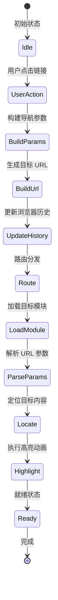

# P0-3: 跨模块导航参数设计

## 1. 设计概述

解决 AI Reader 各模块间的导航跳转问题，建立统一的参数传递规范和交互流程，确保用户可以从任意模块跳转到其他模块并精确定位到相关内容。

### 1.1 设计目标

| 目标 | 描述 | 优先级 |
|-----|------|--------|
| 统一参数规范 | 所有模块导航使用相同的参数命名和数据结构 | P0 |
| 精确定位 | 支持跳转到章节、段落、实体级别的精确定位 | P0 |
| 高亮反馈 | 跳转后提供视觉反馈（高亮、动画） | P0 |
| 浏览器历史 | 支持浏览器前进/后退，URL 可分享 | P0 |
| 类型安全 | TypeScript 类型约束，避免参数错误 | P1 |

---

## 2. 问题分析

### 2.1 当前原型中的导航问题

| 问题 | 原型表现 | 影响 |
|-----|---------|------|
| 阅读器→人物 | `<mark data-link="actor" data-id="actor_ye">` 无跳转链接 | 用户无法查看人物详情 |
| 阅读器→事件 | `<mark data-link="event" data-id="event_red_coast">` 无跳转链接 | 用户无法查看事件分析 |
| 人物→阅读器 | "来源章节"仅显示文本，无链接 | 无法快速定位原文 |
| 时间线→阅读器 | `href="reader.html"` 无参数，仅跳转首页 | 无法定位具体段落 |
| 事件→阅读器 | `href="reader.html"` 无参数 | 无法定位具体段落 |

### 2.2 根本原因

1. **缺少统一的 ID 规范**：实体 ID 命名不一致（如 `actor_ye` vs `char-001`）
2. **缺少可寻址单元定义**：段落级定位使用 `data-span-id` 但未在 URL 中体现
3. **缺少导航服务层**：各模块独立构建链接，无统一路由处理

---

## 3. 导航参数规范

### 3.1 核心类型定义

```typescript
/**
 * 模块类型枚举
 */
enum ModuleType {
  READER = 'reader',
  CHARACTERS = 'characters',
  EVENTS = 'events',
  TIMELINE = 'timeline',
  CHAT = 'chat',
  LIBRARY = 'library',
  SETTINGS = 'settings',
}

/**
 * 实体类型枚举
 */
enum EntityType {
  CHARACTER = 'actor',      // 对应原型的 data-link="actor"
  EVENT = 'event',          // 对应原型的 data-link="event"
  TIME = 'time',            // 对应原型的 data-link="time"
  LOCATION = 'location',
  NOTE = 'note',
  HIGHLIGHT = 'highlight',
}

/**
 * 可寻址单元类型
 */
enum AddressableType {
  BOOK = 'book',
  CHAPTER = 'chapter',
  SPAN = 'span',            // 对应 data-span-id
  PARAGRAPH = 'paragraph',
}

/**
 * 高亮配置
 */
interface HighlightConfig {
  /** 是否启用高亮 */
  enabled: boolean;
  /** 高亮持续时间（毫秒），0 表示持续 */
  duration?: number;
  /** 高亮动画类型 */
  animation?: 'pulse' | 'flash' | 'fade' | 'none';
  /** 高亮颜色主题 */
  color?: 'amber' | 'teal' | 'blue' | 'default';
}

/**
 * 基础导航参数
 */
interface BaseNavigationParams {
  /** 目标模块 */
  module: ModuleType;
  /** 高亮配置 */
  highlight?: HighlightConfig;
  /** 导航来源（用于返回按钮） */
  from?: ModuleType;
  /** 自定义数据（用于扩展） */
  custom?: Record<string, string | number | boolean>;
}

/**
 * 阅读器导航参数
 */
interface ReaderNavigationParams extends BaseNavigationParams {
  module: ModuleType.READER;
  /** 书籍 ID */
  bookId: string;
  /** 章节索引（从 0 开始）或章节 ID */
  chapterIndex?: number;
  chapterId?: string;
  /** 段落/片段 ID（对应 data-span-id） */
  spanId?: string;
  /** 要高亮的实体 */
  highlightEntity?: {
    type: EntityType;
    id: string;
  };
  /** 搜索关键词（用于搜索跳转） */
  searchQuery?: string;
}

/**
 * 人物关系导航参数
 */
interface CharactersNavigationParams extends BaseNavigationParams {
  module: ModuleType.CHARACTERS;
  /** 人物 ID */
  characterId?: string;
  /** 是否显示详情面板 */
  showDetailPanel?: boolean;
  /** 是否将节点居中 */
  centerOnNode?: boolean;
  /** 关联的书籍 ID（用于过滤） */
  bookId?: string;
}

/**
 * 事件分析导航参数
 */
interface EventsNavigationParams extends BaseNavigationParams {
  module: ModuleType.EVENTS;
  /** 事件 ID */
  eventId?: string;
  /** 视图模式 */
  viewMode?: 'matrix' | 'causality' | 'list';
  /** 是否显示详情面板 */
  showDetailPanel?: boolean;
  /** 关联的书籍 ID */
  bookId?: string;
}

/**
 * 时间线导航参数
 */
interface TimelineNavigationParams extends BaseNavigationParams {
  module: ModuleType.TIMELINE;
  /** 时间节点 ID */
  timeNodeId?: string;
  /** 目标时间（ISO 8601 格式） */
  targetTime?: string;
  /** 视图模式 */
  viewMode?: 'chronological' | 'narrative' | 'corrected';
}

/**
 * AI 问答导航参数
 */
interface ChatNavigationParams extends BaseNavigationParams {
  module: ModuleType.CHAT;
  /** 会话 ID */
  sessionId?: string;
  /** 预填充的问题 */
  question?: string;
  /** 关联的上下文（用于 RAG） */
  context?: {
    chapterIndex?: number;
    spanIds?: string[];
  };
}

/**
 * 联合导航参数类型
 */
type NavigationParams =
  | ReaderNavigationParams
  | CharactersNavigationParams
  | EventsNavigationParams
  | TimelineNavigationParams
  | ChatNavigationParams;
```

### 3.2 参数命名规范

| 参数名 | 类型 | 描述 | 示例 |
|--------|------|------|------|
| `bookId` | string | 书籍唯一标识 | `book-three-body` |
| `chapterId` | string | 章节标识 | `ch-017` |
| `chapterIndex` | number | 章节索引 | `16` |
| `spanId` | string | 片段标识 | `s17-01` |
| `characterId` | string | 人物标识 | `actor_ye` |
| `eventId` | string | 事件标识 | `event_red_coast` |
| `timeNodeId` | string | 时间节点标识 | `time_t_plus_1` |
| `viewMode` | string | 视图模式 | `causality` |
| `highlight` | string | 高亮配置 | `entity:actor_ye` |
| `from` | string | 来源模块 | `reader` |

---

## 4. URL 路由设计

### 4.1 路由格式

```
格式: /:module[?query-params]
示例:
  /reader?bookId=book-three-body&chapterIndex=16&spanId=s17-01&highlight=entity:actor_ye
  /characters?characterId=actor_ye&centerOnNode=true&from=reader
  /events?eventId=event_red_coast&viewMode=causality&bookId=book-three-body
  /timeline?timeNodeId=time_t_plus_1&viewMode=chronological
  /chat?question=叶文洁在第17章为什么态度更激进？
```

### 4.2 URL 参数编码规范

```typescript
/**
 * URL 参数构建器
 */
class UrlBuilder {
  /**
   * 构建阅读器 URL
   */
  static buildReaderUrl(params: ReaderNavigationParams): string {
    const query = new URLSearchParams();
    query.set('bookId', params.bookId);

    if (params.chapterIndex !== undefined) {
      query.set('chapterIndex', params.chapterIndex.toString());
    }
    if (params.chapterId) {
      query.set('chapterId', params.chapterId);
    }
    if (params.spanId) {
      query.set('spanId', params.spanId);
    }
    if (params.highlightEntity) {
      query.set('highlight', `entity:${params.highlightEntity.type}:${params.highlightEntity.id}`);
    }
    if (params.highlight?.enabled) {
      query.set('hl', '1');
      if (params.highlight.duration) {
        query.set('hlDuration', params.highlight.duration.toString());
      }
    }
    if (params.from) {
      query.set('from', params.from);
    }

    return `/reader?${query.toString()}`;
  }

  /**
   * 构建人物关系 URL
   */
  static buildCharactersUrl(params: CharactersNavigationParams): string {
    const query = new URLSearchParams();

    if (params.characterId) {
      query.set('characterId', params.characterId);
    }
    if (params.showDetailPanel) {
      query.set('panel', 'true');
    }
    if (params.centerOnNode) {
      query.set('center', 'true');
    }
    if (params.bookId) {
      query.set('bookId', params.bookId);
    }
    if (params.from) {
      query.set('from', params.from);
    }

    return `/characters?${query.toString()}`;
  }

  /**
   * 构建事件分析 URL
   */
  static buildEventsUrl(params: EventsNavigationParams): string {
    const query = new URLSearchParams();

    if (params.eventId) {
      query.set('eventId', params.eventId);
    }
    if (params.viewMode) {
      query.set('view', params.viewMode);
    }
    if (params.showDetailPanel) {
      query.set('panel', 'true');
    }
    if (params.bookId) {
      query.set('bookId', params.bookId);
    }
    if (params.from) {
      query.set('from', params.from);
    }

    return `/events?${query.toString()}`;
  }

  /**
   * 构建时间线 URL
   */
  static buildTimelineUrl(params: TimelineNavigationParams): string {
    const query = new URLSearchParams();

    if (params.timeNodeId) {
      query.set('timeNodeId', params.timeNodeId);
    }
    if (params.targetTime) {
      query.set('time', params.targetTime);
    }
    if (params.viewMode) {
      query.set('view', params.viewMode);
    }
    if (params.from) {
      query.set('from', params.from);
    }

    return `/timeline?${query.toString()}`;
  }

  /**
   * 构建聊天 URL
   */
  static buildChatUrl(params: ChatNavigationParams): string {
    const query = new URLSearchParams();

    if (params.sessionId) {
      query.set('sessionId', params.sessionId);
    }
    if (params.question) {
      query.set('q', encodeURIComponent(params.question));
    }
    if (params.context?.spanIds) {
      query.set('ctx', params.context.spanIds.join(','));
    }
    if (params.from) {
      query.set('from', params.from);
    }

    return `/chat?${query.toString()}`;
  }
}

/**
 * URL 参数解析器
 */
class UrlParser {
  /**
   * 解析阅读器 URL
   */
  static parseReaderUrl(search: string): ReaderNavigationParams | null {
    const query = new URLSearchParams(search);
    const bookId = query.get('bookId');

    if (!bookId) return null;

    return {
      module: ModuleType.READER,
      bookId,
      chapterIndex: query.get('chapterIndex')
        ? parseInt(query.get('chapterIndex')!, 10)
        : undefined,
      chapterId: query.get('chapterId') || undefined,
      spanId: query.get('spanId') || undefined,
      highlight: query.get('hl') === '1' ? {
        enabled: true,
        duration: query.get('hlDuration')
          ? parseInt(query.get('hlDuration')!, 10)
          : undefined,
      } : undefined,
      from: query.get('from') as ModuleType | undefined,
    };
  }

  // ... 其他模块的解析方法类似
}
```

---

## 5. 跨模块跳转流程

### 5.1 导航流程图



### 5.2 跳转行为定义

#### 5.2.1 阅读器 → 人物关系

**触发条件**：用户点击阅读器中的人物实体标记 `<mark data-link="actor" data-id="actor_ye">`

**目标行为**：
1. 跳转到人物关系页面
2. 在关系图中定位到对应节点
3. 将节点居中显示
4. 高亮节点 3 秒
5. 自动展开详情面板

**参数示例**：
```typescript
{
  module: ModuleType.CHARACTERS,
  characterId: 'actor_ye',
  bookId: 'book-three-body',
  centerOnNode: true,
  showDetailPanel: true,
  highlight: { enabled: true, duration: 3000, animation: 'pulse' },
  from: ModuleType.READER,
}
```

**URL 示例**：
```
/characters?characterId=actor_ye&bookId=book-three-body&center=true&panel=true&hl=1&hlDuration=3000&from=reader
```

#### 5.2.2 阅读器 → 事件分析

**触发条件**：用户点击阅读器中的事件标记 `<mark data-link="event" data-id="event_red_coast">`

**目标行为**：
1. 跳转到事件分析页面
2. 切换到因果链视图模式
3. 在因果链中定位到该事件
4. 高亮事件节点
5. 展开事件详情

**参数示例**：
```typescript
{
  module: ModuleType.EVENTS,
  eventId: 'event_red_coast',
  bookId: 'book-three-body',
  viewMode: 'causality',
  showDetailPanel: true,
  highlight: { enabled: true, duration: 3000, animation: 'pulse' },
  from: ModuleType.READER,
}
```

**URL 示例**：
```
/events?eventId=event_red_coast&bookId=book-three-body&view=causality&panel=true&hl=1&from=reader
```

#### 5.2.3 阅读器 → 时间线

**触发条件**：用户点击阅读器中的时间标记 `<mark data-link="time" data-id="time_t_plus_1">`

**目标行为**：
1. 跳转到时间线页面
2. 定位到对应时间节点
3. 高亮时间节点
4. 显示相关时间区间的事件

**参数示例**：
```typescript
{
  module: ModuleType.TIMELINE,
  timeNodeId: 'time_t_plus_1',
  bookId: 'book-three-body',
  viewMode: 'chronological',
  highlight: { enabled: true, duration: 3000 },
  from: ModuleType.READER,
}
```

#### 5.2.4 人物关系 → 阅读器

**触发条件**：用户在人物详情面板点击"来源章节"链接

**目标行为**：
1. 跳转到阅读器页面
2. 加载对应章节
3. 滚动到相关段落
4. 高亮该人物的所有出现位置

**参数示例**：
```typescript
{
  module: ModuleType.READER,
  bookId: 'book-three-body',
  chapterIndex: 16,
  spanId: 's17-01',
  highlightEntity: { type: EntityType.CHARACTER, id: 'actor_ye' },
  highlight: { enabled: true, duration: 5000 },
  from: ModuleType.CHARACTERS,
}
```

**URL 示例**：
```
/reader?bookId=book-three-body&chapterIndex=16&spanId=s17-01&highlight=entity:actor:actor_ye&hl=1&hlDuration=5000&from=characters
```

#### 5.2.5 时间线 → 阅读器

**触发条件**：用户在时间线节点点击"跳转原文"

**目标行为**：
1. 跳转到阅读器页面
2. 加载对应章节
3. 滚动到相关段落
4. 高亮对应时间标记

**参数示例**：
```typescript
{
  module: ModuleType.READER,
  bookId: 'book-three-body',
  chapterIndex: 16,
  spanId: 's17-06',
  highlightEntity: { type: EntityType.TIME, id: 'time_t_plus_1' },
  highlight: { enabled: true, duration: 3000 },
  from: ModuleType.TIMELINE,
}
```

#### 5.2.6 事件分析 → 阅读器

**触发条件**：用户在事件矩阵点击"定位原文"

**目标行为**：
1. 跳转到阅读器页面
2. 加载事件首次出现的章节
3. 滚动到相关段落
4. 高亮事件标记

**参数示例**：
```typescript
{
  module: ModuleType.READER,
  bookId: 'book-three-body',
  chapterIndex: 16,
  spanId: 's17-01',
  highlightEntity: { type: EntityType.EVENT, id: 'event_red_coast' },
  highlight: { enabled: true, duration: 3000 },
  from: ModuleType.EVENTS,
}
```

---

## 6. 导航服务设计

### 6.1 服务接口

```typescript
/**
 * 导航服务
 */
interface INavigationService {
  /**
   * 导航到指定模块
   */
  navigate(params: NavigationParams): void;

  /**
   * 导航到阅读器
   */
  navigateToReader(params: ReaderNavigationParams): void;

  /**
   * 导航到人物关系
   */
  navigateToCharacters(params: CharactersNavigationParams): void;

  /**
   * 导航到事件分析
   */
  navigateToEvents(params: EventsNavigationParams): void;

  /**
   * 导航到时间线
   */
  navigateToTimeline(params: TimelineNavigationParams): void;

  /**
   * 导航到 AI 问答
   */
  navigateToChat(params: ChatNavigationParams): void;

  /**
   * 返回上一页
   */
  back(): void;

  /**
   * 前进到下一页
   */
  forward(): void;

  /**
   * 解析当前 URL 参数
   */
  parseCurrentUrl(): NavigationParams | null;
}

/**
 * 导航服务实现
 */
class NavigationService implements INavigationService {
  private router: Router;
  private history: History;

  constructor(router: Router, history: History) {
    this.router = router;
    this.history = history;
  }

  /**
   * 通用导航方法
   */
  navigate(params: NavigationParams): void {
    const url = this.buildUrl(params);
    this.history.pushState(params, '', url);
    this.router.navigate(url);
  }

  /**
   * 导航到阅读器
   */
  navigateToReader(params: ReaderNavigationParams): void {
    const url = UrlBuilder.buildReaderUrl(params);
    this.navigate({ ...params, url });
  }

  /**
   * 导航到人物关系
   */
  navigateToCharacters(params: CharactersNavigationParams): void {
    const url = UrlBuilder.buildCharactersUrl(params);
    this.navigate({ ...params, url });
  }

  /**
   * 导航到事件分析
   */
  navigateToEvents(params: EventsNavigationParams): void {
    const url = UrlBuilder.buildEventsUrl(params);
    this.navigate({ ...params, url });
  }

  /**
   * 导航到时间线
   */
  navigateToTimeline(params: TimelineNavigationParams): void {
    const url = UrlBuilder.buildTimelineUrl(params);
    this.navigate({ ...params, url });
  }

  /**
   * 导航到 AI 问答
   */
  navigateToChat(params: ChatNavigationParams): void {
    const url = UrlBuilder.buildChatUrl(params);
    this.navigate({ ...params, url });
  }

  /**
   * 返回上一页
   */
  back(): void {
    this.history.back();
  }

  /**
   * 前进到下一页
   */
  forward(): void {
    this.history.forward();
  }

  /**
   * 解析当前 URL
   */
  parseCurrentUrl(): NavigationParams | null {
    const path = window.location.pathname;
    const search = window.location.search;

    switch (path) {
      case '/reader':
        return UrlParser.parseReaderUrl(search);
      case '/characters':
        return UrlParser.parseCharactersUrl(search);
      case '/events':
        return UrlParser.parseEventsUrl(search);
      case '/timeline':
        return UrlParser.parseTimelineUrl(search);
      case '/chat':
        return UrlParser.parseChatUrl(search);
      default:
        return null;
    }
  }

  /**
   * 构建 URL
   */
  private buildUrl(params: NavigationParams): string {
    switch (params.module) {
      case ModuleType.READER:
        return UrlBuilder.buildReaderUrl(params as ReaderNavigationParams);
      case ModuleType.CHARACTERS:
        return UrlBuilder.buildCharactersUrl(params as CharactersNavigationParams);
      case ModuleType.EVENTS:
        return UrlBuilder.buildEventsUrl(params as EventsNavigationParams);
      case ModuleType.TIMELINE:
        return UrlBuilder.buildTimelineUrl(params as TimelineNavigationParams);
      case ModuleType.CHAT:
        return UrlBuilder.buildChatUrl(params as ChatNavigationParams);
      default:
        return '/';
    }
  }
}
```

### 6.2 React Hook 封装

```typescript
/**
 * 导航 Hook
 */
function useNavigation() {
  const navigate = useNavigate();
  const location = useLocation();

  const navigationService = useMemo(() => {
    return new NavigationService(
      { navigate: (url: string) => navigate(url) },
      window.history
    );
  }, [navigate]);

  /**
   * 跳转到阅读器
   */
  const goToReader = useCallback((params: Omit<ReaderNavigationParams, 'module' | 'from'>) => {
    navigationService.navigateToReader({
      ...params,
      module: ModuleType.READER,
      from: location.pathname.slice(1) as ModuleType,
    });
  }, [navigationService, location]);

  /**
   * 跳转到人物关系
   */
  const goToCharacters = useCallback((params: Omit<CharactersNavigationParams, 'module' | 'from'>) => {
    navigationService.navigateToCharacters({
      ...params,
      module: ModuleType.CHARACTERS,
      from: location.pathname.slice(1) as ModuleType,
    });
  }, [navigationService, location]);

  /**
   * 跳转到事件分析
   */
  const goToEvents = useCallback((params: Omit<EventsNavigationParams, 'module' | 'from'>) => {
    navigationService.navigateToEvents({
      ...params,
      module: ModuleType.EVENTS,
      from: location.pathname.slice(1) as ModuleType,
    });
  }, [navigationService, location]);

  /**
   * 跳转到时间线
   */
  const goToTimeline = useCallback((params: Omit<TimelineNavigationParams, 'module' | 'from'>) => {
    navigationService.navigateToTimeline({
      ...params,
      module: ModuleType.TIMELINE,
      from: location.pathname.slice(1) as ModuleType,
    });
  }, [navigationService, location]);

  /**
   * 跳转到 AI 问答
   */
  const goToChat = useCallback((params: Omit<ChatNavigationParams, 'module' | 'from'>) => {
    navigationService.navigateToChat({
      ...params,
      module: ModuleType.CHAT,
      from: location.pathname.slice(1) as ModuleType,
    });
  }, [navigationService, location]);

  return {
    goToReader,
    goToCharacters,
    goToEvents,
    goToTimeline,
    goToChat,
    goBack: () => navigationService.back(),
    goForward: () => navigationService.forward(),
    currentParams: navigationService.parseCurrentUrl(),
  };
}
```

---

## 7. 原型更新方案

### 7.1 阅读器页面更新

```html
<!-- 原始代码 -->
<p data-span-id="s17-01">
  <mark data-link="actor" data-id="actor_ye">叶文洁</mark>在山坡上停下脚步...
</p>

<!-- 更新后：添加可点击的链接 -->
<p data-span-id="s17-01">
  <a href="/characters?characterId=actor_ye&bookId=book-three-body&center=true&panel=true&from=reader"
     class="entity-link" data-entity-type="actor" data-entity-id="actor_ye">
    <mark>叶文洁</mark>
  </a>在山坡上停下脚步，
  <a href="/events?eventId=event_red_coast&bookId=book-three-body&view=causality&from=reader"
     class="entity-link" data-entity-type="event" data-entity-id="event_red_coast">
    <mark>红岸基地首次响应</mark>
  </a>，天线群像一片沉默的森林。
</p>
```

### 7.2 人物关系页面更新

```html
<!-- 原始代码 -->
<div class="field"><label>来源章节</label><input value="第17章、第23章" /></div>

<!-- 更新后：可点击的章节链接 -->
<div class="field">
  <label>来源章节</label>
  <div class="chapter-links">
    <a href="/reader?bookId=book-three-body&chapterIndex=16&spanId=s17-01&highlight=entity:actor:actor_ye&from=characters"
       class="chapter-link">
      第17章
    </a>
    <a href="/reader?bookId=book-three-body&chapterIndex=22&spanId=s23-05&highlight=entity:actor:actor_ye&from=characters"
       class="chapter-link">
      第23章
    </a>
  </div>
</div>
```

### 7.3 时间线页面更新

```html
<!-- 原始代码 -->
<a class="btn btn-flat" href="reader.html">跳转原文</a>

<!-- 更新后：带参数的跳转链接 -->
<a class="btn btn-flat"
   href="/reader?bookId=book-three-body&chapterIndex=0&spanId=s01-03&highlight=entity:time:time_t_plus_1&from=timeline">
  跳转原文
</a>
```

### 7.4 事件分析页面更新

```html
<!-- 原始代码 -->
<a class="btn btn-flat" href="reader.html">定位原文</a>

<!-- 更新后：带参数的跳转链接 -->
<a class="btn btn-flat"
   href="/reader?bookId=book-three-body&chapterIndex=16&spanId=s17-01&highlight=entity:event:event_red_coast&from=events">
  定位原文
</a>
```

---

## 8. 实现要点

### 8.1 导航状态管理

使用 Zustand 管理导航状态：

```typescript
/**
 * 导航状态 Store
 */
interface NavigationStore {
  /** 当前导航参数 */
  currentParams: NavigationParams | null;
  /** 导航历史栈 */
  historyStack: NavigationParams[];
  /** 设置当前参数 */
  setCurrentParams: (params: NavigationParams) => void;
  /** 推入历史栈 */
  pushHistory: (params: NavigationParams) => void;
  /** 清空历史栈 */
  clearHistory: () => void;
}

const useNavigationStore = create<NavigationStore>((set) => ({
  currentParams: null,
  historyStack: [],
  setCurrentParams: (params) => set({ currentParams: params }),
  pushHistory: (params) => set((state) => ({
    historyStack: [...state.historyStack, params],
  })),
  clearHistory: () => set({ historyStack: [] }),
}));
```

### 8.2 高亮动画实现

```css
/* 高亮基础样式 */
.entity-highlight {
  background: rgba(220, 143, 75, 0.4);
  border-radius: 3px;
  padding: 1px 3px;
  transition: all 0.3s ease;
}

/* 高亮动画 - pulse */
@keyframes highlight-pulse {
  0%, 100% {
    background: rgba(220, 143, 75, 0.4);
    box-shadow: 0 0 0 0 rgba(220, 143, 75, 0.4);
  }
  50% {
    background: rgba(220, 143, 75, 0.8);
    box-shadow: 0 0 0 6px rgba(220, 143, 75, 0);
  }
}

.entity-highlight.pulse {
  animation: highlight-pulse 1.5s ease-in-out infinite;
}

/* 高亮动画 - flash */
@keyframes highlight-flash {
  0% { background: rgba(220, 143, 75, 0.4); }
  20% { background: rgba(220, 143, 75, 1); }
  100% { background: rgba(220, 143, 75, 0.4); }
}

.entity-highlight.flash {
  animation: highlight-flash 0.6s ease-out;
}

/* 高亮动画 - fade */
@keyframes highlight-fade {
  0% { background: rgba(220, 143, 75, 1); }
  100% { background: rgba(220, 143, 75, 0.4); }
}

.entity-highlight.fade {
  animation: highlight-fade 1s ease-out;
}
```

### 8.3 可访问性支持

| 要求 | 实现 |
|-----|------|
| ARIA 标签 | 链接添加 `aria-label` 描述跳转目标 |
| 键盘导航 | 所有链接可 Tab 聚焦，Enter 激活 |
| 焦点管理 | 跳转后焦点设置到目标元素 |
| 屏幕阅读器 | 跳转完成后播报到达位置 |
| 跳过链接 | 提供"跳转到内容"链接 |

---

## 9. 设计交付物清单

- [x] 导航参数 TypeScript 接口定义
- [x] URL 路由设计方案
- [x] 跨模块跳转流程图 (Mermaid)
- [x] 跳转行为定义表
- [x] 导航服务接口设计
- [x] React Hook 封装示例
- [x] 原型页面更新方案
- [x] 高亮动画 CSS 样式
- [x] 可访问性支持清单

---

## 10. 后续扩展

1. **深度链接**：支持外部链接直接打开到具体位置
2. **书签分享**：生成可分享的 URL，包含当前阅读位置
3. **导航历史**：可视化的导航历史记录
4. **面包屑导航**：显示当前位置路径
5. **返回按钮**：智能返回上一级或来源模块

---

*文档版本: 1.0*
*创建日期: 2025-02-19*
*设计者: designer-4*
