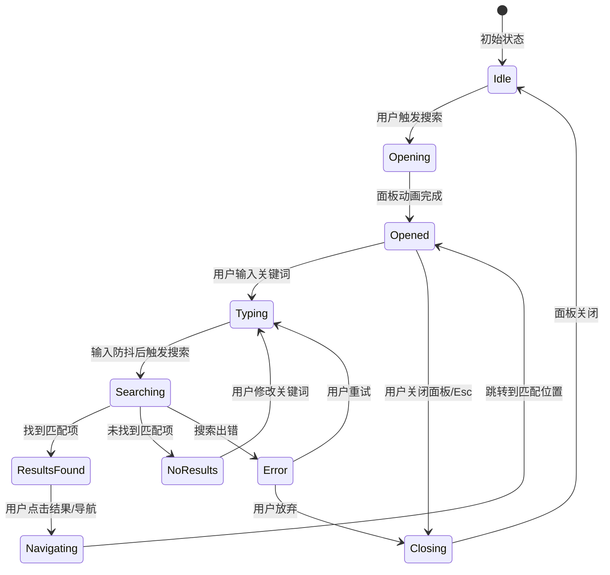

# P1-1: 全文搜索入口设计

## 1. 设计概述

为 AI Reader 阅读器设计全文搜索功能，解决用户无法快速查找内容的问题。搜索功能应集成到阅读器的核心交互流程中，支持多入口触发、智能结果展示和快速导航。

### 1.1 设计目标

| 目标 | 描述 | 优先级 |
|-----|------|--------|
| 多入口触发 | 支持工具栏按钮、快捷键、全局搜索三种触发方式 | P0 |
| 实时搜索 | 输入即搜索，结果即时展示 | P0 |
| 结果可导航 | 支持上一个/下一个快速跳转，高亮所有匹配项 | P0 |
| 上下文展示 | 显示匹配结果的章节信息和前后文本片段 | P1 |
| 高级过滤 | 支持限定搜索范围和匹配模式 | P2 |

---

## 2. 搜索入口设计

### 2.1 入口位置

#### 2.1.1 阅读器工具栏搜索按钮

在阅读器工具栏 (`.reader-toolbar`) 添加搜索按钮：

```
位置：在"添加书签"和"记录笔记"按钮之间
图标：放大镜图标
快捷键：Ctrl+F / Cmd+F (Windows/macOS)
```

**HTML 结构扩展**：

```html
<div class="reader-toolbar">
  <div class="pill-group">
    <span class="tag">字体：思源宋体</span>
    <span class="tag">字号：20px</span>
    <span class="tag">行距：2.1</span>
  </div>
  <div class="btn-row">
    <button type="button" class="btn btn-ghost" data-search-trigger aria-label="搜索 (Ctrl+F)">
      <span class="search-icon" aria-hidden="true">
        <svg viewBox="0 0 16 16"><path d="M6.5 2.5a4 4 0 1 0 0 8 4 4 0 0 0 0-8zM1.5 6.5a5 5 0 1 1 8.7 3.3l3.4 3.4a.5.5 0 0 1-.7.7l-3.4-3.4a5 5 0 0 1-4-4z"/></svg>
      </span>
      <span>搜索</span>
    </button>
    <a class="btn btn-flat" href="#">添加书签</a>
    <a class="btn btn-ghost" href="#">记录笔记</a>
  </div>
</div>
```

#### 2.1.2 快捷键触发

| 快捷键 | 功能 | 适用平台 |
|--------|------|----------|
| `Ctrl+F` | 打开搜索面板 | Windows/Linux |
| `Cmd+F` | 打开搜索面板 | macOS |
| `Ctrl+G` / `F3` | 下一个匹配项 | Windows/Linux |
| `Cmd+G` | 下一个匹配项 | macOS |
| `Ctrl+Shift+G` / `Shift+F3` | 上一个匹配项 | Windows/Linux |
| `Cmd+Shift+G` | 上一个匹配项 | macOS |
| `Escape` | 关闭搜索面板 | 全平台 |

#### 2.1.3 全局搜索入口（顶部导航）

在顶部导航栏添加全局搜索图标按钮，点击后弹出跨全书搜索对话框：

```html
<div class="topbar">
  <div class="brand"><span class="brand-mark">册</span>AI Reader / 阅读器</div>
  <div class="topbar-controls">
    <button type="button" class="btn-icon" data-global-search aria-label="全局搜索">
      <svg viewBox="0 0 16 16"><path d="M6.5 2.5a4 4 0 1 0 0 8 4 4 0 0 0 0-8zM1.5 6.5a5 5 0 1 1 8.7 3.3l3.4 3.4a.5.5 0 0 1-.7.7l-3.4-3.4a5 5 0 0 1-4-4z"/></svg>
    </button>
  </div>
  <span class="status" data-network>在线可用</span>
</div>
```

---

## 3. 搜索面板设计

### 3.1 面板位置与布局

搜索面板以浮动对话框形式展示，固定在阅读器顶部中央：

```
┌─────────────────────────────────────────────────────────┐
│  [搜索输入框]        [x]  [上一项] [下一项] 1/15        │
├─────────────────────────────────────────────────────────┤
│  o 当前章节  o 全书  o 高级选项                          │
├─────────────────────────────────────────────────────────┤
│  [搜索结果列表]                                          │
│  - 第17章 三体游戏                                       │
│    ...寒风掠过红岸基地首次响应...                        │
│  - 第12章 红岸之二                                       │
│    ...首次响应来自四光年外...                            │
└─────────────────────────────────────────────────────────┘
```

### 3.2 面板组件结构

```html
<aside class="search-panel" data-search-panel aria-hidden="true">
  <div class="search-panel-header">
    <div class="search-input-wrapper">
      <span class="search-input-icon" aria-hidden="true">
        <svg viewBox="0 0 16 16"><path d="M6.5 2.5a4 4 0 1 0 0 8 4 4 0 0 0 0-8zM1.5 6.5a5 5 0 1 1 8.7 3.3l3.4 3.4a.5.5 0 0 1-.7.7l-3.4-3.4a5 5 0 0 1-4-4z"/></svg>
      </span>
      <input
        type="search"
        class="search-input"
        placeholder="搜索正文内容..."
        data-search-input
        aria-label="搜索关键词"
        autocomplete="off"
      />
      <button type="button" class="btn-clear" data-clear-search aria-label="清除搜索">
        <svg viewBox="0 0 16 16"><path d="M4.6 4.6l6.8 6.8M11.4 4.6l-6.8 6.8"/></svg>
      </button>
    </div>

    <div class="search-controls">
      <div class="result-counter" data-result-counter>未搜索</div>
      <button type="button" class="btn btn-flat" data-prev-match aria-label="上一个匹配项" disabled>
        <svg viewBox="0 0 16 16"><path d="M10 3L5 8l5 5"/></svg>
      </button>
      <button type="button" class="btn btn-flat" data-next-match aria-label="下一个匹配项" disabled>
        <svg viewBox="0 0 16 16"><path d="M6 3l5 5-5 5"/></svg>
      </button>
      <button type="button" class="btn btn-ghost" data-close-search aria-label="关闭搜索">
        <svg viewBox="0 0 16 16"><path d="M4 4l8 8M12 4l-8 8"/></svg>
      </button>
    </div>
  </div>

  <div class="search-options" data-search-options>
    <fieldset class="search-scope">
      <legend>搜索范围</legend>
      <label>
        <input type="radio" name="search-scope" value="chapter" checked />
        当前章节
      </label>
      <label>
        <input type="radio" name="search-scope" value="book" />
        全书
      </label>
    </fieldset>

    <details class="search-advanced">
      <summary>高级选项</summary>
      <fieldset class="search-mode">
        <legend>匹配模式</legend>
        <label>
          <input type="radio" name="search-mode" value="fuzzy" checked />
          模糊匹配
        </label>
        <label>
          <input type="radio" name="search-mode" value="exact" />
          精确匹配
        </label>
        <label>
          <input type="radio" name="search-mode" value="regex" />
          正则表达式
        </label>
      </fieldset>
      <fieldset class="search-case">
        <legend>
          <label>
            <input type="checkbox" name="search-case-sensitive" />
            区分大小写
          </label>
        </legend>
      </fieldset>
    </details>
  </div>

  <div class="search-results" data-search-results aria-live="polite">
    <div class="search-empty">输入关键词开始搜索</div>
  </div>
</aside>
```

### 3.3 样式规范

```css
/* 搜索面板容器 */
.search-panel {
  position: fixed;
  top: 80px;
  left: 50%;
  transform: translateX(-50%);
  width: min(580px, calc(100vw - 56px));
  max-height: 70vh;
  background: var(--bg-panel);
  border: 1px solid var(--line-strong);
  border-radius: var(--radius-lg);
  box-shadow: var(--shadow-soft);
  z-index: 1000;
  display: flex;
  flex-direction: column;
  opacity: 0;
  pointer-events: none;
  transition: opacity 200ms ease, transform 200ms ease;
}

.search-panel[aria-hidden="false"] {
  opacity: 1;
  pointer-events: auto;
}

/* 搜索输入区域 */
.search-panel-header {
  display: flex;
  gap: 12px;
  padding: 16px;
  border-bottom: 1px solid var(--line-soft);
}

.search-input-wrapper {
  flex: 1;
  position: relative;
  display: flex;
  align-items: center;
  gap: 8px;
  padding: 8px 12px;
  border: 2px solid var(--line-soft);
  border-radius: var(--radius-md);
  background: var(--bg-soft);
  transition: border-color 180ms ease;
}

.search-input-wrapper:focus-within {
  border-color: var(--info);
}

.search-input {
  flex: 1;
  border: none;
  background: transparent;
  font: inherit;
  font-size: 15px;
  color: var(--ink-main);
  outline: none;
}

/* 搜索控制按钮 */
.search-controls {
  display: flex;
  align-items: center;
  gap: 8px;
}

.result-counter {
  padding: 6px 10px;
  border-radius: var(--radius-sm);
  background: var(--bg-soft);
  font-size: 13px;
  font-weight: 700;
  color: var(--ink-soft);
  min-width: 60px;
  text-align: center;
}

.result-counter.has-results {
  background: rgba(31, 122, 114, 0.12);
  color: var(--brand-teal);
}

/* 搜索结果区域 */
.search-results {
  flex: 1;
  overflow-y: auto;
  padding: 12px;
}

.search-result-item {
  padding: 12px;
  margin-bottom: 8px;
  border-radius: var(--radius-md);
  border: 1px solid transparent;
  cursor: pointer;
  transition: all 180ms ease;
}

.search-result-item:hover {
  background: var(--bg-soft);
  border-color: var(--line-soft);
}

.search-result-item.is-current {
  background: rgba(31, 122, 114, 0.1);
  border-color: var(--brand-teal);
}

.search-result-chapter {
  font-size: 13px;
  font-weight: 700;
  color: var(--ink-soft);
  margin-bottom: 6px;
}

.search-result-context {
  font-size: 14px;
  line-height: 1.6;
  color: var(--ink-main);
}

.search-result-highlight {
  background: rgba(220, 143, 75, 0.3);
  padding: 2px 4px;
  border-radius: 4px;
  font-weight: 700;
}

.search-result-item.is-current .search-result-highlight {
  background: var(--brand-amber);
  color: white;
}

/* 搜索选项 */
.search-options {
  padding: 12px 16px;
  border-top: 1px solid var(--line-soft);
  background: var(--bg-soft);
}

.search-scope,
.search-mode {
  display: flex;
  gap: 16px;
  border: none;
  padding: 0;
  margin: 0 0 8px 0;
}

.search-scope label,
.search-mode label {
  display: flex;
  align-items: center;
  gap: 6px;
  font-size: 13px;
  cursor: pointer;
}
```

---

## 4. 搜索结果展示设计

### 4.1 结果列表组件

每个搜索结果条目包含：

| 元素 | 描述 | 样式 |
|-----|------|------|
| 章节标题 | 显示匹配内容所在章节 | `.search-result-chapter` |
| 上下文片段 | 匹配关键词及其前后文本 | `.search-result-context` |
| 高亮关键词 | 在上下文中高亮显示搜索词 | `.search-result-highlight` |
| 当前匹配指示 | 当前选中的匹配项有特殊样式 | `.is-current` |

### 4.2 结果数据模型

```typescript
/**
 * 搜索匹配项
 */
interface SearchMatch {
  /** 匹配内容的唯一标识 */
  id: string;
  /** 所属书籍 ID */
  bookId: string;
  /** 所属章节索引 */
  chapterIndex: number;
  /** 匹配所在的段落/片段 ID */
  spanId: string;
  /** 匹配在文档中的起始位置 */
  startOffset: number;
  /** 匹配在文档中的结束位置 */
  endOffset: number;
  /** 匹配的原始文本 */
  matchedText: string;
  /** 上下文片段（前后各 N 个字符） */
  contextBefore: string;
  contextAfter: string;
}

/**
 * 搜索结果
 */
interface SearchResult {
  /** 搜索关键词 */
  query: string;
  /** 搜索范围 */
  scope: 'chapter' | 'book';
  /** 匹配模式 */
  mode: 'fuzzy' | 'exact' | 'regex';
  /** 是否区分大小写 */
  caseSensitive: boolean;
  /** 所有匹配项 */
  matches: SearchMatch[];
  /** 当前选中的匹配项索引 */
  currentIndex: number;
  /** 搜索耗时（毫秒） */
  searchTime: number;
}

/**
 * 搜索状态
 */
interface SearchState {
  /** 是否正在搜索 */
  isSearching: boolean;
  /** 当前搜索结果 */
  result: SearchResult | null;
  /** 搜索面板是否打开 */
  isPanelOpen: boolean;
  /** 搜索历史 */
  history: string[];
}

/**
 * 搜索选项
 */
interface SearchOptions {
  /** 搜索范围 */
  scope: 'chapter' | 'book';
  /** 匹配模式 */
  mode: 'fuzzy' | 'exact' | 'regex';
  /** 是否区分大小写 */
  caseSensitive: boolean;
  /** 上下文长度（字符数） */
  contextLength: number;
  /** 最大结果数 */
  maxResults: number;
}
```

### 4.3 结果分组

当搜索范围选择"全书"时，结果按章节分组展示：

```html
<div class="search-results-group">
  <div class="search-group-header">
    <span class="search-group-title">第17章 三体游戏</span>
    <span class="search-group-count">5 处匹配</span>
  </div>
  <div class="search-result-item" data-match-id="m1">
    <div class="search-result-context">
      ...寒风掠过<mark class="search-result-highlight">红岸基地</mark>，天线群像...
    </div>
  </div>
  <div class="search-result-item" data-match-id="m2">
    <div class="search-result-context">
      ...<mark class="search-result-highlight">红岸基地</mark>首次响应的后果...
    </div>
  </div>
</div>
```

---

## 5. 搜索交互流程



### 5.1 关键交互细节

| 交互 | 行为 | 备注 |
|-----|------|------|
| 打开面板 | 显示面板，聚焦输入框，选中文本（如果有） | 快捷键触发时自动聚焦 |
| 输入搜索 | 300ms 防抖后自动搜索 | 实时反馈 |
| 点击结果 | 关闭面板，滚动到匹配位置并高亮 | 保持高亮直到下次操作 |
| 上一项/下一项 | 移动当前选中项，滚动到对应位置 | 循环导航 |
| 清除搜索 | 清空输入框，移除所有高亮 | 恢复初始状态 |
| 关闭面板 | 隐藏面板，清除高亮 | Escape 触发 |
| 点击外部 | 关闭面板 | 点击遮罩层 |

### 5.2 高亮行为

1. **搜索时高亮**：在正文中用 `<mark class="search-match">` 包裹所有匹配项
2. **当前高亮**：当前导航到的匹配项用 `.search-match.is-current` 标记
3. **高亮样式**：
   ```css
   .search-match {
     background: rgba(220, 143, 75, 0.4);
     border-radius: 3px;
     padding: 1px 3px;
   }
   .search-match.is-current {
     background: var(--brand-amber);
     color: white;
     animation: pulse 1s ease-in-out infinite;
   }
   @keyframes pulse {
     0%, 100% { opacity: 1; }
     50% { opacity: 0.8; }
   }
   ```

---

## 6. 跨模块导航集成

搜索结果点击后应支持跳转到其他模块查看相关内容：

### 6.1 结果类型扩展

```typescript
type MatchEntityType = 'actor' | 'event' | 'time' | 'location';

interface EntitySearchMatch extends SearchMatch {
  /** 关联的实体类型 */
  entityType: MatchEntityType;
  /** 关联的实体 ID */
  entityId: string;
  /** 可跳转的模块 */
  targetModule: 'characters' | 'events' | 'timeline';
}
```

### 6.2 跨模块跳转按钮

在搜索结果中添加"查看详情"按钮：

```html
<div class="search-result-item" data-match-id="m1">
  <div class="search-result-chapter">第17章 三体游戏</div>
  <div class="search-result-context">
    ...<mark class="search-result-highlight">叶文洁</mark>在山坡上停下脚步...
  </div>
  <div class="search-result-actions">
    <button type="button" class="btn-link" data-entity-link="actor_ye">
      查看人物关系
    </button>
  </div>
</div>
```

---

## 7. 实现要点

### 7.1 性能考虑

| 策略 | 描述 | 实现 |
|-----|------|------|
| 虚拟滚动 | 大量结果时使用虚拟列表 | 只渲染可见区域 |
| 分块搜索 | 全书搜索时分章节处理 | 避免阻塞主线程 |
| 结果缓存 | 缓存最近搜索结果 | 避免重复计算 |
| 索引预建 | 预建全文索引 | 使用 SQLite FTS5 |
| Web Worker | 搜索逻辑放入 Worker | 不阻塞 UI |

### 7.2 数据存储建议

使用 SQLite FTS5 (Full-Text Search) 扩展：

```sql
-- 创建全文搜索表
CREATE VIRTUAL TABLE book_content_fts USING fts5(
  book_id,
  chapter_index,
  span_id,
  content,
  tokenize = 'simple unicode61'
);

-- 插入内容
INSERT INTO book_content_fts(book_id, chapter_index, span_id, content)
VALUES (?, ?, ?, ?);

-- 搜索查询
SELECT
  book_id, chapter_index, span_id,
  snippet(book_content_fts, 2, '<mark>', '</mark>', '...', 30) as snippet,
  offsets(book_content_fts) as offsets
FROM book_content_fts
WHERE book_content_fts MATCH ? AND book_id = ?
ORDER BY rank;
```

### 7.3 可访问性

| 要求 | 实现 |
|-----|------|
| ARIA 标签 | 所有搜索控件添加 `aria-label` |
| 键盘导航 | Tab 键遍历，Enter 确认，Escape 关闭 |
| 屏幕阅读器 | 使用 `aria-live` 区域播报搜索结果 |
| 焦点管理 | 打开面板时聚焦输入框，关闭后恢复焦点 |
| 高对比度 | 高亮颜色支持高对比度模式 |

---

## 8. 设计交付物清单

- [ ] 搜索面板 HTML 结构定义
- [ ] 搜索面板样式 CSS 定义
- [ ] 搜索状态管理接口 (TypeScript)
- [ ] 搜索服务接口定义 (IPC channels)
- [ ] 交互流程原型（Mermaid 图）
- [ ] 可访问性检查清单
- [ ] 性能测试用例

---

## 9. 后续扩展

1. **搜索历史**：保存用户最近的搜索关键词，提供快速重搜
2. **搜索建议**：输入时提供自动完成建议（基于章节标题、人物名等）
3. **搜索统计**：记录用户搜索行为，优化搜索排序
4. **语音搜索**：支持语音输入搜索关键词
5. **搜索导出**：导出搜索结果为 Markdown/CSV

---

*文档版本: 1.0*
*创建日期: 2025-02-19*
*设计者: designer-4*
