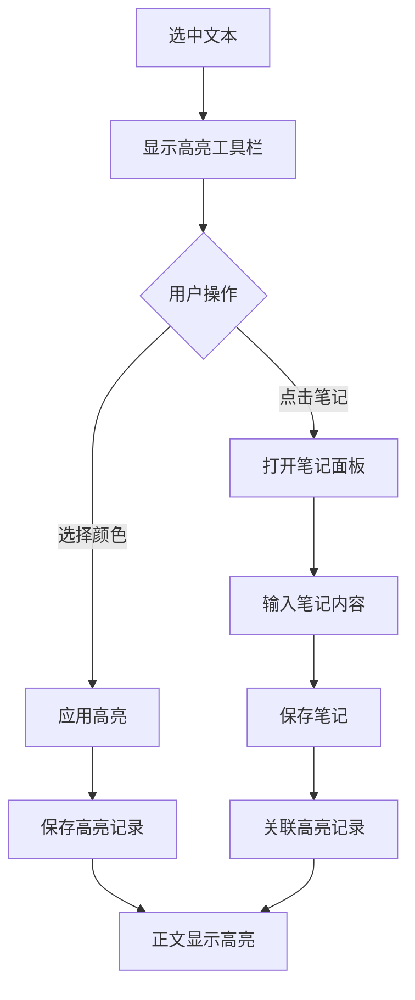

# P1-2: 笔记/高亮系统设计

## 问题背景

原型审查报告中指出：**无笔记/高亮功能设计 - 阅读器标配**

这是一个 **Major** 级别的问题，笔记和高亮是阅读器的核心功能。

---

## 设计方案

### 1. 高亮功能

#### 1.1 高亮工具栏

选中文本后显示浮动工具栏：

```
    选中的文本会在这里显示
         ↓
┌─────────────────────────────┐
│  🟡  🟢  🔵  🩷  🟣  │  📝  │  🗑️  │
│  黄   绿   蓝   粉   紫  │ 笔记 │ 删除 │
└─────────────────────────────┘
```

#### 1.2 高亮样式

| 颜色 | 用途 | CSS 变量 |
|-----|------|---------|
| 黄色 | 重要内容 | --highlight-yellow |
| 绿色 | 关键概念 | --highlight-green |
| 蓝色 | 人物信息 | --highlight-blue |
| 粉色 | 情感段落 | --highlight-pink |
| 紫色 | 伏笔线索 | --highlight-purple |

### 2. 笔记功能

#### 2.1 笔记编辑面板

```
┌─────────────────────────────────────────────────────────────┐
│  📝 添加笔记                                           [×]  │
├─────────────────────────────────────────────────────────────┤
│                                                             │
│  引用文本:                                                   │
│  ┌─────────────────────────────────────────────────────┐   │
│  │ "叶文洁站在雷达峰上，望着远方的天际线..."               │   │
│  └─────────────────────────────────────────────────────┘   │
│                                                             │
│  笔记内容:                                                   │
│  ┌─────────────────────────────────────────────────────┐   │
│  │                                                     │   │
│  │  这里是人物的首次出场，奠定了整部小说的基调...          │   │
│  │                                                     │   │
│  └─────────────────────────────────────────────────────┘   │
│                                                             │
│  标签: [人物] [伏笔] [ + 添加标签 ]                          │
│                                                             │
│                              [取消]  [保存]                  │
│                                                             │
└─────────────────────────────────────────────────────────────┘
```

### 3. 笔记管理面板

```
┌─────────────────────────────────────────────────────────────┐
│  📚 笔记与标注                                               │
├─────────────────────────────────────────────────────────────┤
│  筛选: [全部▼] [有笔记▼]  排序: [按时间▼]  [导出 ↓]          │
├─────────────────────────────────────────────────────────────┤
│                                                             │
│  ┌─────────────────────────────────────────────────────┐   │
│  │ 🟡 第三章 P.56                                       │   │
│  │ "叶文洁被分配到了红岸基地..."                          │   │
│  │ 📝 重要转折点，人物命运的改变                          │   │
│  │ 🏷️ [人物] [转折]                     2026-02-19      │   │
│  └─────────────────────────────────────────────────────┘   │
│                                                             │
│  ┌─────────────────────────────────────────────────────┐   │
│  │ 🔵 第一章 P.12                                       │   │
│  │ "三体世界是一个三星系统..."                           │   │
│  │ 📝 核心设定，理解整部作品的关键                        │   │
│  │ 🏷️ [设定] [科幻]                     2026-02-18      │   │
│  └─────────────────────────────────────────────────────┘   │
│                                                             │
└─────────────────────────────────────────────────────────────┘
```

### 4. 数据模型

```typescript
/**
 * 高亮颜色枚举
 */
enum HighlightColor {
  YELLOW = 'yellow',
  GREEN = 'green',
  BLUE = 'blue',
  PINK = 'pink',
  PURPLE = 'purple',
}

/**
 * 高亮记录
 */
interface Highlight {
  id: string;
  bookId: string;
  chapterId: string;
  paragraphId: string;
  startOffset: number;
  endOffset: number;
  color: HighlightColor;
  text: string;
  createdAt: string;
  updatedAt: string;
}

/**
 * 笔记
 */
interface Note {
  id: string;
  highlightId: string;
  content: string;
  tags: string[];
  createdAt: string;
  updatedAt: string;
}

/**
 * 笔记与高亮组合
 */
interface AnnotatedHighlight extends Highlight {
  note?: Note;
}

/**
 * 笔记导出格式
 */
type NoteExportFormat = 'markdown' | 'html' | 'json';
```

### 5. 交互流程



### 6. 正文显示样式

```css
/* 高亮基础样式 */
.highlight {
  padding: 2px 0;
  border-radius: 2px;
  cursor: pointer;
}

.highlight-yellow { background-color: rgba(255, 235, 59, 0.4); }
.highlight-green { background-color: rgba(76, 175, 80, 0.3); }
.highlight-blue { background-color: rgba(33, 150, 243, 0.3); }
.highlight-pink { background-color: rgba(233, 30, 99, 0.3); }
.highlight-purple { background-color: rgba(156, 39, 176, 0.3); }

/* 有笔记的高亮显示图标 */
.highlight-with-note::after {
  content: '📝';
  font-size: 0.8em;
  margin-left: 2px;
}
```

### 7. 导出功能

支持导出为：
- **Markdown**: 按章节组织的笔记列表
- **HTML**: 带格式的笔记文档
- **JSON**: 结构化数据备份

---

## 验收标准

- [ ] 选中文本可添加高亮
- [ ] 支持 5 种高亮颜色
- [ ] 可为高亮添加笔记
- [ ] 笔记管理面板正常显示
- [ ] 支持按标签筛选
- [ ] 笔记可导出
