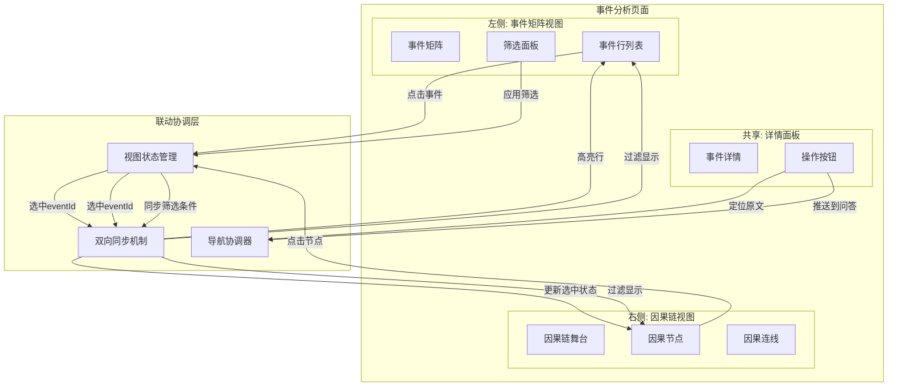
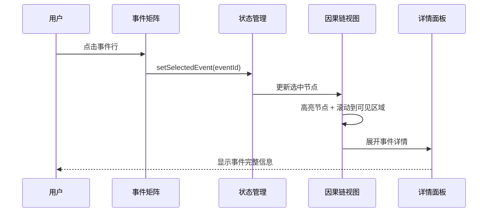
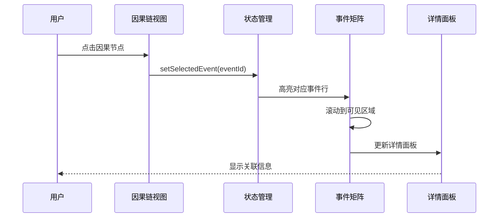
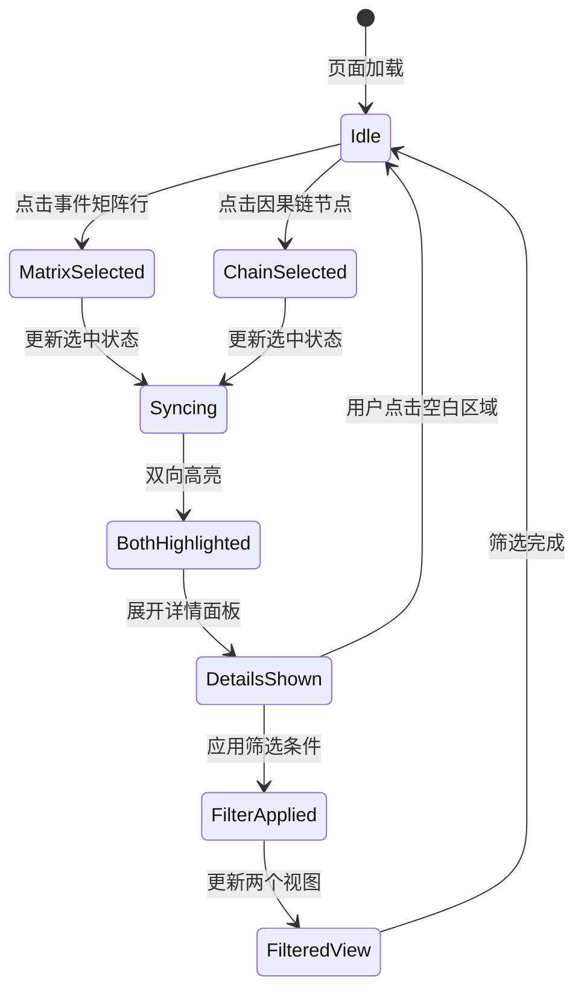
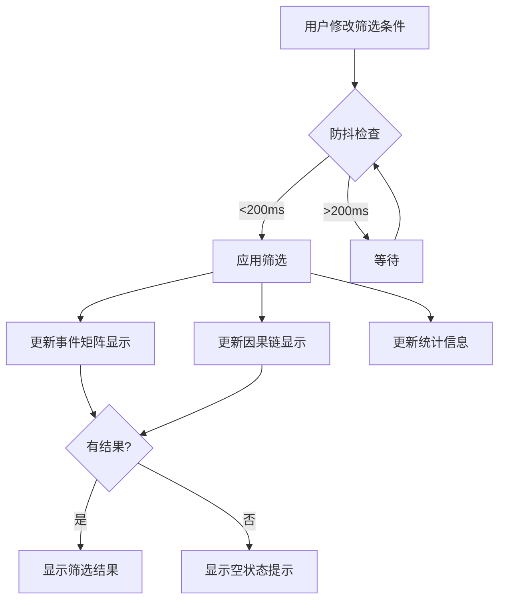
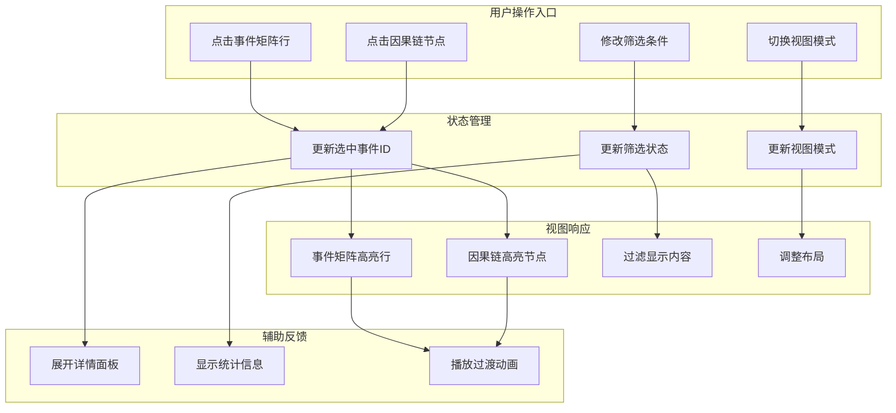
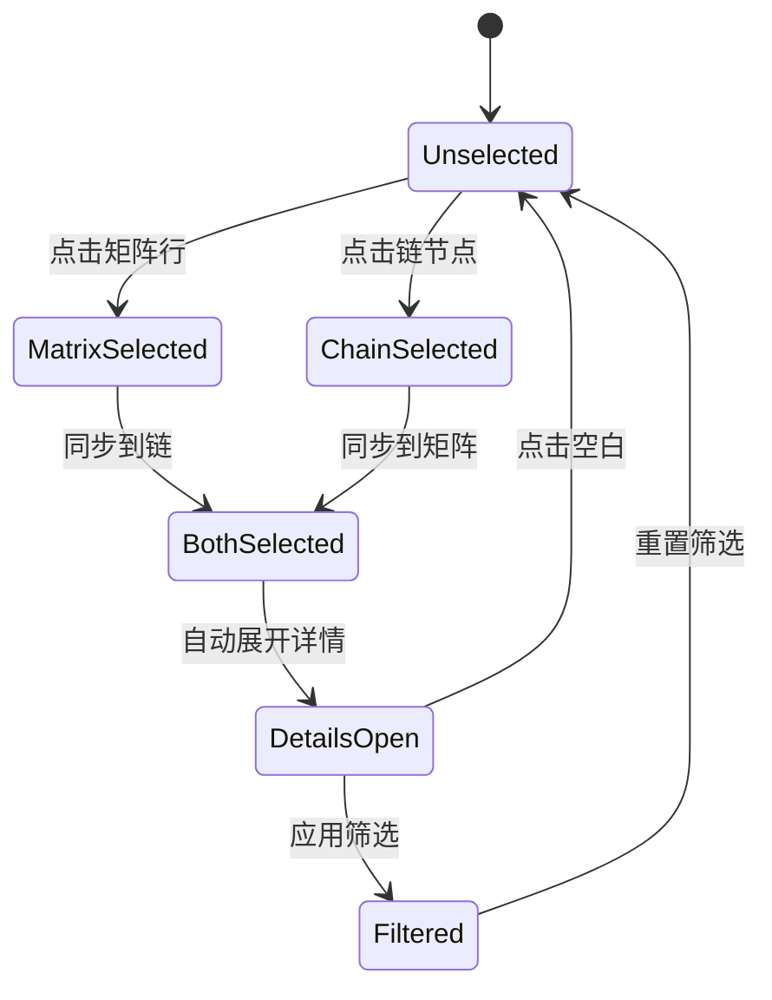

# P1-3: 因果链与事件矩阵联动设计

**设计者**: designer-6
**创建时间**: 2026-02-19
**优先级**: P1
**状态**: Draft

---

## 1. 概述

### 1.1 设计目标

设计因果链视图与事件矩阵视图之间的双向联动机制，解决当前原型中"因果链与事件矩阵无关联"的问题，实现：
- 两个视图间的无缝切换与定位
- 选中状态的双向同步
- 筛选条件的跨视图同步
- 统一的导航体验

### 1.2 问题陈述

根据原型审查报告和 `events.html` 分析，当前存在的问题：
- 事件矩阵 (`.event-matrix`) 与因果链视图 (`.causality-flow`) 无联动
- 点击事件行无法定位到因果链中的位置
- 因果链中选中节点无法高亮事件矩阵对应行
- 筛选条件（事件类型、置信度、时间范围）无法跨视图同步
- 缺少统一的视图切换机制

---

## 2. 联动架构设计

### 2.1 视图布局架构



### 2.2 视图切换模式设计

#### 模式一: Tab 切换 (移动端/窄屏优先)

```
+--------------------------------------------------+
|  事件分析                          [矩阵] [因果链] |
+--------------------------------------------------+
|                                                  |
|  [当前选中视图内容区域]                           |
|                                                  |
+--------------------------------------------------+
|  事件详情面板 (固定底部)                           |
+--------------------------------------------------+
```

**交互规则**:
- 切换 Tab 时保持当前选中事件的上下文
- 切换时自动滚动到对应事件位置
- 使用淡入淡出动画过渡 (300ms)

#### 模式二: 分屏显示 (桌面端默认)

```
+-----------------------------+----------------------+
|  事件影响矩阵         | 因果链舞台            |
+-----------------------------+----------------------+
|  [事件行 1]                |  [原因]              |
|  [事件行 2] ***选中***     |    [节点 A]          |
|  [事件行 3]                |      [连线]          |
|  [事件行 4]                |    [节点 B] ***选中***|
+-----------------------------+----------------------+
|  事件详情面板                               |
+----------------------------------------------+
```

**交互规则**:
- 使用可拖拽的分隔栏调整宽度
- 支持收起/展开侧边面板
- 双侧视图同时响应滚动和选中

#### 响应式断点

| 断点 | 布局模式 | 最小宽度 |
|------|----------|----------|
| < 768px | Tab 切换 (堆叠) | 100% |
| 768px - 1200px | 分屏 (30:70) | 30% / 70% |
| > 1200px | 分屏 (40:60) | 40% / 60% |

---

## 3. 联动交互流程

### 3.1 事件矩阵 → 因果链



**交互细节**:
1. **点击事件行**:
   - 事件行添加 `.selected` 样式类
   - 背景色变更为 `rgba(31, 122, 114, 0.15)`
   - 左侧添加选中指示条

2. **因果链响应**:
   - 对应因果节点添加 `.highlight` 样式
   - 自动滚动使节点居中显示
   - 前置/后续节点以低透明度显示

3. **详情面板展开**:
   - 显示事件标题、描述、涉及人物
   - 提供操作按钮: 定位原文、推送到问答

### 3.2 因果链 → 事件矩阵



**交互细节**:
1. **点击因果节点**:
   - 节点添加 `.active` 样式
   - 边框加粗并高亮
   - 相邻连线高亮显示

2. **事件矩阵响应**:
   - 对应事件行添加 `.linked` 样式
   - 背景色变更为 `rgba(220, 143, 75, 0.12)`
   - 自动滚动到可见位置

3. **视觉反馈**:
   - 使用 200ms 的缓动动画
   - 提供悬浮提示显示事件摘要

### 3.3 状态同步流程图



---

## 4. 筛选联动设计

### 4.1 筛选面板布局

```
+--------------------------------------------------------------+
|  事件筛选                                    [重置] [保存预设] |
+--------------------------------------------------------------+
|  事件类型                                            |
|    [x] 转折点 [ ] 冲突 [x] 关键对话 [ ] 未知                   |
|                                                              |
|  影响力范围                                     |
|    [低] ━━━━●━━━━━━━━ [高]  0.75                           |
|                                                              |
|  置信度筛选                                       |
|    [x] 高置信 (>0.8)  [x] 中置信 (0.5-0.8)  [ ] 低置信        |
|                                                              |
|  时间范围                                          |
|    第 [1] 章 ━─●───── 第 [40] 章                           |
|                                                              |
|  涉及人物                                         |
|    [叶文洁] [汪淼] [史强] [+添加]                            |
+--------------------------------------------------------------+
```

### 4.2 筛选条件同步逻辑

```typescript
// 筛选状态接口
interface EventFilterState {
  // 事件类型筛选
  eventTypes: Set<'TURNING_POINT' | 'CONFLICT' | 'KEY_DIALOGUE' | 'UNKNOWN'>;

  // 影响力范围
  impactRange: [number, number]; // [min, max]

  // 置信度筛选
  confidenceLevels: Set<'HIGH' | 'MEDIUM' | 'LOW'>;

  // 章节范围
  chapterRange: [number, number];

  // 涉及人物
  characterIds: Set<string>;
}

// 筛选同步逻辑
function applyFilterSync(
  state: EventFilterState,
  matrixEvents: EventMatrixRow[],
  chainNodes: CausalNode[]
): {
  filteredMatrix: EventMatrixRow[];
  filteredChain: CausalNode[];
} {
  // 应用到事件矩阵
  const filteredMatrix = matrixEvents.filter(evt => {
    if (state.eventTypes.size > 0 && !state.eventTypes.has(evt.type)) return false;
    if (evt.impact < state.impactRange[0] || evt.impact > state.impactRange[1]) return false;
    // ... 其他筛选条件
    return true;
  });

  // 应用到因果链 (只保留与筛选事件相关的节点)
  const filteredChain = chainNodes.filter(node => {
    return filteredMatrix.some(evt => evt.eventId === node.eventId);
  });

  return { filteredMatrix, filteredChain };
}
```

### 4.3 筛选响应式更新



---

## 5. 导航增强设计

### 5.1 跳转到原文

**从事件矩阵跳转**:
```
事件矩阵 → [定位原文] → 阅读器
参数: bookId + chapterId + spanId + highlight=true
```

**从因果链跳转**:
```
因果链节点 → [查看来源] → 阅读器
参数: bookId + chapterId + spanId + eventId + highlight=true
```

**跳转动画**:
1. 目标段落淡入高亮 (500ms)
2. 页面平滑滚动到目标位置
3. 高亮效果持续 3 秒后淡出

### 5.2 悬浮提示设计

```typescript
// 悬浮提示内容结构
interface EventTooltip {
  // 基本信息
  title: string;
  type: EventType;
  impact: number;

  // 快速预览
  description: string;
  characters: string[]; // 涉及人物名称

  // 关联信息
  relatedEvents?: string[]; // 相关事件ID
  chapterInfo?: string; // "第17章"

  // 操作链接
  actions: {
    viewInChain: boolean; // 可在因果链中查看
    locateSource: boolean; // 可定位原文
  };
}
```

**悬浮提示 UI**:
```
+---------------------------------------+
|  红岸基地首次响应           [×]       |
|  转折点 · 影响力 0.93                      |
|  ------------------------------------  |
|  触发条件：外部文明信号确认              |
|  涉及：叶文洁、伊文斯                   |
|  第17章 · 来源: 3处                     |
|                                        |
|  [在因果链中查看] [定位原文]            |
+---------------------------------------+
```

---

## 6. 联动状态同步设计

### 6.1 状态管理架构

```typescript
// Zustand Store 定义
interface EventAnalysisStore {
  // 当前选中事件
  selectedEventId: string | null;

  // 视图模式
  viewMode: 'split' | 'tab-matrix' | 'tab-chain';

  // 筛选状态
  filters: EventFilterState;

  // 详情面板状态
  detailPanelOpen: boolean;

  // 操作方法
  setSelectedEvent: (eventId: string | null) => void;
  setViewMode: (mode: 'split' | 'tab-matrix' | 'tab-chain') => void;
  updateFilters: (filters: Partial<EventFilterState>) => void;
  resetFilters: () => void;
  toggleDetailPanel: () => void;

  // 联动方法
  highlightInChain: (eventId: string) => void;
  highlightInMatrix: (eventId: string) => void;
  syncSelection: (eventId: string) => void;
}

export const useEventAnalysisStore = create<EventAnalysisStore>((set, get) => ({
  selectedEventId: null,
  viewMode: window.innerWidth >= 768 ? 'split' : 'tab-matrix',
  filters: DEFAULT_FILTERS,
  detailPanelOpen: false,

  setSelectedEvent: (eventId) => {
    set({ selectedEventId: eventId, detailPanelOpen: !!eventId });
    // 触发双向高亮
    get().syncSelection(eventId);
  },

  syncSelection: (eventId) => {
    if (!eventId) return;
    // 在两个视图中都更新高亮状态
    get().highlightInChain(eventId);
    get().highlightInMatrix(eventId);
  },

  highlightInChain: (eventId) => {
    // DOM 操作：高亮因果链节点
    document
      .querySelectorAll(`[data-event-id="${eventId}"]`)
      .forEach(el => el.classList.add('highlight'));
  },

  highlightInMatrix: (eventId) => {
    // DOM 操作：高亮事件矩阵行
    document
      .querySelectorAll(`[data-event-id="${eventId}"]`)
      .forEach(el => el.classList.add('selected'));
  },

  // ... 其他方法
}));
```

### 6.2 跨组件通信

```typescript
// 事件总线用于跨视图通信
class EventAnalysisBus {
  private events = new EventEmitter();

  // 订阅事件
  on(event: string, callback: Function) {
    this.events.on(event, callback);
  }

  // 发布事件
  emit(event: string, data: unknown) {
    this.events.emit(event, data);
  }
}

// 事件类型
const BUS_EVENTS = {
  EVENT_SELECTED: 'event:selected',
  FILTER_CHANGED: 'filter:changed',
  VIEW_MODE_CHANGED: 'view:changed',
  DETAILS_TOGGLED: 'details:toggled',
} as const;

// 使用示例
const bus = new EventAnalysisBus();

// 事件矩阵组件中
bus.emit(BUS_EVENTS.EVENT_SELECTED, { eventId: 'evt_001' });

// 因果链组件中
bus.on(BUS_EVENTS.EVENT_SELECTED, ({ eventId }) => {
  highlightNode(eventId);
  scrollToNode(eventId);
});
```

---

## 7. UI 组件更新方案

### 7.1 事件矩阵行组件

```tsx
interface EventMatrixRowProps {
  event: TimelineEvent;
  isSelected: boolean;
  isLinked: boolean; // 被因果链关联
  onSelect: (eventId: string) => void;
}

function EventMatrixRow({ event, isSelected, isLinked, onSelect }: EventMatrixRowProps) {
  return (
    <article
      className={cn(
        'event-row',
        isSelected && 'selected',
        isLinked && 'linked'
      )}
      data-event-id={event.id}
      onClick={() => onSelect(event.id)}
    >
      <div className="event-head">
        <strong>{event.title}</strong>
        <EventTypeTag type={event.type} impact={event.impact} />
      </div>
      <p>{event.description}</p>
      <ImpactBar value={event.impact} />

      <div className="btn-row">
        <Button variant="flat" size="sm" href={`/reader?spanId=${event.spanId}`}>
          定位原文
        </Button>
        <Button
          variant="ghost"
          size="sm"
          onClick={() => navigateToChain(event.id)}
        >
          查看因果链
        </Button>
      </div>
    </article>
  );
}
```

### 7.2 因果链节点组件

```tsx
interface CausalNodeProps {
  node: CausalNode;
  isActive: boolean;
  isHighlighted: boolean;
  onSelect: (eventId: string) => void;
}

function CausalNode({ node, isActive, isHighlighted, onSelect }: CausalNodeProps) {
  return (
    <article
      className={cn(
        'flow-item',
        'causal-node',
        isActive && 'active',
        isHighlighted && 'highlight'
      )}
      data-event-id={node.eventId}
      onClick={() => onSelect(node.eventId)}
    >
      <strong>{node.type}</strong>
      <p>{node.description}</p>
      {isActive && (
        <div className="node-actions">
          <Button variant="flat" size="sm">
            定位原文
          </Button>
          <Button variant="ghost" size="sm">
            查看矩阵
          </Button>
        </div>
      )}
    </article>
  );
}
```

### 7.3 样式定义

```css
/* 事件矩阵行样式 */
.event-row {
  border-radius: 12px;
  border: 1px solid rgba(118, 98, 68, 0.24);
  background: rgba(255, 254, 249, 0.94);
  padding: 10px;
  cursor: pointer;
  transition: all 200ms ease;
  position: relative;
}

/* 选中状态 */
.event-row.selected {
  background: rgba(31, 122, 114, 0.15);
  border-color: rgba(31, 122, 114, 0.5);
  box-shadow: 0 0 0 2px rgba(31, 122, 114, 0.2);
}

.event-row.selected::before {
  content: "";
  position: absolute;
  left: 0;
  top: 8px;
  bottom: 8px;
  width: 4px;
  background: var(--brand-teal);
  border-radius: 0 4px 4px 0;
}

/* 关联状态（被因果链选中） */
.event-row.linked {
  background: rgba(220, 143, 75, 0.12);
  border-color: rgba(220, 143, 75, 0.4);
}

/* 因果链节点样式 */
.causal-node {
  border-radius: 12px;
  border: 1px solid rgba(118, 98, 68, 0.2);
  background: rgba(255, 253, 247, 0.96);
  padding: 12px;
  cursor: pointer;
  transition: all 200ms ease;
}

/* 激活状态 */
.causal-node.active {
  border-color: var(--brand-teal);
  border-width: 2px;
  background: rgba(226, 245, 241, 0.95);
  transform: scale(1.02);
}

/* 高亮状态 */
.causal-node.highlight {
  animation: pulse-highlight 1s ease;
}

@keyframes pulse-highlight {
  0%, 100% {
    box-shadow: 0 0 0 0 rgba(31, 122, 114, 0.4);
  }
  50% {
    box-shadow: 0 0 0 8px rgba(31, 122, 114, 0);
  }
}

/* 详情面板过渡 */
.detail-panel {
  transition: transform 300ms ease, opacity 300ms ease;
}

.detail-panel.open {
  transform: translateY(0);
  opacity: 1;
}

.detail-panel.closed {
  transform: translateY(100%);
  opacity: 0;
}
```

### 7.4 响应式布局

```css
/* 桌面端: 分屏布局 */
@media (min-width: 1200px) {
  .event-pro {
    display: grid;
    grid-template-columns: minmax(0, 1fr) 10px minmax(360px, 480px);
    gap: 12px;
  }

  .event-pro.tab-mode {
    display: grid;
    grid-template-columns: minmax(0, 1fr);
  }
}

/* 平板端: 窄分屏 */
@media (min-width: 768px) and (max-width: 1199px) {
  .event-pro {
    display: grid;
    grid-template-columns: minmax(0, 1fr) 10px 320px;
    gap: 12px;
  }
}

/* 移动端: Tab 切换 */
@media (max-width: 767px) {
  .event-pro {
    display: block;
  }

  .event-pro .tab-content {
    display: none;
  }

  .event-pro .tab-content.active {
    display: block;
  }

  .event-pro .causality-flow {
    border-top: 1px solid var(--line-soft);
    margin-top: 12px;
  }
}
```

---

## 8. 联动交互流程图

### 8.1 完整联动流程



### 8.2 状态机图



---

## 9. 数据结构定义

### 9.1 事件矩阵数据

```typescript
interface EventMatrixRow {
  id: string;                    // 事件唯一ID
  bookId: string;
  title: string;
  description: string;
  type: EventType;
  impact: number;                // 影响力 0-1
  chapterId: string;
  chapterIndex: number;
  spanId: string;
  characters: {
    id: string;
    name: string;
    role: 'MAIN' | 'MINOR' | 'OTHER';
  }[];
  confidence: number;            // 置信度 0-1
  relatedEvents?: string[];      // 关联事件ID
}

type EventType =
  | 'TURNING_POINT'  // 转折点
  | 'CONFLICT'       // 冲突
  | 'KEY_DIALOGUE'   // 关键对话
  | 'UNKNOWN';       // 未知
```

### 9.2 因果链数据

```typescript
interface CausalNode {
  id: string;
  eventId: string;               // 关联的事件ID
  type: 'CAUSE' | 'RELAY' | 'EFFECT';
  title: string;
  description: string;
  position: { x: number; y: number };
  relatedEvents: string[];       // 相关事件ID
  sourceChapters: string[];      // 来源章节
}

interface CausalLink {
  id: string;
  sourceId: string;              // 源节点ID
  targetId: string;              // 目标节点ID
  relationship: 'DIRECT' | 'INDIRECT' | 'CONDITIONAL';
  strength: number;              // 连接强度 0-1
  description?: string;
}

interface CausalChain {
  id: string;
  bookId: string;
  nodes: CausalNode[];
  links: CausalLink[];
  metadata: {
    chapterRange: [number, number];
    timeRange: string;
    characterCount: number;
  };
}
```

---

## 10. 验收标准

### 10.1 功能验收

- [ ] 点击事件矩阵行可高亮因果链对应节点
- [ ] 点击因果链节点可高亮事件矩阵对应行
- [ ] 选中状态双向同步，无延迟
- [ ] 筛选条件可同步应用到两个视图
- [ ] 视图切换保持当前选中事件上下文
- [ ] 从任一视图可跳转到原文
- [ ] 悬浮提示显示事件详情预览
- [ ] 详情面板响应选中状态变化

### 10.2 交互验收

- [ ] 分屏模式下拖拽分隔栏流畅
- [ ] Tab 切换有淡入淡出动画
- [ ] 高亮/选中状态有明显视觉区分
- [ ] 空状态有友好提示
- [ ] 操作反馈及时（<100ms）

### 10.3 响应式验收

- [ ] 桌面端默认使用分屏布局
- [ ] 平板端支持窄分屏或 Tab 切换
- [ ] 移动端强制使用 Tab 切换
- [ ] 布局切换时保持状态

### 10.4 性能验收

- [ ] 联动响应时间 < 100ms
- [ ] 筛选更新 < 200ms
- [ ] 大量事件（>100）时不卡顿
- [ ] 动画帧率稳定 60fps

---

## 11. 实施建议

### 11.1 实施顺序

**Phase 1 - 基础联动** (1-2天)
1. 实现状态管理 Store
2. 实现事件矩阵组件
3. 实现因果链组件
4. 实现双向选中同步

**Phase 2 - 筛选联动** (1天)
1. 实现筛选面板 UI
2. 实现筛选逻辑
3. 实现跨视图筛选同步

**Phase 3 - 视图切换** (0.5天)
1. 实现分屏布局
2. 实现 Tab 切换
3. 实现响应式断点

**Phase 4 - 导航增强** (0.5天)
1. 实现跳转原文
2. 实现悬浮提示
3. 实现详情面板

### 11.2 依赖关系

| 任务 | 依赖 |
|------|------|
| 双向选中同步 | 状态管理 Store、事件 ID 规范 |
| 筛选联动 | 筛选状态接口、事件数据结构 |
| 视图切换 | 响应式布局系统 |
| 导航增强 | 跨模块导航参数 |

### 11.3 与其他模块集成

| 模块 | 集成点 |
|------|--------|
| 阅读器 | 跳转原文使用 `spanId` 参数 |
| 时间线 | 共享事件数据结构 |
| 人物关系 | 共享人物引用数据 |
| AI 问答 | 推送事件到问答面板 |

---

## 12. 参考资料

- 原型文件: `.omc/prototypes/ai-reader-electron/pages/events.html`
- 样式规范: `.omc/prototypes/ai-reader-electron/assets/styles.css`
- 跨模块导航: `.omc/plans/designs/task-03-cross-module-navigation.md`
- 时间线联动: `.omc/plans/designs/task-07-timeline-event-linkage.md`
- 开发计划: `.omc/plans/ai-reader-development-plan.md`

---

**文档版本**: 1.0
**最后更新**: 2026-02-19
**设计者**: designer-6
