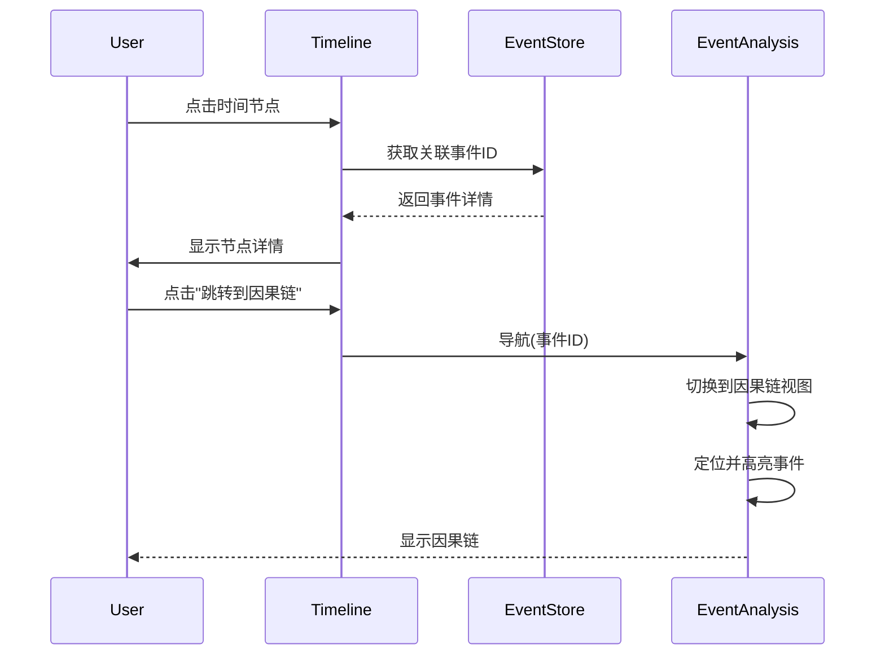

# P1-4: 时间线与事件分析联动设计

## 问题背景

原型审查报告中指出：**与事件分析页无联动设计 - 时间线如何跳转到因果链？**

这是一个 **Major** 级别的问题，时间线应该与事件分析模块双向联动。

---

## 设计方案

### 1. 联动入口

#### 1.1 时间线 → 事件分析

```
┌─────────────────────────────────────────────────────────────┐
│  📅 时间线                                                   │
├─────────────────────────────────────────────────────────────┤
│                                                             │
│  1979 ───────●───────●───────●─────── 1985                  │
│              │       │       │                              │
│              ▼       ▼       ▼                              │
│           红岸   首次接触  ETO成立                           │
│           成立    [→因果链]  [→因果链]                        │
│          [→因果链]                                          │
│                                                             │
│  ══════════════════════════════════════════════════════════ │
│                                                             │
│  选中: 红岸成立                                              │
│  ┌─────────────────────────────────────────────────────┐   │
│  │ 📅 1967年3月                                         │   │
│  │ 📝 红岸基地正式成立，开始监听外星文明                    │   │
│  │                                                     │   │
│  │ [查看详情]  [跳转到因果链 →]                          │   │
│  └─────────────────────────────────────────────────────┘   │
│                                                             │
└─────────────────────────────────────────────────────────────┘
```

#### 1.2 事件分析 → 时间线

```
┌─────────────────────────────────────────────────────────────┐
│  ⚡ 事件详情                                                 │
├─────────────────────────────────────────────────────────────┤
│                                                             │
│  📅 时间: 1967年3月 (AI推断, 置信度 92%)                      │
│                                                             │
│  [📅 在时间线上查看此事件 →]                                  │
│                                                             │
└─────────────────────────────────────────────────────────────┘
```

### 2. 联动流程

```mermaid
flowchart TD
    subgraph Timeline["时间线模块"]
        T1[点击时间节点]
        T2[显示节点详情]
        T3[点击"跳转到因果链"]
    end
    
    subgraph Events["事件分析模块"]
        E1[接收事件ID]
        E2[切换到因果链视图]
        E3[定位并高亮事件]
    end
    
    T1 --> T2
    T2 --> T3
    T3 --> E1
    E1 --> E2
    E2 --> E3
```

### 3. 时间范围选择联动

```typescript
/**
 * 时间范围选择器
 */
interface TimeRangeSelector {
  /** 开始时间 */
  start: string | null;
  /** 结束时间 */
  end: string | null;
  /** 预设范围 */
  preset: 'all' | 'chapter' | 'decade' | 'custom';
}

/**
 * 时间范围同步到事件分析
 */
const syncTimeRangeToEvents = (range: TimeRangeSelector) => {
  navigationService.navigate({
    module: ModuleType.EVENTS,
    filters: {
      timeRange: {
        start: range.start,
        end: range.end,
      },
    },
  });
};
```

### 4. 数据同步设计

#### 4.1 时间归一化同步

```typescript
/**
 * 时间归一化结果
 */
interface NormalizedTime {
  originalText: string;      // 原始时间文本
  parsedTime: string;        // 解析后的 ISO 时间
  confidence: number;        // 置信度
  source: 'explicit' | 'inferred' | 'contextual';
}

/**
 * 时间纠偏后同步
 */
const onTimeCorrection = (eventId: string, correctedTime: NormalizedTime) => {
  // 更新时间线上的节点位置
  timelineStore.updateEventTime(eventId, correctedTime.parsedTime);
  
  // 更新事件分析中的时间
  eventStore.updateEventTime(eventId, correctedTime);
};
```

### 5. 多线索时间线设计（增强功能）

#### 5.1 多线索视图

```
┌─────────────────────────────────────────────────────────────┐
│  📅 时间线                                        [线索管理] │
├─────────────────────────────────────────────────────────────┤
│                                                             │
│  线索选择: ☑ 主线  ☑ 叶文洁  ☐ 三体文明  ☐ 其他角色          │
│                                                             │
│  主线      ────●────────●────────●────────●──────→          │
│               │        │        │        │                  │
│  叶文洁   ───●──●──────●──●─────●────────●──────→           │
│             │  │      │  │     │        │                   │
│             ▼  ▼      ▼  ▼     ▼        ▼                   │
│           出生 红岸  首次接触  回复  ETO                       │
│                                                             │
│  ══════════════════════════════════════════════════════════ │
│  1960        1970        1980        1990        2000        │
│                                                             │
└─────────────────────────────────────────────────────────────┘
```

#### 5.2 数据模型

```typescript
/**
 * 时间线索
 */
interface TimelineTrack {
  id: string;
  name: string;
  type: 'main' | 'character' | 'faction' | 'location';
  color: string;
  visible: boolean;
  events: TimelineEvent[];
}

/**
 * 时间线事件
 */
interface TimelineEvent {
  id: string;
  trackId: string;
  time: string;
  title: string;
  description?: string;
  linkedEventId?: string;  // 关联的事件分析ID
  linkedChapterId?: string;
}

/**
 * 多线索时间线状态
 */
interface MultiTrackTimelineState {
  tracks: TimelineTrack[];
  visibleTrackIds: string[];
  selectedEventId: string | null;
  zoomLevel: number;
  viewportStart: string;
  viewportEnd: string;
}
```

### 6. 交互流程图



### 7. 实现要点

1. **双向导航**: 时间线 ↔ 事件分析
2. **状态同步**: 时间纠偏结果同步更新
3. **线索管理**: 支持多线索显示和切换
4. **范围联动**: 时间范围筛选同步

---

## 验收标准

- [ ] 点击时间节点可跳转到事件分析
- [ ] 事件详情可跳转到时间线
- [ ] 时间范围选择同步到事件分析
- [ ] 时间纠偏结果同步更新
- [ ] 多线索时间线正常显示（可选）
