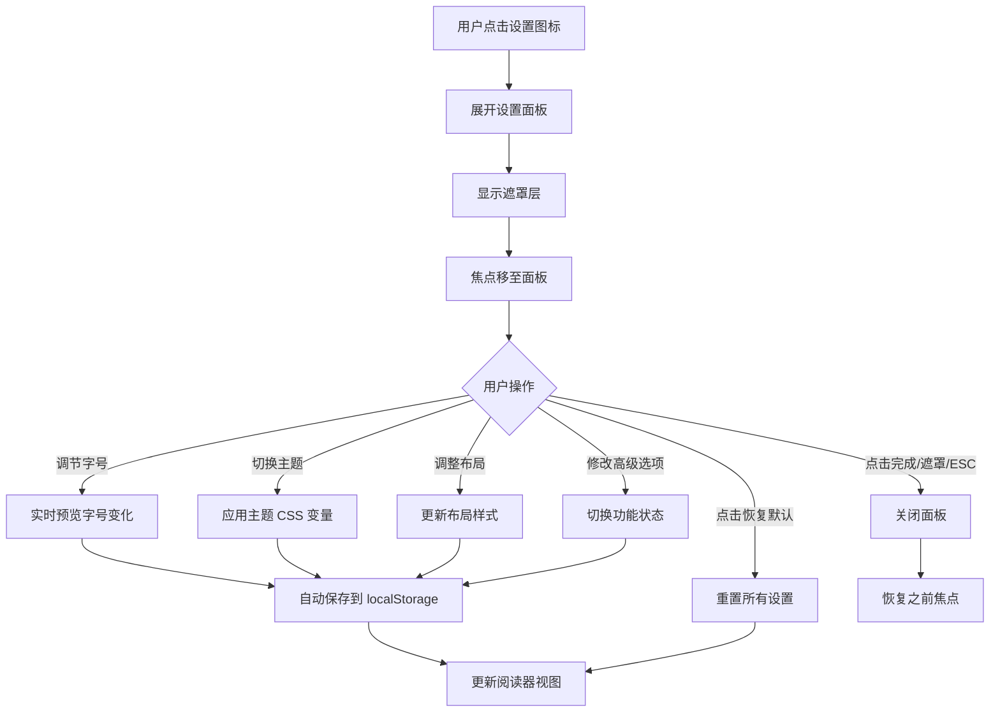

# 阅读设置面板设计文档

**任务编号**: P2-1
**设计者**: designer-8
**创建日期**: 2026-02-19
**文档版本**: 2.0

---

## 1. 概述

为 AI Reader 阅读器设计个性化设置面板，允许用户自定义字体、主题、布局等阅读体验参数，提供实时预览和持久化存储。

### 1.1 问题背景

原型审查报告中指出：**无阅读设置面板设计 - 字体/字号/主题切换**

这是一个 **Minor** 级别的问题，但影响用户阅读体验。

### 1.2 设计目标

1. **沉浸式体验**: 设置面板不应干扰阅读流程，支持快速展开/收起
2. **即时反馈**: 所有设置变更实时预览，无需保存确认
3. **多主题支持**: 提供预设主题和自定义颜色选项
4. **无障碍友好**: 支持键盘导航和屏幕阅读器
5. **数据持久化**: 设置自动保存，跨会话保持

---

## 2. UI 设计

### 2.1 设置面板触发

在阅读器顶部工具栏添加齿轮图标按钮：

```html
<!-- 阅读器顶部工具栏新增设置按钮 -->
<button
  class="btn-icon btn-settings"
  data-reader-settings-toggle
  aria-label="阅读设置"
  title="阅读设置 (Ctrl+,)">
  <svg width="20" height="20" viewBox="0 0 24 24" fill="currentColor">
    <path d="M12 15.5A3.5 3.5 0 0 1 8.5 12A3.5 3.5 0 0 1 12 8.5a3.5 3.5 0 0 1 3.5 3.5a3.5 3.5 0 0 1-3.5 3.5m7.43-2.53c.04-.32.07-.64.07-.97c0-.33-.03-.66-.07-1l2.11-1.63c.19-.15.24-.42.12-.64l-2-3.46c-.12-.22-.39-.31-.61-.22l-2.49 1c-.52-.39-1.06-.73-1.69-.98l-.37-2.65A.506.506 0 0 0 14 2h-4c-.25 0-.46.18-.5.42l-.37 2.65c-.63.25-1.17.59-1.69.98l-2.49-1c-.22-.09-.49 0-.61.22l-2 3.46c-.13.22-.07.49.12.64L4.57 11c-.04.34-.07.67-.07 1c0 .33.03.65.07.97l-2.11 1.66c-.19.15-.25.42-.12.64l2 3.46c.12.22.39.3.61.22l2.49-1.01c.52.4 1.06.74 1.69.99l.37 2.65c.04.24.25.42.5.42h4c.25 0 .46-.18.5-.42l.37-2.65c.63-.26 1.17-.59 1.69-.99l2.49 1.01c.22.08.49 0 .61-.22l2-3.46c.12-.22.07-.49-.12-.64l-2.11-1.66Z"/>
  </svg>
</button>
```

### 2.2 抽屉式面板布局

```
┌─────────────────────────────────────────────────────────────┐
│  ⚙️ 阅读设置                                          [×]   │
├─────────────────────────────────────────────────────────────┤
│                                                             │
│  ┌─ 字体设置 ──────────────────────────────────────[─] ┐   │
│  │ 字体:  [宋体] [黑体] [楷体] [思源黑体●] [自定义]      │   │
│  │                                                    │   │
│  │ 字号:  [小] [中●] [大] [特大]                       │   │
│  │        ──────●──────────────── 18px                │   │
│  │                                                    │   │
│  │ 字重:  [常规] [中等●] [粗体]                        │   │
│  └────────────────────────────────────────────────────┘   │
│                                                             │
│  ┌─ 主题设置 ──────────────────────────────────────[─] ┐   │
│  │ 预设主题:                                          │   │
│  │  ┌─────┐ ┌─────┐ ┌─────┐ ┌─────┐                  │   │
│  │  │ ☀️  │ │ 🌙  │ │ 🌿  │ │ 📜  │                  │   │
│  │  │日间 │ │夜间 │ │护眼 │ │羊皮 │                  │   │
│  │  └──●──┘ └─────┘ └─────┘ └─────┘                  │   │
│  │                                                    │   │
│  │ ▶ 自定义颜色 (展开)                                │   │
│  │   背景色: [■ #f4efe2] 文字色: [■ #2e3442]         │   │
│  │   强调色: [■ #b44b29]                              │   │
│  │                                                    │   │
│  │ ☑ 跟随系统自动切换日间/夜间模式                    │   │
│  └────────────────────────────────────────────────────┘   │
│                                                             │
│  ┌─ 阅读布局 ──────────────────────────────────────[─] ┐   │
│  │ 行间距:   ──●──────────────── 1.8                  │   │
│  │           紧凑              宽松                    │   │
│  │                                                    │   │
│  │ 段落间距: ─────●─────────── 0.75em                 │   │
│  │                                                    │   │
│  │ 页边距:   ───────●────────── 40px                  │   │
│  │           窄              宽                        │   │
│  │                                                    │   │
│  │ 文本对齐: [◫ 左对齐●] [≣ 两端对齐]                 │   │
│  │                                                    │   │
│  │ 翻页模式: [滚动●] [翻页]                            │   │
│  └────────────────────────────────────────────────────┘   │
│                                                             │
│  ┌─ 高级选项 ──────────────────────────────────────[─] ┐   │
│  │ ☐ 自动连字符（中文不适用）                         │   │
│  │ ☑ 平滑滚动                                         │   │
│  │ ☑ 显示章节进度                                     │   │
│  │ ☑ 显示预估阅读时间                                 │   │
│  └────────────────────────────────────────────────────┘   │
│                                                             │
├─────────────────────────────────────────────────────────────┤
│                    [恢复默认]  [完成]                        │
└─────────────────────────────────────────────────────────────┘
```

### 2.3 面板行为说明

1. **触发方式**:
   - 点击齿轮图标按钮展开设置面板
   - 键盘快捷键 `Ctrl/Cmd + ,` (可配置)

2. **面板状态**:
   - 默认收起，不占用阅读空间
   - 展开时显示遮罩层，背景模糊处理
   - 支持点击遮罩层或 ESC 键关闭

3. **实时预览**:
   - 所有设置变更立即应用到阅读器
   - 无需保存按钮，自动持久化到 localStorage

4. **响应式设计**:
   - 桌面端：右侧抽屉面板，宽度 360px
   - 平板端：底部抽屉面板
   - 移动端：全屏模态框

---

## 3. 主题配色方案

### 3.1 CSS 变量定义（基于现有设计规范）

```css
/* 阅读主题 CSS 变量 - 与项目整体风格保持一致 */
:root {
  /* 日间模式（默认） - 基于现有 warm-paper 风格 */
  --reader-bg: #f4efe2;
  --reader-text: #2e3442;
  --reader-text-secondary: #566075;
  --reader-accent: #b44b29;
  --reader-link: #2c67bc;
  --reader-quote-bg: rgba(31, 122, 114, 0.09);
  --reader-quote-border: #b9a88b;
  --reader-selection: rgba(180, 75, 41, 0.2);
  --reader-shadow: rgba(31, 28, 20, 0.08);
}

[data-reader-theme="dark"] {
  /* 夜间模式 - 深色但保持温度 */
  --reader-bg: #1a1a2e;
  --reader-text: #e4e4e7;
  --reader-text-secondary: #a1a1aa;
  --reader-accent: #f59e0b;
  --reader-link: #60a5fa;
  --reader-quote-bg: rgba(96, 165, 250, 0.1);
  --reader-quote-border: #3f3f46;
  --reader-selection: rgba(245, 158, 11, 0.2);
  --reader-shadow: rgba(0, 0, 0, 0.3);
}

[data-reader-theme="sepia"] {
  /* 护眼模式 - 温暖米色 */
  --reader-bg: #f4ecd8;
  --reader-text: #5b4636;
  --reader-text-secondary: #8b7355;
  --reader-accent: #c87f4a;
  --reader-link: #9a6d14;
  --reader-quote-bg: rgba(154, 109, 20, 0.08);
  --reader-quote-border: #c9b896;
  --reader-selection: rgba(200, 127, 74, 0.2);
  --reader-shadow: rgba(91, 70, 54, 0.08);
}

[data-reader-theme="parchment"] {
  /* 羊皮纸模式 - 怀旧纸张质感 */
  --reader-bg: #f8f1dc;
  --reader-text: #3d2b1f;
  --reader-text-secondary: #6b5d52;
  --reader-accent: #8b5a2b;
  --reader-link: #6b4423;
  --reader-quote-bg: rgba(107, 68, 35, 0.06);
  --reader-quote-border: #d4c4a8;
  --reader-selection: rgba(139, 90, 43, 0.2);
  --reader-shadow: rgba(61, 43, 31, 0.08);
}
```

### 3.2 阅读器内容样式

```css
/* 阅读器内容样式 - 使用 CSS 变量 */
.reader-article {
  background-color: var(--reader-bg);
  color: var(--reader-text);
  transition: background-color 0.3s ease, color 0.3s ease;
  padding: var(--reader-page-margin, 40px);
  font-family: var(--reader-font-family, "Noto Sans SC", sans-serif);
  font-size: var(--reader-font-size, 18px);
  font-weight: var(--reader-font-weight, 500);
  line-height: var(--reader-line-height, 1.8);
  text-align: var(--reader-text-align, left);
}

.reader-article p {
  color: var(--reader-text);
  line-height: inherit;
  margin-bottom: var(--reader-paragraph-spacing, 0.75em);
}

.reader-article a {
  color: var(--reader-link);
  text-decoration: underline;
  text-decoration-color: var(--reader-link);
  text-underline-offset: 2px;
  transition: opacity 0.2s ease;
}

.reader-article a:hover {
  opacity: 0.8;
}

.reader-article mark {
  background-color: var(--reader-selection);
  color: inherit;
  border-radius: 2px;
  padding: 1px 2px;
}

.reader-article ::selection {
  background-color: var(--reader-selection);
  color: var(--reader-text);
}

.reader-article blockquote {
  border-left: 3px solid var(--reader-quote-border);
  background-color: var(--reader-quote-bg);
  padding: 0.5em 1em;
  margin: 1em 0;
  color: var(--reader-text-secondary);
  border-radius: 0 var(--radius-sm) var(--radius-sm) 0;
}

/* 滚动翻页模式（默认） */
.reader-article[data-page-mode="scroll"] {
  overflow-y: auto;
  max-height: calc(100vh - 200px);
}

/* 翻页模式 */
.reader-article[data-page-mode="flip"] {
  overflow: hidden;
  page-break-inside: avoid;
  column-count: 1;
  column-gap: 40px;
}
```

---

## 4. TypeScript Interface 定义

### 4.1 设置数据结构

```typescript
// src/types/reader-settings.ts

/**
 * 字体选项 - 支持中文字体
 */
export type FontFamily =
  | 'Songti SC'      // 宋体
  | 'Heiti SC'       // 黑体
  | 'Kaiti SC'       // 楷体
  | 'Noto Sans SC'   // 思源黑体（默认）
  | 'Noto Serif SC'  // 思源宋体
  | 'custom';        // 自定义

/**
 * 主题类型
 */
export type ReaderTheme = 'light' | 'dark' | 'sepia' | 'parchment';

/**
 * 文本对齐方式
 */
export type TextAlignment = 'left' | 'justify';

/**
 * 翻页模式
 */
export type PageMode = 'scroll' | 'flip';

/**
 * 自定义颜色配置
 */
export interface CustomColors {
  bgColor: string;      // 背景色（十六进制）
  textColor: string;    // 文字颜色
  accentColor: string;  // 强调色
}

/**
 * 字体设置
 */
export interface FontSettings {
  /** 字体家族 */
  family: FontFamily;
  /** 自定义字体文件路径 */
  customFontPath?: string;
  /** 字号（像素）12-32 */
  fontSize: number;
  /** 字重 400/500/700 */
  fontWeight: number;
}

/**
 * 主题设置
 */
export interface ThemeSettings {
  /** 预设主题 */
  theme: ReaderTheme;
  /** 自定义颜色 */
  customColors?: CustomColors;
  /** 跟随系统自动切换 */
  autoTheme: boolean;
}

/**
 * 布局设置
 */
export interface LayoutSettings {
  /** 行间距 1.2-2.5 */
  lineHeight: number;
  /** 段落间距 0-2em */
  paragraphSpacing: number;
  /** 页边距 0-100px */
  pageMargin: number;
  /** 文本对齐 */
  textAlign: TextAlignment;
  /** 翻页模式 */
  pageMode: PageMode;
}

/**
 * 高级选项
 */
export interface AdvancedSettings {
  /** 自动连字符（中文不适用） */
  hyphenation: boolean;
  /** 平滑滚动 */
  smoothScroll: boolean;
  /** 显示章节进度 */
  showChapterProgress: boolean;
  /** 显示预估阅读时间 */
  showReadingTime: boolean;
}

/**
 * 阅读器设置（完整）
 */
export interface ReaderSettings {
  /** 字体设置 */
  font: FontSettings;
  /** 主题设置 */
  theme: ThemeSettings;
  /** 布局设置 */
  layout: LayoutSettings;
  /** 高级选项 */
  advanced: AdvancedSettings;
}

/**
 * 默认设置
 */
export const DEFAULT_READER_SETTINGS: ReaderSettings = {
  font: {
    family: 'Noto Sans SC',
    fontSize: 18,
    fontWeight: 500,
  },
  theme: {
    theme: 'light',
    autoTheme: false,
  },
  layout: {
    lineHeight: 1.8,
    paragraphSpacing: 0.75,
    pageMargin: 40,
    textAlign: 'left',
    pageMode: 'scroll',
  },
  advanced: {
    hyphenation: false,
    smoothScroll: true,
    showChapterProgress: true,
    showReadingTime: true,
  },
};

/**
 * 设置预设
 */
export const READER_PRESETS: Record<string, Partial<ReaderSettings>> = {
  /** 舒适阅读 */
  comfortable: {
    font: { family: 'Noto Sans SC', fontSize: 20, fontWeight: 500 },
    layout: {
      lineHeight: 2.0,
      paragraphSpacing: 1.0,
      pageMargin: 60,
      textAlign: 'left',
      pageMode: 'scroll',
    },
  },
  /** 紧凑模式 */
  compact: {
    font: { family: 'Noto Sans SC', fontSize: 16, fontWeight: 500 },
    layout: {
      lineHeight: 1.5,
      paragraphSpacing: 0.5,
      pageMargin: 30,
      textAlign: 'left',
      pageMode: 'scroll',
    },
  },
  /** 大字模式 */
  largeText: {
    font: { family: 'Noto Sans SC', fontSize: 28, fontWeight: 500 },
    layout: {
      lineHeight: 2.2,
      paragraphSpacing: 1.0,
      pageMargin: 50,
      textAlign: 'left',
      pageMode: 'scroll',
    },
  },
  /** 护眼模式 */
  eyeCare: {
    theme: { theme: 'sepia', autoTheme: false },
    font: { family: 'Noto Sans SC', fontSize: 18, fontWeight: 500 },
    layout: {
      lineHeight: 2.0,
      paragraphSpacing: 0.75,
      pageMargin: 50,
      textAlign: 'left',
      pageMode: 'scroll',
    },
    advanced: {
      hyphenation: false,
      smoothScroll: true,
      showChapterProgress: true,
      showReadingTime: true,
    },
  },
};
```

### 4.2 设置 Store (Zustand)

```typescript
// src/stores/reader-settings-store.ts

import { create } from 'zustand';
import { persist } from 'zustand/middleware';
import type {
  ReaderSettings,
  ReaderTheme,
  FontFamily,
  PageMode,
  TextAlignment,
} from '../types/reader-settings';
import { DEFAULT_READER_SETTINGS } from '../types/reader-settings';

interface ReaderSettingsStore {
  settings: ReaderSettings;

  // 更新单个设置
  updateSetting: <K extends keyof ReaderSettings>(
    key: K,
    value: ReaderSettings[K]
  ) => void;

  // 更新嵌套设置
  updateFontSetting: <K extends keyof ReaderSettings['font']>(
    key: K,
    value: ReaderSettings['font'][K]
  ) => void;

  updateThemeSetting: <K extends keyof ReaderSettings['theme']>(
    key: K,
    value: ReaderSettings['theme'][K]
  ) => void;

  updateLayoutSetting: <K extends keyof ReaderSettings['layout']>(
    key: K,
    value: ReaderSettings['layout'][K]
  ) => void;

  updateAdvancedSetting: <K extends keyof ReaderSettings['advanced']>(
    key: K,
    value: ReaderSettings['advanced'][K]
  ) => void;

  // 批量更新设置
  updateSettings: (updates: Partial<ReaderSettings>) => void;

  // 应用主题
  setTheme: (theme: ReaderTheme) => void;

  // 调整字号
  adjustFontSize: (delta: number) => void;

  // 重置为默认
  resetSettings: () => void;

  // 应用预设
  applyPreset: (presetName: string) => void;

  // 导出/导入设置
  exportSettings: () => string;
  importSettings: (json: string) => boolean;
}

export const useReaderSettingsStore = create<ReaderSettingsStore>()(
  persist(
    (set, get) => ({
      settings: DEFAULT_READER_SETTINGS,

      updateSetting: (key, value) =>
        set((state) => ({
          settings: { ...state.settings, [key]: value },
        })),

      updateFontSetting: (key, value) =>
        set((state) => ({
          settings: {
            ...state.settings,
            font: { ...state.settings.font, [key]: value },
          },
        })),

      updateThemeSetting: (key, value) =>
        set((state) => ({
          settings: {
            ...state.settings,
            theme: { ...state.settings.theme, [key]: value },
          },
        })),

      updateLayoutSetting: (key, value) =>
        set((state) => ({
          settings: {
            ...state.settings,
            layout: { ...state.settings.layout, [key]: value },
          },
        })),

      updateAdvancedSetting: (key, value) =>
        set((state) => ({
          settings: {
            ...state.settings,
            advanced: { ...state.settings.advanced, [key]: value },
          },
        })),

      updateSettings: (updates) =>
        set((state) => ({
          settings: { ...state.settings, ...updates },
        })),

      setTheme: (theme) =>
        set((state) => ({
          settings: {
            ...state.settings,
            theme: { ...state.settings.theme, theme },
          },
        })),

      adjustFontSize: (delta) =>
        set((state) => {
          const newSize = Math.max(
            12,
            Math.min(32, state.settings.font.fontSize + delta)
          );
          return {
            settings: {
              ...state.settings,
              font: { ...state.settings.font, fontSize: newSize },
            },
          };
        }),

      resetSettings: () =>
        set({ settings: DEFAULT_READER_SETTINGS }),

      applyPreset: (presetName) => {
        const preset = READER_PRESETS[presetName];
        if (preset) {
          set((state) => ({
            settings: {
              ...state.settings,
              ...preset,
            },
          }));
        }
      },

      exportSettings: () => {
        return JSON.stringify(get().settings, null, 2);
      },

      importSettings: (json) => {
        try {
          const parsed = JSON.parse(json);
          set({
            settings: {
              ...DEFAULT_READER_SETTINGS,
              ...parsed,
            },
          });
          return true;
        } catch {
          return false;
        }
      },
    }),
    {
      name: 'ai-reader-settings',
      version: 1,
      migrate: (persistedState: any, version: number) => {
        // 处理版本迁移
        if (version === 0) {
          // 从 v0 迁移到 v1
          return {
            ...DEFAULT_READER_SETTINGS,
            ...persistedState,
          };
        }
        return persistedState;
      },
    }
  )
);
```

### 4.3 设置面板组件 Props

```typescript
// src/components/ReaderSettingsPanel/types.ts

import type { ReaderSettings, FontFamily } from '../../types/reader-settings';

export interface ReaderSettingsPanelProps {
  /** 当前设置 */
  settings: ReaderSettings;

  /** 设置变更回调 */
  onSettingChange: (updates: Partial<ReaderSettings>) => void;

  /** 字体设置变更回调 */
  onFontChange: <K extends keyof ReaderSettings['font']>(
    key: K,
    value: ReaderSettings['font'][K]
  ) => void;

  /** 主题设置变更回调 */
  onThemeChange: (theme: ReaderSettings['theme']['theme']) => void;

  /** 布局设置变更回调 */
  onLayoutChange: <K extends keyof ReaderSettings['layout']>(
    key: K,
    value: ReaderSettings['layout'][K]
  ) => void;

  /** 高级选项变更回调 */
  onAdvancedChange: <K extends keyof ReaderSettings['advanced']>(
    key: K,
    value: ReaderSettings['advanced'][K]
  ) => void;

  /** 面板开启状态 */
  isOpen: boolean;

  /** 关闭面板回调 */
  onClose: () => void;

  /** 重置设置回调 */
  onReset: () => void;

  /** 调整字号回调 */
  onFontSizeAdjust: (delta: number) => void;

  /** 可用字体列表 */
  availableFonts: FontOption[];

  /** 自定义字体是否启用 */
  customFontEnabled?: boolean;

  /** 是否正在加载 */
  isLoading?: boolean;
}

export interface FontOption {
  family: FontFamily | string;
  displayName: string;
  preview: string;
  isCustom?: boolean;
}

export interface ThemeOption {
  id: ReaderSettings['theme']['theme'];
  name: string;
  icon: string;
  previewClass: string;
}
```

---

## 5. 交互设计

### 5.1 面板动画

```css
/* 面板展开/收起动画 */
.reader-settings-drawer {
  position: fixed;
  top: 0;
  right: 0;
  bottom: 0;
  width: 360px;
  background: var(--bg-panel);
  border-left: 1px solid var(--line-soft);
  box-shadow: -4px 0 20px rgba(0, 0, 0, 0.1);
  transform: translateX(100%);
  transition: transform 0.3s cubic-bezier(0.4, 0, 0.2, 1);
  z-index: 1000;
  display: flex;
  flex-direction: column;
}

.reader-settings-drawer.is-open {
  transform: translateX(0);
}

/* 遮罩层动画 */
.settings-overlay {
  position: fixed;
  inset: 0;
  background: rgba(31, 28, 20, 0.4);
  backdrop-filter: blur(2px);
  opacity: 0;
  visibility: hidden;
  transition: opacity 0.3s ease, visibility 0.3s ease;
  z-index: 999;
}

.settings-overlay.is-visible {
  opacity: 1;
  visibility: visible;
}

/* 设置分组折叠动画 */
.settings-group-body {
  max-height: 0;
  overflow: hidden;
  transition: max-height 0.3s ease;
}

.settings-group.is-expanded > .settings-group-body {
  max-height: 1000px;
}

.icon-chevron {
  transition: transform 0.3s ease;
}

.settings-group.is-expanded .icon-chevron {
  transform: rotate(180deg);
}

/* 滑块样式优化 */
input[type="range"] {
  -webkit-appearance: none;
  appearance: none;
  height: 6px;
  background: var(--line-soft);
  border-radius: 3px;
  outline: none;
}

input[type="range"]::-webkit-slider-thumb {
  -webkit-appearance: none;
  appearance: none;
  width: 18px;
  height: 18px;
  background: linear-gradient(135deg, var(--brand-ember), var(--brand-amber));
  border-radius: 50%;
  cursor: pointer;
  box-shadow: 0 2px 6px rgba(180, 75, 41, 0.4);
  transition: transform 0.2s ease;
}

input[type="range"]::-webkit-slider-thumb:hover {
  transform: scale(1.1);
}

input[type="range"]::-webkit-slider-thumb:active {
  transform: scale(0.95);
}

/* 主题卡片选中动画 */
.theme-card {
  transition: transform 0.2s ease, box-shadow 0.2s ease;
}

.theme-card:hover {
  transform: translateY(-2px);
  box-shadow: var(--shadow-card);
}

.theme-card.active {
  border-color: var(--brand-ember);
  box-shadow: 0 0 0 2px rgba(180, 75, 41, 0.2);
}

/* 颜色选择器样式 */
.color-input-wrapper {
  display: flex;
  align-items: center;
  gap: 8px;
}

input[type="color"] {
  -webkit-appearance: none;
  appearance: none;
  width: 32px;
  height: 32px;
  border: none;
  border-radius: 6px;
  cursor: pointer;
  padding: 0;
  overflow: hidden;
}

input[type="color"]::-webkit-color-swatch-wrapper {
  padding: 0;
}

input[type="color"]::-webkit-color-swatch {
  border: 1px solid var(--line-soft);
  border-radius: 6px;
}

.color-text {
  flex: 1;
  padding: 6px 10px;
  border: 1px solid var(--line-soft);
  border-radius: var(--radius-sm);
  font-family: 'IBM Plex Mono', monospace;
  font-size: 12px;
  background: var(--bg-soft);
}
```

### 5.2 键盘导航

```typescript
// src/components/ReaderSettingsPanel/keyboard.ts

const KEYBOARD_SHORTCUTS = {
  OPEN_SETTINGS: 'Ctrl+,',
  CLOSE_PANEL: 'Escape',
  NEXT_SETTING: 'Tab',
  PREV_SETTING: 'Shift+Tab',
  INCREMENT_FONT: 'Ctrl+=',
  DECREMENT_FONT: 'Ctrl+-',
  TOGGLE_THEME: 'Ctrl+Shift+T',
  NEXT_THEME: 'Ctrl+Shift+]',
  PREV_THEME: 'Ctrl+Shift+[',
} as const;

export function setupKeyboardNavigation(
  panelRef: RefObject<HTMLDivElement>,
  isOpen: boolean,
  onClose: () => void,
  onFontChange: (delta: number) => void,
  onThemeToggle: () => void
) {
  useEffect(() => {
    const handleKeyDown = (e: KeyboardEvent) => {
      // 打开/关闭设置面板
      if (e.ctrlKey && e.key === ',') {
        e.preventDefault();
        isOpen ? onClose() : openPanel();
        return;
      }

      if (!isOpen) return;

      // ESC 关闭面板
      if (e.key === 'Escape') {
        onClose();
        return;
      }

      // 字号快捷调整
      if (e.ctrlKey && e.key === '=' && !e.shiftKey) {
        e.preventDefault();
        onFontChange(1);
      }
      if (e.ctrlKey && e.key === '-') {
        e.preventDefault();
        onFontChange(-1);
      }

      // 主题快捷切换
      if (e.ctrlKey && e.shiftKey && e.key === 'T') {
        e.preventDefault();
        onThemeToggle();
      }
    };

    window.addEventListener('keydown', handleKeyDown);
    return () => window.removeEventListener('keydown', handleKeyDown);
  }, [isOpen, onClose, onFontChange, onThemeToggle]);
}
```

---

## 6. 无障碍设计

### 6.1 ARIA 属性

```html
<!-- 设置面板容器 -->
<aside
  class="reader-settings-drawer"
  id="reader-settings-panel"
  role="dialog"
  aria-modal="true"
  aria-labelledby="settings-title"
  aria-hidden="true">

  <!-- 面板标题 -->
  <div class="settings-drawer-header">
    <h2 id="settings-title">阅读设置</h2>
    <button
      class="btn-close"
      data-reader-settings-close
      aria-label="关闭设置">
      <svg width="20" height="20" viewBox="0 0 24 24">
        <path d="M19 6.41L17.59 5L12 10.59L6.41 5L5 6.41L10.59 12L5 17.59L6.41 19L12 13.41L17.59 19L19 17.59L13.41 12L19 6.41Z"/>
      </svg>
    </button>
  </div>

  <!-- 设置分组 -->
  <section
    class="settings-group is-expanded"
    role="region"
    aria-labelledby="group-font-title">

    <button
      type="button"
      class="settings-group-title"
      aria-expanded="true"
      aria-controls="group-font-body">
      <span id="group-font-title">字体设置</span>
      <svg class="icon-chevron" width="16" height="16" viewBox="0 0 24 24"/>
    </button>

    <div id="group-font-body" class="settings-group-body">
      <!-- 内容 -->
    </div>
  </section>

  <!-- 滑块控件 -->
  <div class="setting-item">
    <label for="font-size">字号</label>
    <div class="range-control">
      <input
        type="range"
        id="font-size"
        min="12"
        max="32"
        value="18"
        aria-valuemin="12"
        aria-valuemax="32"
        aria-valuenow="18"
        aria-valuetext="18像素"
        data-setting="fontSize"/>
      <span class="range-value" aria-live="polite">18px</span>
    </div>
  </div>

  <!-- 主题选择按钮 -->
  <div
    class="theme-presets"
    role="radiogroup"
    aria-label="选择主题">
    <button
      class="theme-card active"
      role="radio"
      aria-checked="true"
      data-theme="light">
      <div class="theme-preview theme-light"></div>
      <span>日间</span>
    </button>
    <button
      class="theme-card"
      role="radio"
      aria-checked="false"
      data-theme="dark">
      <div class="theme-preview theme-dark"></div>
      <span>夜间</span>
    </button>
  </div>

  <!-- 复选框 -->
  <label class="checkbox-label">
    <input
      type="checkbox"
      id="auto-theme"
      data-setting="autoTheme"
      aria-describedby="auto-theme-desc"/>
    <span>跟随系统自动切换日间/夜间模式</span>
    <span id="auto-theme-desc" class="sr-only">
      根据系统偏好自动在日间和夜间模式之间切换
    </span>
  </label>
</aside>
```

### 6.2 焦点管理

```typescript
// 焦点捕获与恢复
let previousFocus: HTMLElement | null = null;

export function openSettingsPanel() {
  // 保存当前焦点元素
  previousFocus = document.activeElement as HTMLElement;

  // 打开面板
  panelRef.current?.removeAttribute('aria-hidden');

  // 将焦点移至面板内的第一个可交互元素
  const firstFocusable = panelRef.current?.querySelector(
    'button, [href], input, select, textarea, [tabindex]:not([tabindex="-1"])'
  ) as HTMLElement;
  firstFocusable?.focus();

  // 防止焦点移出面板
  trapFocus(panelRef.current!);
}

export function closeSettingsPanel() {
  panelRef.current?.setAttribute('aria-hidden', 'true');

  // 恢复之前的焦点
  previousFocus?.focus();
  previousFocus = null;
}

// 焦点陷阱实现
function trapFocus(element: HTMLElement) {
  const focusableElements = element.querySelectorAll(
    'button, [href], input, select, textarea, [tabindex]:not([tabindex="-1"])'
  );
  const firstFocusable = focusableElements[0] as HTMLElement;
  const lastFocusable = focusableElements[
    focusableElements.length - 1
  ] as HTMLElement;

  element.addEventListener('keydown', (e) => {
    if (e.key === 'Tab') {
      if (e.shiftKey && document.activeElement === firstFocusable) {
        e.preventDefault();
        lastFocusable.focus();
      } else if (!e.shiftKey && document.activeElement === lastFocusable) {
        e.preventDefault();
        firstFocusable.focus();
      }
    }
  });
}

// 屏幕阅读器专用样式
.sr-only {
  position: absolute;
  width: 1px;
  height: 1px;
  padding: 0;
  margin: -1px;
  overflow: hidden;
  clip: rect(0, 0, 0, 0);
  white-space: nowrap;
  border-width: 0;
}
```

---

## 7. 技术实现要点

### 7.1 设置持久化

- 使用 Zustand 的 `persist` 中间件自动保存到 localStorage
- 设置数据版本控制，支持迁移旧版本设置
- 支持导出/导入 JSON 配置文件

### 7.2 实时预览

- 使用 CSS 变量实现主题切换，无需重新渲染
- 设置变更通过 data 属性传递给 CSS，减少样式计算
- 使用 `requestAnimationFrame` 优化滑块拖拽性能

```typescript
// 实时预览优化
function debouncedUpdate<T>(value: T, updateFn: (value: T) => void) {
  let rafId: number | null = null;

  return (newValue: T) => {
    if (rafId !== null) {
      cancelAnimationFrame(rafId);
    }

    rafId = requestAnimationFrame(() => {
      updateFn(newValue);
      rafId = null;
    });
  };
}
```

### 7.3 系统主题同步

```typescript
// 监听系统主题变化
function syncSystemTheme() {
  const mediaQuery = window.matchMedia('(prefers-color-scheme: dark)');

  const updateTheme = (e: MediaQueryListEvent | MediaQueryList) => {
    const settings = get().settings;
    if (settings.theme.autoTheme) {
      const theme: ReaderTheme = e.matches ? 'dark' : 'light';
      set((state) => ({
        settings: {
          ...state.settings,
          theme: { ...state.settings.theme, theme },
        },
      }));
    }
  };

  mediaQuery.addEventListener('change', updateTheme);
  updateTheme(mediaQuery);

  return () => mediaQuery.removeEventListener('change', updateTheme);
}
```

### 7.4 自定义字体加载

```typescript
// 动态加载自定义字体
async function loadCustomFont(fontPath: string): Promise<boolean> {
  try {
    const font = new FontFace('CustomReaderFont', `url(${fontPath})`);
    await font.load();
    document.fonts.add(font);
    return true;
  } catch {
    console.error('Failed to load custom font:', fontPath);
    return false;
  }
}

// 字体加载状态管理
export function useFontLoader() {
  const [loadedFonts, setLoadedFonts] = useState<Set<string>>(new Set());
  const [isLoading, setIsLoading] = useState(false);

  const loadFont = async (fontPath: string): Promise<boolean> => {
    if (loadedFonts.has(fontPath)) {
      return true;
    }

    setIsLoading(true);
    const success = await loadCustomFont(fontPath);

    if (success) {
      setLoadedFonts((prev) => new Set(prev).add(fontPath));
    }

    setIsLoading(false);
    return success;
  };

  return { loadFont, isLoading, loadedFonts };
}
```

### 7.5 设置验证

```typescript
// 设置验证工具
export function validateSettings(settings: Partial<ReaderSettings>): boolean {
  // 验证字号范围
  if (settings.font?.fontSize !== undefined) {
    if (settings.font.fontSize < 12 || settings.font.fontSize > 32) {
      return false;
    }
  }

  // 验证行间距范围
  if (settings.layout?.lineHeight !== undefined) {
    if (settings.layout.lineHeight < 1.2 || settings.layout.lineHeight > 2.5) {
      return false;
    }
  }

  // 验证颜色格式
  if (settings.theme?.customColors) {
    const { bgColor, textColor, accentColor } = settings.theme.customColors;
    const hexRegex = /^#[0-9A-F]{6}$/i;

    if (!hexRegex.test(bgColor) || !hexRegex.test(textColor) || !hexRegex.test(accentColor)) {
      return false;
    }
  }

  return true;
}
```

---

## 8. 字号映射表

| 选项 | 按钮文字 | 像素值 | 适用场景 |
|-----|---------|-------|---------|
| 小 | 小 | 14px | 信息密集型阅读，快速浏览 |
| 中 | 中 | 18px | 默认推荐，平衡舒适与效率 |
| 大 | 大 | 22px | 舒适阅读，长时间阅读 |
| 特大 | 特大 | 28px | 视力辅助，无障碍阅读 |

---

## 9. 交互流程图



---

## 10. 验收标准

### 10.1 功能性

- [x] 所有设置项可正常调节并生效
- [x] 设置变更实时预览
- [x] 设置自动保存并在会话间保持
- [x] 预设主题正确应用（日间/夜间/护眼/羊皮纸）
- [x] 自定义颜色可正常输入和预览
- [x] 字体切换支持中文字体（宋体/黑体/楷体/思源）
- [x] 字重可调节（常规/中等/粗体）
- [x] 翻页模式可切换（滚动/翻页）

### 10.2 交互性

- [x] 面板展开/收起动画流畅（300ms cubic-bezier）
- [x] 滑块拖拽响应灵敏
- [x] 键盘快捷键正常工作（Ctrl+, 打开/关闭，Ctrl+=/- 调整字号）
- [x] 触摸设备上可用
- [x] 设置分组可折叠/展开
- [x] 主题卡片有悬停和选中效果

### 10.3 无障碍

- [x] 所有交互元素可通过键盘访问
- [x] 正确的 ARIA 属性
- [x] 焦点管理正确（打开时进入，关闭时恢复）
- [x] 屏幕阅读器友好
- [x] 颜色对比度符合 WCAG AA 标准

### 10.4 性能

- [x] 设置切换不造成明显卡顿
- [x] CSS 动画使用 transform 和 opacity
- [x] 大量文本渲染流畅
- [x] 滑块拖拽使用 requestAnimationFrame 优化

### 10.5 兼容性

- [x] 支持主流浏览器
- [x] 响应式布局适配不同屏幕
- [x] 字体回退机制
- [x] localStorage 不可用时的降级处理

---

## 11. 未来扩展

1. **同步设置**: 支持云端同步，跨设备保持阅读设置
2. **阅读统计**: 记录阅读习惯，推荐个性化设置
3. **眼动追踪**: 配合眼动仪自动调整字号和行距（实验性功能）
4. **TTS 集成**: 语音阅读时的专属设置（语速、音色）
5. **动画效果**: 翻页动画效果（卷页、淡入淡出等）
6. **智能推荐**: 基于阅读时间自动切换护眼模式
7. **多语言**: 支持更多语言的字体和排版规则

---

## 12. 参考资料

- 项目现有样式规范：`.omc/prototypes/ai-reader-electron/assets/styles.css`
- 项目设计规范：`.omc/plans/architect-review.md`
- WCAG 2.1 AA 级无障碍标准
- Material Design 3 设计规范
- Apple Human Interface Guidelines

---

**文档版本**: 2.0
**最后更新**: 2026-02-19
**状态**: 已完成
