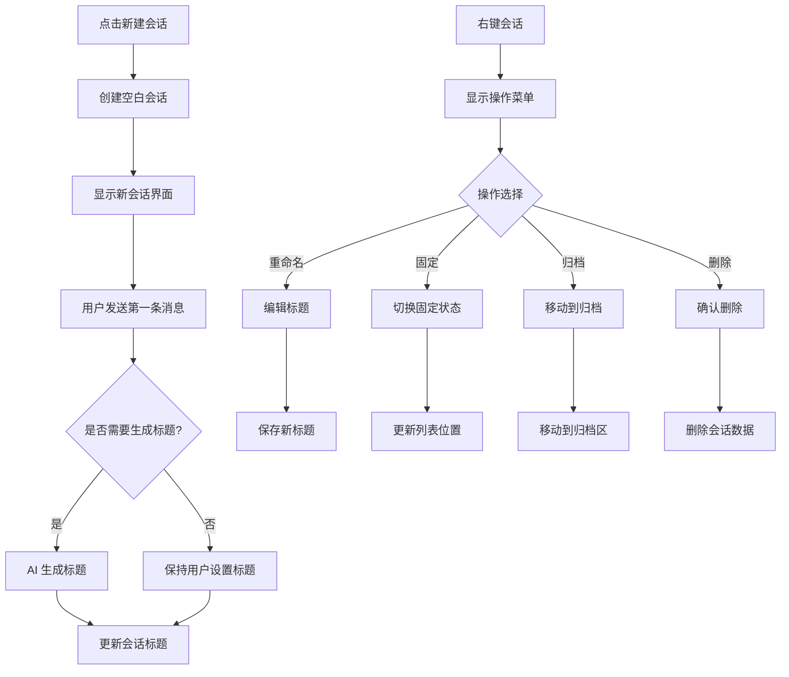

# P2-2: AI会话管理设计

## 问题背景

原型审查报告中指出：**无会话管理设计 - 会话列表、命名、删除**

这是一个 **Minor** 级别的问题，但影响用户管理多个对话的能力。

---

## 设计方案

### 1. 会话列表面板

```
┌─────────────────────────────────────────────────────────────┐
│  🤖 AI 问答                                         [+ 新建] │
├─────────────────────────────────────────────────────────────┤
│  🔍 搜索会话...                                              │
├─────────────────────────────────────────────────────────────┤
│                                                             │
│  📌 固定会话                                                 │
│  ┌─────────────────────────────────────────────────────┐   │
│  │ 💬 三体文明相关讨论                       📌 ⋮        │   │
│  │ 最后更新: 2 小时前                                  │   │
│  │ 📚 三体 | 12 条消息                                 │   │
│  └─────────────────────────────────────────────────────┘   │
│                                                             │
│  📅 今天                                                     │
│  ┌─────────────────────────────────────────────────────┐   │
│  │ 💬 叶文洁人物分析                         ⋮          │   │
│  │ 最后更新: 30 分钟前                                 │   │
│  │ 📚 三体 | 8 条消息                                  │   │
│  └─────────────────────────────────────────────────────┘   │
│                                                             │
│  📅 昨天                                                     │
│  ┌─────────────────────────────────────────────────────┐   │
│  │ 💬 章节摘要 - 红岸基地                    ⋮          │   │
│  │ 最后更新: 昨天 15:30                                │   │
│  │ 📚 三体 | 5 条消息                                  │   │
│  └─────────────────────────────────────────────────────┘   │
│  ┌─────────────────────────────────────────────────────┐   │
│  │ 💬 未命名会话                            ⋮          │   │
│  │ 最后更新: 昨天 10:15                                │   │
│  │ 📚 三体 | 3 条消息                                  │   │
│  └─────────────────────────────────────────────────────┘   │
│                                                             │
│  📁 已归档                                                   │
│  ┌─────────────────────────────────────────────────────┐   │
│  │ 📦 旧书讨论 (3 个会话)                    [展开]     │   │
│  └─────────────────────────────────────────────────────┘   │
│                                                             │
└─────────────────────────────────────────────────────────────┘
```

### 2. 会话操作菜单

```
┌─────────────────┐
│ ✏️ 重命名       │
│ 📌 固定/取消固定 │
│ 📦 归档         │
│ 📤 导出         │
│ ─────────────── │
│ 🗑️ 删除        │
└─────────────────┘
```

### 3. 数据模型

```typescript
/**
 * AI 会话
 */
interface AISession {
  /** 会话唯一标识 */
  id: string;
  
  /** 会话标题（用户设置或 AI 生成） */
  title: string;
  
  /** 关联的书籍 ID */
  bookId?: string;
  
  /** 关联的章节范围 */
  chapterScope?: {
    startChapterId?: string;
    endChapterId?: string;
  };
  
  /** 是否固定 */
  isPinned: boolean;
  
  /** 是否归档 */
  isArchived: boolean;
  
  /** 对话消息列表 */
  messages: AIMessage[];
  
  /** 会话摘要（AI 生成） */
  summary?: string;
  
  /** 创建时间 */
  createdAt: string;
  
  /** 更新时间 */
  updatedAt: string;
}

/**
 * AI 消息
 */
interface AIMessage {
  id: string;
  role: 'user' | 'assistant';
  content: string;
  timestamp: string;
  
  /** 关联的引用（如有） */
  references?: {
    chapterId: string;
    paragraphId?: string;
    text: string;
  }[];
}

/**
 * 会话创建参数
 */
interface CreateSessionParams {
  bookId?: string;
  initialMessage?: string;
  title?: string;
}

/**
 * 会话导出格式
 */
type SessionExportFormat = 'markdown' | 'json' | 'txt';
```

### 4. 交互流程



### 5. 标题自动生成

```typescript
/**
 * 根据首条消息生成会话标题
 */
const generateSessionTitle = async (firstMessage: string): Promise<string> => {
  // 1. 截取前 20 个字符作为备选
  const truncated = firstMessage.slice(0, 20);
  
  // 2. 或者调用 AI 生成更合适的标题
  const aiGenerated = await generateTitleWithAI(firstMessage);
  
  return aiGenerated || truncated + '...';
};
```

### 6. 会话存储

```typescript
/**
 * 会话存储结构
 */
interface SessionStorage {
  sessions: AISession[];
  activeSessionId: string | null;
}

/**
 * 存储键名
 */
const STORAGE_KEY = 'ai-reader-sessions';

/**
 * 加载所有会话
 */
const loadSessions = (): SessionStorage => {
  const data = localStorage.getItem(STORAGE_KEY);
  return data ? JSON.parse(data) : { sessions: [], activeSessionId: null };
};

/**
 * 保存会话
 */
const saveSession = (session: AISession) => {
  const storage = loadSessions();
  const index = storage.sessions.findIndex(s => s.id === session.id);
  
  if (index >= 0) {
    storage.sessions[index] = session;
  } else {
    storage.sessions.push(session);
  }
  
  localStorage.setItem(STORAGE_KEY, JSON.stringify(storage));
};

/**
 * 删除会话
 */
const deleteSession = (sessionId: string) => {
  const storage = loadSessions();
  storage.sessions = storage.sessions.filter(s => s.id !== sessionId);
  localStorage.setItem(STORAGE_KEY, JSON.stringify(storage));
};
```

### 7. 导出功能

```typescript
/**
 * 导出会话为 Markdown
 */
const exportAsMarkdown = (session: AISession): string => {
  let md = `# ${session.title}\n\n`;
  md += `> 创建于: ${session.createdAt}\n\n`;
  md += `---\n\n`;
  
  for (const msg of session.messages) {
    const role = msg.role === 'user' ? '**用户**' : '**AI**';
    md += `${role}: ${msg.content}\n\n`;
  }
  
  return md;
};
```

---

## 验收标准

- [ ] 会话列表正常显示
- [ ] 可新建会话
- [ ] 可重命名会话
- [ ] 可固定/取消固定会话
- [ ] 可归档/恢复会话
- [ ] 可删除会话
- [ ] 会话标题可自动生成
- [ ] 可导出会话内容
