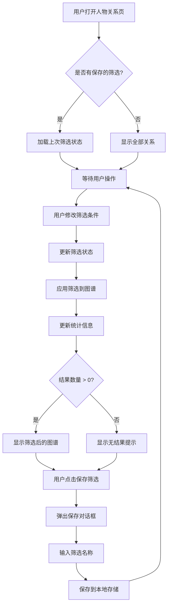
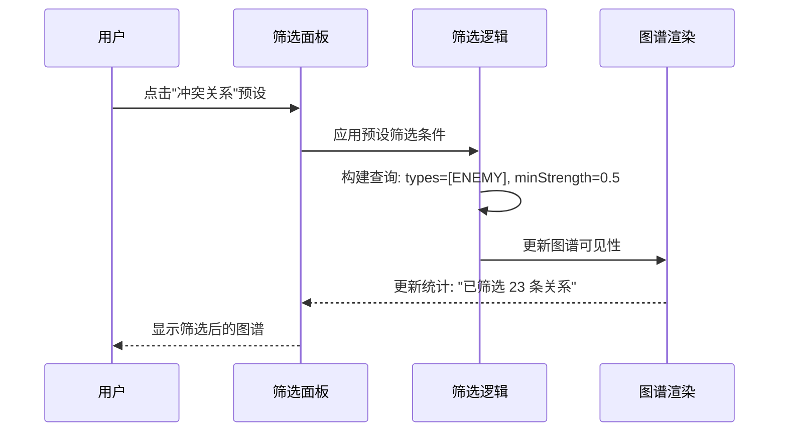

# P2-3: 关系筛选设计

## 设计文档信息
- **任务编号**: P2-3
- **设计者**: designer-9
- **创建日期**: 2026-02-19
- **优先级**: P2
- **关联模块**: 人物关系图 (characters.html)

---

## 1. 问题描述

### 当前原型问题
原型页面 `characters.html` 中存在"修正与筛选"面板，但功能不完整：
- 缺少完整的筛选器 UI 组件
- 缺少多条件组合筛选逻辑
- 缺少筛选结果的可视化反馈
- 缺少筛选状态的持久化

### 用户需求
当小说人物众多（如《三体》中的 40+ 角色）时，用户需要：
1. 快速定位特定类型的关系（如只看敌对关系）
2. 按章节筛选人物关系变化
3. 按关系强度过滤次要关系
4. 保存常用的筛选配置
5. 组合多个筛选条件进行复杂查询

---

## 2. 设计目标

### 核心目标
- 提供直观的关系筛选面板，支持多维度筛选
- 实现筛选结果与图谱的实时联动
- 支持筛选条件的保存与快速应用
- 保持与现有原型设计风格一致

### 非目标
- 不涉及人物信息的编辑功能（已有独立面板）
- 不涉及关系的人工添加/删除（已有独立表单）
- 不涉及图谱布局算法的调整

---

## 3. UI 设计

### 3.1 筛选面板布局

关系筛选面板位于 `characters.html` 右侧卡片区域，与"修正与筛选"整合：

```
┌─────────────────────────────────────────────────┐
│  人物关系筛选                          [重置]    │
├─────────────────────────────────────────────────┤
│  关系类型                          │
│    [全选] [合作] [冲突] [亲属] [未知]           │
│                                              │
│  关系强度                            │
│    [低] ━━━●━━━ [高]  0.75                 │
│                                              │
│  人物角色                            │
│    [x] 主角 (4)  [ ] 配角 (28)  [ ] 其他 (10) │
│                                              │
│  来源章节                            │
│    第 [1] ━─●──── 第 [40] 章              │
│                                              │
│  快速筛选                                          │
│    [冲突关系] [高风险] [主线角色] [自定义...]    │
│                                              │
│  已保存的筛选                                    │
│    [ETO组织关系 ▼] [主角团 ▼]               │
│                                              │
│  [保存当前筛选]                                 │
└─────────────────────────────────────────────────┘
```

### 3.2 筛选组件规范

#### 3.2.1 关系类型选择器
```tsx
interface RelationshipTypeFilter {
  // 关系类型选项（与数据库一致）
  types: RelationshipType[];
  // 多选状态
  selected: Set<RelationshipType>;

  // 关系类型枚举
  type RelationshipType =
    | 'FAMILY'    // 亲属/血缘
    | 'FRIEND'    // 合作关系
    | 'ENEMY'     // 冲突关系
    | 'LOVER'     // 恋爱关系
    | 'NEUTRAL'   // 中立关系
    | 'UNKNOWN';  // 关系不明

  // UI 组件：复选框组
  // 样式：使用 tag 风格的按钮，选中状态使用对应关系类型颜色
}
```

#### 3.2.2 关系强度滑块
```tsx
interface StrengthFilter {
  // 最小强度阈值 (0-1)
  minStrength: number;
  // 最大强度阈值 (0-1)
  maxStrength: number;

  // UI 组件：双向滑块
  // 实时显示当前阈值数值
  // 拖动时触发图谱实时更新（节流 200ms）
}
```

#### 3.2.3 角色类型筛选
```tsx
interface CharacterRoleFilter {
  // 主角筛选
  includeMainCharacters: boolean;
  // 配角筛选
  includeMinorCharacters: boolean;
  // 其他角色筛选
  includeOtherCharacters: boolean;

  // UI 组件：复选框 + 数量统计
  // 数据来源：characters.is_main_character + mention_count 阈值
}
```

#### 3.2.4 章节范围选择器
```tsx
interface ChapterRangeFilter {
  // 起始章节索引
  startChapter: number;
  // 结束章节索引
  endChapter: number;

  // UI 组件：双向滑块或数字输入框
  // 显示格式："第 X - 第 Y 章"
  // 限制：不超过书籍总章节数
}
```

#### 3.2.5 快速筛选预设
```tsx
interface QuickFilterPreset {
  id: string;
  label: string;
  // 预设的筛选条件
  filters: {
    types?: RelationshipType[];
    minStrength?: number;
    roles?: CharacterRole[];
  };
}

// 预设示例
const QUICK_PRESETS: QuickFilterPreset[] = [
  {
    id: 'conflict',
    label: '冲突关系',
    filters: { types: ['ENEMY'], minStrength: 0.5 }
  },
  {
    id: 'high-risk',
    label: '高风险',
    filters: { types: ['ENEMY'], minStrength: 0.8 }
  },
  {
    id: 'main-cast',
    label: '主线角色',
    filters: { roles: ['MAIN'] }
  }
];
```

### 3.3 视觉反馈设计

#### 筛选状态指示
- **空状态**: 无筛选条件时显示"显示全部关系"
- **筛选中**: 显示"已筛选 X 条关系"
- **无结果**: 显示"没有符合条件的关系"并提供重置按钮

#### 图谱联动效果
- **隐藏节点**: 使用 `opacity: 0.2` 而非完全隐藏，保持结构可见性
- **高亮匹配**: 符合筛选条件的节点和连线使用高亮边框
- **动画过渡**: 筛切换时使用 300ms CSS transition

---

## 4. 交互流程

### 4.1 筛选操作流程



### 4.2 快速筛选应用流程



### 4.3 多条件组合筛选逻辑

```typescript
// 筛选条件组合逻辑
interface FilterState {
  types?: Set<RelationshipType>;
  strengthRange?: [number, number];
  roles?: Set<CharacterRole>;
  chapterRange?: [number, number];
}

function applyFilters(
  relationships: Relationship[],
  filters: FilterState
): Relationship[] {
  return relationships.filter(rel => {
    // 1. 关系类型筛选（AND 逻辑，任一选中类型即匹配）
    if (filters.types && filters.types.size > 0) {
      if (!filters.types.has(rel.type)) return false;
    }

    // 2. 关系强度筛选（在范围内）
    if (filters.strengthRange) {
      const [min, max] = filters.strengthRange;
      if (rel.strength < min || rel.strength > max) return false;
    }

    // 3. 角色类型筛选（任一角色符合）
    if (filters.roles && filters.roles.size > 0) {
      const charA = getCharacter(rel.characterA);
      const charB = getCharacter(rel.characterB);
      if (!filters.roles.has(charA.role) && !filters.roles.has(charB.role)) {
        return false;
      }
    }

    // 4. 章节筛选（关系的来源章节在范围内）
    if (filters.chapterRange) {
      const [start, end] = filters.chapterRange;
      const chapterNum = getChapterNumber(rel.sourceChapter);
      if (chapterNum < start || chapterNum > end) return false;
    }

    return true;
  });
}
```

---

## 5. 数据结构定义

### 5.1 TypeScript 接口定义

```typescript
// =====================
// 筛选状态接口
// =====================

/**
 * 关系类型枚举（与数据库一致）
 */
export type RelationshipType =
  | 'FAMILY'    // 亲属/血缘关系
  | 'FRIEND'    // 合作/友好关系
  | 'ENEMY'     // 敌对/冲突关系
  | 'LOVER'     // 恋爱关系
  | 'NEUTRAL'   // 中立关系
  | 'UNKNOWN';  // 未知关系

/**
 * 人物角色类型
 */
export type CharacterRole = 'MAIN' | 'MINOR' | 'OTHER';

/**
 * 关系类型显示配置
 */
export const RELATIONSHIP_TYPE_CONFIG: Record<
  RelationshipType,
  { label: string; color: string; icon?: string }
> = {
  FAMILY: { label: '亲属', color: '#cf8b1f' },
  FRIEND: { label: '合作', color: '#198761' },
  ENEMY: { label: '冲突', color: '#c94734' },
  LOVER: { label: '恋爱', color: '#e86a9e' },
  NEUTRAL: { label: '中立', color: '#6b7280' },
  UNKNOWN: { label: '未知', color: '#9ca3af' },
};

/**
 * 筛选状态
 */
export interface RelationshipFilterState {
  // 选中的关系类型（空集合表示全选）
  types: Set<RelationshipType>;
  // 关系强度范围 [最小, 最大]
  strengthRange: [number, number];
  // 选中的角色类型
  roles: Set<CharacterRole>;
  // 章节范围 [起始, 结束]
  chapterRange: [number, number];
  // 是否包含无证据的关系
  includeNoEvidence: boolean;
}

/**
 * 默认筛选状态
 */
export const DEFAULT_FILTER_STATE: RelationshipFilterState = {
  types: new Set<RelationshipType>(),
  strengthRange: [0, 1],
  roles: new Set<CharacterRole>(['MAIN', 'MINOR', 'OTHER']),
  chapterRange: [1, Infinity],
  includeNoEvidence: true,
};

// =====================
// 筛选预设接口
// =====================

/**
 * 筛选预设
 */
export interface FilterPreset {
  id: string;
  name: string;
  description?: string;
  filters: Partial<RelationshipFilterState>;
  createdAt: number;
  isSystemPreset: boolean; // 系统预设 vs 用户自定义
}

// =====================
// 筛选结果接口
// =====================

/**
 * 筛选结果统计
 */
export interface FilterStats {
  // 总关系数
  total: number;
  // 符合条件的关系数
  matched: number;
  // 各类型关系数量
  byType: Record<RelationshipType, number>;
  // 各强度区间数量
  byStrength: {
    weak: number;    // 0-0.3
    medium: number;  // 0.3-0.7
    strong: number;  // 0.7-1.0
  };
}

/**
 * 可见性状态（用于图谱渲染）
 */
export interface VisibilityState {
  // 节点可见性 map: characterId -> boolean
  nodes: Map<string, boolean>;
  // 连线可见性 map: relationshipId -> boolean
  edges: Map<string, boolean>;
  // 高亮节点 set
  highlightedNodes: Set<string>;
  // 高亮连线 set
  highlightedEdges: Set<string>;
}

// =====================
// 筛选持久化接口
// =====================

/**
 * 筛选持久化存储（本地存储）
 */
export interface FilterStorage {
  // 当前筛选状态
  current: RelationshipFilterState;
  // 保存的预设列表
  presets: FilterPreset[];
  // 最后更新时间
  lastUpdated: number;
}

// =====================
// 与数据库的交互接口
// =====================

/**
 * 关系数据结构（来自数据库）
 */
export interface Relationship {
  id: string;
  bookId: string;
  characterA: string; // 人物 ID
  characterB: string; // 人物 ID
  type: RelationshipType;
  description: string | null;
  strength: number; // 0-1
  sourceChapter: string | null; // 章节 ID
  evidenceText: string | null;
  confidence: number; // 0-1
  isManual: boolean;
}

/**
 * 人物数据结构（来自数据库）
 */
export interface Character {
  id: string;
  bookId: string;
  name: string;
  aliases: string[] | null;
  isMainCharacter: boolean;
  mentionCount: number;
  confidence: number;
}

// 辅助函数：根据人物属性推断角色类型
export function getCharacterRole(character: Character): CharacterRole {
  if (character.isMainCharacter) return 'MAIN';
  if (character.mentionCount > 10) return 'MINOR';
  return 'OTHER';
}
```

### 5.2 Zustand Store 定义

```typescript
// stores/relationshipFilterStore.ts
import { create } from 'zustand';
import { persist } from 'zustand/middleware';

interface RelationshipFilterStore {
  // 当前筛选状态
  filters: RelationshipFilterState;
  // 是否有筛选条件激活
  isActive: boolean;
  // 保存的预设
  presets: FilterPreset[];
  // 筛选结果统计
  stats: FilterStats | null;

  // Actions
  setFilters: (filters: Partial<RelationshipFilterState>) => void;
  resetFilters: () => void;
  toggleType: (type: RelationshipType) => void;
  setStrengthRange: (range: [number, number]) => void;
  toggleRole: (role: CharacterRole) => void;
  setChapterRange: (range: [number, number]) => void;

  // 预设管理
  savePreset: (name: string, description?: string) => void;
  loadPreset: (presetId: string) => void;
  deletePreset: (presetId: string) => void;

  // 统计更新
  updateStats: (relationships: Relationship[]) => void;
}

export const useRelationshipFilterStore = create<RelationshipFilterStore>()(
  persist(
    (set, get) => ({
      filters: DEFAULT_FILTER_STATE,
      isActive: false,
      presets: SYSTEM_PRESETS,
      stats: null,

      setFilters: (newFilters) =>
        set((state) => {
          const updated = { ...state.filters, ...newFilters };
          const isActive = !isEqualFilters(updated, DEFAULT_FILTER_STATE);
          return { filters: updated, isActive };
        }),

      resetFilters: () =>
        set({
          filters: DEFAULT_FILTER_STATE,
          isActive: false,
        }),

      toggleType: (type) =>
        set((state) => {
          const types = new Set(state.filters.types);
          if (types.has(type)) {
            types.delete(type);
          } else {
            types.add(type);
          }
          return {
            filters: { ...state.filters, types },
            isActive: types.size > 0 || state.filters.strengthRange[0] > 0,
          };
        }),

      setStrengthRange: (range) =>
        set((state) => ({
          filters: { ...state.filters, strengthRange: range },
        })),

      toggleRole: (role) =>
        set((state) => {
          const roles = new Set(state.filters.roles);
          if (roles.has(role)) {
            roles.delete(role);
          } else {
            roles.add(role);
          }
          return { filters: { ...state.filters, roles } };
        }),

      setChapterRange: (range) =>
        set((state) => ({
          filters: { ...state.filters, chapterRange: range },
        })),

      savePreset: (name, description) =>
        set((state) => {
          const newPreset: FilterPreset = {
            id: generateId(),
            name,
            description,
            filters: { ...state.filters },
            createdAt: Date.now(),
            isSystemPreset: false,
          };
          return { presets: [...state.presets, newPreset] };
        }),

      loadPreset: (presetId) =>
        set((state) => {
          const preset = state.presets.find((p) => p.id === presetId);
          if (!preset) return state;
          return {
            filters: { ...DEFAULT_FILTER_STATE, ...preset.filters },
            isActive: true,
          };
        }),

      deletePreset: (presetId) =>
        set((state) => ({
          presets: state.presets.filter((p) => p.id !== presetId),
        })),

      updateStats: (relationships) =>
        set((state) => {
          const filtered = applyFilters(relationships, state.filters);
          return {
            stats: calculateStats(filtered, relationships),
          };
        }),
    }),
    {
      name: 'ai-reader-relationship-filter',
      partialize: (state) => ({
        filters: state.filters,
        presets: state.presets,
      }),
    }
  )
);

// 辅助函数
function isEqualFilters(
  a: RelationshipFilterState,
  b: RelationshipFilterState
): boolean {
  return (
    setsEqual(a.types, b.types) &&
    a.strengthRange[0] === b.strengthRange[0] &&
    a.strengthRange[1] === b.strengthRange[1] &&
    setsEqual(a.roles, b.roles) &&
    a.chapterRange[0] === b.chapterRange[0] &&
    a.chapterRange[1] === b.chapterRange[1] &&
    a.includeNoEvidence === b.includeNoEvidence
  );
}

function setsEqual<T>(a: Set<T>, b: Set<T>): boolean {
  if (a.size !== b.size) return false;
  for (const item of a) {
    if (!b.has(item)) return false;
  }
  return true;
}

// 系统预设
const SYSTEM_PRESETS: FilterPreset[] = [
  {
    id: 'system-conflict',
    name: '冲突关系',
    filters: { types: new Set(['ENEMY']), strengthRange: [0.5, 1] },
    createdAt: 0,
    isSystemPreset: true,
  },
  {
    id: 'system-high-risk',
    name: '高风险',
    filters: { types: new Set(['ENEMY']), strengthRange: [0.8, 1] },
    createdAt: 0,
    isSystemPreset: true,
  },
  {
    id: 'system-main-cast',
    name: '主线角色',
    filters: { roles: new Set(['MAIN']) },
    createdAt: 0,
    isSystemPreset: true,
  },
];
```

---

## 6. 实现建议

### 6.1 技术栈选型
- **UI 组件**: shadcn/ui (Checkbox, Slider, Button, Select)
- **状态管理**: Zustand (与项目整体架构一致)
- **本地存储**: Zustand persist 中间件
- **图谱可视化**: React Flow (已选型，需要实现可见性控制)

### 6.2 React Flow 集成

```typescript
// 使用 React Flow 实现筛选结果可视化
import { useNodesState, useEdgesState } from 'reactflow';

function RelationshipGraph() {
  const [nodes, setNodes, onNodesChange] = useNodesState([]);
  const [edges, setEdges, onEdgesChange] = useEdgesState([]);
  const { filters, isActive } = useRelationshipFilterStore();

  // 根据筛选状态更新节点和边的可见性
  useEffect(() => {
    if (!isActive) {
      // 无筛选，显示所有
      setNodes((nodes) =>
        nodes.map((n) => ({ ...n, hidden: false, style: undefined }))
      );
      setEdges((edges) =>
        edges.map((e) => ({ ...e, hidden: false, style: undefined }))
      );
      return;
    }

    // 应用筛选
    const visibility = calculateVisibility(relationships, filters);

    setNodes((nodes) =>
      nodes.map((node) => {
        const visible = visibility.nodes.get(node.id) ?? true;
        const highlighted = visibility.highlightedNodes.has(node.id);
        return {
          ...node,
          hidden: !visible,
          style: highlighted
            ? { ...node.style, borderWidth: 3, borderColor: '#6366F1' }
            : visible
            ? { ...node.style, opacity: visible ? 1 : 0.2 }
            : undefined,
        };
      })
    );

    setEdges((edges) =>
      edges.map((edge) => {
        const visible = visibility.edges.get(edge.id) ?? true;
        const highlighted = visibility.highlightedEdges.has(edge.id);
        return {
          ...edge,
          hidden: !visible,
          style: highlighted
            ? { ...edge.style, strokeWidth: 3 }
            : { ...edge.style, opacity: visible ? 1 : 0.2 },
        };
      })
    );
  }, [filters, isActive]);

  return <ReactFlow nodes={nodes} edges={edges} />;
}
```

### 6.3 性能优化建议
- **筛选结果缓存**: 对于相同筛选条件，缓存计算结果
- **图谱渲染节流**: 筛选变更时使用 200ms 节流，避免频繁重绘
- **虚拟化**: 当人物数量 > 100 时，考虑只渲染可见区域
- **Web Worker**: 将筛选计算放到 Web Worker 中执行

---

## 7. 可访问性考虑

### 7.1 键盘导航
- 所有筛选控件支持键盘操作
- Tab 键顺序：关系类型 -> 强度滑块 -> 角色筛选 -> 章节范围 -> 快速预设
- Enter/Space 激活快速预设按钮

### 7.2 屏幕阅读器支持
- 筛选状态变化时使用 ARIA live region 通知
- 滑块组件使用 `aria-valuenow` 和 `aria-valuetext`
- 统计信息使用语义化标记

### 7.3 色盲友好
- 关系类型不仅依赖颜色区分，同时使用：
  - 不同的线型（实线/虚线/点线）
  - 图标标识
  - 文字标签

---

## 8. 验收标准

### 功能验收
- [ ] 支持按关系类型筛选（单选/多选）
- [ ] 支持按关系强度范围筛选
- [ ] 支持按角色类型筛选
- [ ] 支持按章节范围筛选
- [ ] 快速预设可一键应用
- [ ] 筛选条件可保存为自定义预设
- [ ] 预设可加载、删除
- [ ] 筛选状态可重置
- [ ] 筛选结果与图谱实时联动
- [ ] 筛选统计信息准确显示

### 性能验收
- [ ] 筛选操作响应时间 < 100ms
- [ ] 100 个节点图谱筛选后重绘 < 300ms
- [ ] 筛选状态持久化/恢复 < 50ms

### 体验验收
- [ ] UI 与现有原型风格一致
- [ ] 筛选操作直观，无需查看文档即可使用
- [ ] 空状态、无结果状态有友好提示
- [ ] 暗黑模式下可读性良好
- [ ] 键盘导航流畅

---

## 9. 未来扩展方向

1. **高级筛选**: 支持更复杂的逻辑组合（AND/OR/NOT）
2. **筛选历史**: 记录用户最近的筛选操作，支持快速回溯
3. **智能推荐**: 根据用户阅读习惯推荐筛选预设
4. **跨书筛选**: 支持在系列书籍中筛选人物关系变化
5. **时间轴联动**: 结合时间线，动态展示关系随时间的演变

---

## 10. 参考资料

- 原型文件: `.omc/prototypes/ai-reader-electron/pages/characters.html`
- 数据库 Schema: `.omc/plans/ai-reader-development-plan.md` (Line 442-458)
- 样式规范: `.omc/prototypes/ai-reader-electron/assets/styles.css` (Line 604-647)
- 开发计划: `.omc/plans/ai-reader-development-plan.md` (第四阶段: 人物关系分析)

---

*文档创建时间: 2026-02-19*
*设计者: designer-9*
