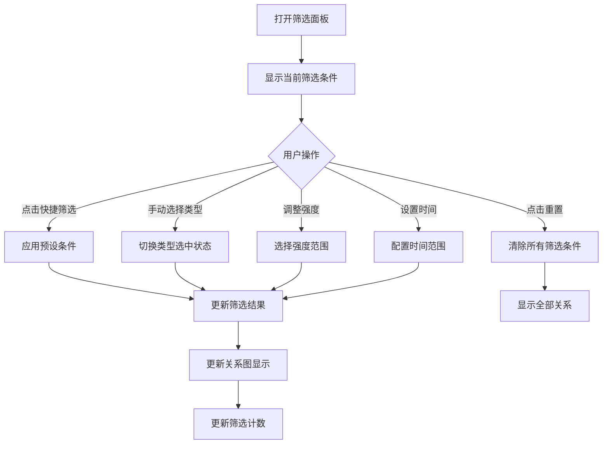

# P2-3: 关系筛选设计

## 问题背景

原型审查报告中指出：
- **无关系筛选设计 - 如何按类型/强度筛选？**
- **缺少"组织/派系/阵营"关系类型**

这是一个 **Minor** 级别的问题，但影响用户分析复杂关系网络。

---

## 设计方案

### 1. 关系类型扩展

#### 1.1 扩展后的关系类型

```typescript
/**
 * 关系类型枚举（扩展版）
 */
enum RelationType {
  // 原有类型
  FAMILY = 'family',           // 家庭关系
  FRIEND = 'friend',           // 友谊
  ENEMY = 'enemy',             // 敌对
  COLLEAGUE = 'colleague',     // 同事
  
  // 新增类型
  ORGANIZATION = 'organization', // 组织关系
  FACTION = 'faction',         // 派系关系
  ALLIANCE = 'alliance',       // 同盟
  SUBORDINATE = 'subordinate', // 上下级
  MENTOR = 'mentor',           // 师徒
  RIVAL = 'rival',             // 竞争对手
  OTHER = 'other',             // 其他
}

/**
 * 关系强度
 */
enum RelationStrength {
  STRONG = 'strong',    // 强关系
  MEDIUM = 'medium',    // 中等关系
  WEAK = 'weak',        // 弱关系
}
```

### 2. 筛选面板 UI

```
┌─────────────────────────────────────────────────────────────┐
│  🔍 关系筛选                                         [重置]  │
├─────────────────────────────────────────────────────────────┤
│                                                             │
│  📌 快捷筛选                                                 │
│  ─────────────────────────────────────────────────────────  │
│  [家庭关系] [敌对关系] [组织关系] [全部显示]                   │
│                                                             │
│  ══════════════════════════════════════════════════════════ │
│                                                             │
│  🏷️ 关系类型                                                 │
│  ─────────────────────────────────────────────────────────  │
│  ☑ 家庭关系 (亲属)                                          │
│  ☑ 友谊                                     │
│  ☑ 敌对                                       │
│  ☑ 同事 (colleague)                                         │
│  ☑ 组织关系 (organization)                                  │
│  ☑ 派系关系 (faction)                                       │
│  ☑ 同盟 (alliance)                                          │
│  ☐ 上下级 (subordinate)                                     │
│  ☐ 师徒 (mentor)                                            │
│  ☐ 竞争对手 (rival)                                         │
│  ☐ 其他 (other)                                             │
│                                                             │
│  ══════════════════════════════════════════════════════════ │
│                                                             │
│  💪 关系强度                                                 │
│  ─────────────────────────────────────────────────────────  │
│  ☑ 强关系                                                   │
│  ☑ 中等关系                                                 │
│  ☐ 弱关系                                                   │
│                                                             │
│  ══════════════════════════════════════════════════════════ │
│                                                             │
│  🕐 时间范围                                                 │
│  ─────────────────────────────────────────────────────────  │
│  ○ 全部时间                                                 │
│  ○ 特定时期: [1960] ─── [2000]                              │
│                                                             │
│  ══════════════════════════════════════════════════════════ │
│                                                             │
│  👤 人物属性                                                 │
│  ─────────────────────────────────────────────────────────  │
│  性别: ○ 全部  ○ 男  ○ 女  ○ 其他                           │
│  阵营: [全部 ▼]                                             │
│                                                             │
└─────────────────────────────────────────────────────────────┘
```

### 3. 已选条件展示

```
┌─────────────────────────────────────────────────────────────┐
│  当前筛选: [家庭关系 ×] [敌对 ×] [强关系 ×]    [清除全部]    │
├─────────────────────────────────────────────────────────────┤
│                                                             │
│  📊 筛选结果: 23 条关系 (共 156 条)                          │
│                                                             │
│  关系图显示...                                               │
│                                                             │
└─────────────────────────────────────────────────────────────┘
```

### 4. 数据模型

```typescript
/**
 * 关系筛选条件
 */
interface RelationshipFilter {
  /** 关系类型列表 */
  relationTypes: RelationType[];
  
  /** 关系强度列表 */
  strengths: RelationStrength[];
  
  /** 时间范围 */
  timeRange?: {
    start?: string;
    end?: string;
  };
  
  /** 人物属性筛选 */
  characterAttributes?: {
    gender?: 'male' | 'female' | 'other';
    faction?: string;
  };
}

/**
 * 筛选结果
 */
interface FilterResult {
  /** 筛选后的关系列表 */
  relationships: Relationship[];
  
  /** 匹配数量 */
  matchCount: number;
  
  /** 总数量 */
  totalCount: number;
  
  /** 筛选耗时 */
  executionTime: number;
}

/**
 * 快捷筛选预设
 */
interface QuickFilterPreset {
  id: string;
  name: string;
  icon: string;
  filter: RelationshipFilter;
}

/**
 * 预设快捷筛选
 */
const QUICK_FILTERS: QuickFilterPreset[] = [
  {
    id: 'family',
    name: '家庭关系',
    icon: '👨‍👩‍👧‍👦',
    filter: { relationTypes: [RelationType.FAMILY] },
  },
  {
    id: 'conflict',
    name: '敌对关系',
    icon: '⚔️',
    filter: { relationTypes: [RelationType.ENEMY, RelationType.RIVAL] },
  },
  {
    id: 'organization',
    name: '组织关系',
    icon: '🏛️',
    filter: { relationTypes: [RelationType.ORGANIZATION, RelationType.FACTION] },
  },
];
```

### 5. 筛选结果展示

#### 5.1 关系图展示

- **符合条件的**: 正常显示，高亮连接线
- **不符合条件的**: 灰色淡化显示或隐藏

```typescript
/**
 * 应用筛选到关系图
 */
const applyFilterToGraph = (
  relationships: Relationship[],
  filter: RelationshipFilter
) => {
  return relationships.map(rel => {
    const matches = matchesFilter(rel, filter);
    return {
      ...rel,
      visible: matches,
      opacity: matches ? 1 : 0.2,  // 不符合的淡化
    };
  });
};
```

### 6. 交互流程



### 7. 关系类型扩展机制

```typescript
/**
 * 自定义关系类型
 */
interface CustomRelationType {
  id: string;
  name: string;
  description?: string;
  color: string;
  icon?: string;
}

/**
 * 关系类型注册表
 */
class RelationTypeRegistry {
  private types: Map<string, RelationTypeConfig>;
  
  register(type: CustomRelationType): void {
    this.types.set(type.id, type);
  }
  
  getAll(): RelationTypeConfig[] {
    return Array.from(this.types.values());
  }
  
  getById(id: string): RelationTypeConfig | undefined {
    return this.types.get(id);
  }
}
```

---

## 验收标准

- [ ] 筛选面板正常显示
- [ ] 可按关系类型筛选
- [ ] 可按关系强度筛选
- [ ] 可按时间范围筛选
- [ ] 快捷筛选正常工作
- [ ] 筛选结果正确显示
- [ ] 关系图正确高亮/淡化
- [ ] 可重置筛选条件
