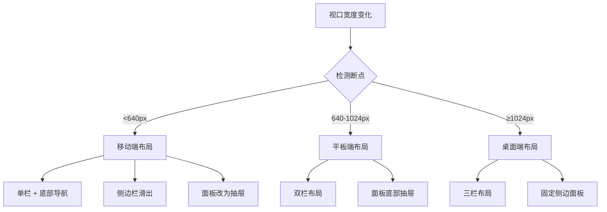

# P2-4: 响应式布局设计

## 问题背景

原型审查报告中指出：
- **阅读器三栏布局在窄屏下中心阅读区过窄**
- **人物关系面板修正表单占用大量空间**

这是一个 **Minor** 级别的问题，但影响移动端用户体验。

---

## 设计方案

### 1. 响应式断点

```typescript
/**
 * 响应式断点定义
 */
const BREAKPOINTS = {
  /** 手机: < 640px */
  mobile: 640,
  /** 平板: 640px - 1024px */
  tablet: 1024,
  /** 桌面: 1024px - 1440px */
  desktop: 1440,
  /** 大屏: > 1440px */
  wide: 9999,
};

/**
 * 设备类型
 */
type DeviceType = 'mobile' | 'tablet' | 'desktop' | 'wide';

/**
 * 当前视口信息
 */
interface ViewportInfo {
  device: DeviceType;
  width: number;
  height: number;
  isLandscape: boolean;
}
```

### 2. 各模块布局适配

#### 2.1 阅读器模块

```
桌面端 (≥1024px): 三栏布局
┌────────┬──────────────────────┬────────┐
│        │                      │        │
│ 目录   │      阅读区域         │ 联动   │
│        │                      │ 面板   │
│ 240px  │       flex-1         │ 320px  │
│        │                      │        │
└────────┴──────────────────────┴────────┘

平板端 (640-1024px): 双栏布局
┌────────┬──────────────────────────────┐
│        │                              │
│ 目录   │        阅读区域               │
│        │                              │
│ 200px  │         flex-1               │
│        │  [联动面板: 底部抽屉]         │
└────────┴──────────────────────────────┘

手机端 (<640px): 单栏布局
┌────────────────────────────────────────┐
│  [≡]  阅读器                    [⚡]   │
├────────────────────────────────────────┤
│                                        │
│              阅读区域                   │
│                                        │
│                                        │
│                                        │
│                                        │
├────────────────────────────────────────┤
│  [目录]    [联动]    [设置]             │
└────────────────────────────────────────┘
```

#### 2.2 人物关系模块

```
桌面端: 左右分栏
┌──────────────────────────┬─────────────┐
│                          │             │
│      关系图              │  详情/编辑   │
│                          │  面板       │
│         flex-1           │   380px    │
│                          │             │
└──────────────────────────┴─────────────┘

手机端: 全屏 + 抽屉
┌────────────────────────────────────────┐
│  [←]  人物关系               [筛选 🔍] │
├────────────────────────────────────────┤
│                                        │
│                                        │
│            关系图 (全屏)                │
│                                        │
│                                        │
│                                        │
│                                        │
├────────────────────────────────────────┤
│  节点详情 (向上滑动显示)                 │
│  ────────────────────────────────────  │
│  👤 叶文洁                              │
│  天体物理学家                           │
│                              [展开 ↑]  │
└────────────────────────────────────────┘
```

### 3. CSS 媒体查询

```css
/* 断点变量 */
:root {
  --breakpoint-mobile: 640px;
  --breakpoint-tablet: 1024px;
  --breakpoint-desktop: 1440px;
}

/* 阅读器布局 */
.reader-container {
  display: flex;
  height: 100vh;
}

/* 桌面端: 三栏 */
@media (min-width: 1024px) {
  .reader-sidebar {
    width: 240px;
    flex-shrink: 0;
  }
  
  .reader-content {
    flex: 1;
    min-width: 0;
  }
  
  .reader-panel {
    width: 320px;
    flex-shrink: 0;
  }
}

/* 平板端: 双栏 + 抽屉 */
@media (min-width: 640px) and (max-width: 1023px) {
  .reader-sidebar {
    width: 200px;
  }
  
  .reader-content {
    flex: 1;
  }
  
  .reader-panel {
    position: fixed;
    bottom: 0;
    left: 0;
    right: 0;
    height: auto;
    max-height: 50vh;
    transform: translateY(100%);
    transition: transform 0.3s ease;
  }
  
  .reader-panel.open {
    transform: translateY(0);
  }
}

/* 手机端: 单栏 + 底部导航 */
@media (max-width: 639px) {
  .reader-sidebar {
    position: fixed;
    left: 0;
    top: 0;
    bottom: 0;
    width: 280px;
    transform: translateX(-100%);
    transition: transform 0.3s ease;
    z-index: 100;
  }
  
  .reader-sidebar.open {
    transform: translateX(0);
  }
  
  .reader-content {
    width: 100%;
  }
  
  .reader-panel {
    position: fixed;
    bottom: 60px;  /* 底部导航高度 */
    left: 0;
    right: 0;
    max-height: 40vh;
  }
}
```

### 4. 移动端交互组件

#### 4.1 底部抽屉

```typescript
/**
 * 底部抽屉组件
 */
interface BottomDrawerProps {
  isOpen: boolean;
  onClose: () => void;
  title?: string;
  children: React.ReactNode;
  /** 抽屉高度 */
  height?: 'auto' | 'half' | 'full';
}

/**
 * 抽屉手势支持
 */
const useDrawerGestures = (onClose: () => void) => {
  const [startY, setStartY] = useState(0);
  
  const handleTouchStart = (e: React.TouchEvent) => {
    setStartY(e.touches[0].clientY);
  };
  
  const handleTouchMove = (e: React.TouchEvent) => {
    const currentY = e.touches[0].clientY;
    const diff = currentY - startY;
    
    // 向下滑动超过 100px 关闭
    if (diff > 100) {
      onClose();
    }
  };
  
  return { handleTouchStart, handleTouchMove };
};
```

#### 4.2 侧边栏（滑出式）

```typescript
/**
 * 侧边栏组件
 */
interface SidebarProps {
  isOpen: boolean;
  onClose: () => void;
  position: 'left' | 'right';
  width?: number;
  children: React.ReactNode;
}

/**
 * 侧边栏动画
 */
const sidebarVariants = {
  closed: (position: 'left' | 'right') => ({
    x: position === 'left' ? '-100%' : '100%',
  }),
  open: {
    x: 0,
  },
};
```

### 5. 关系图移动端适配

```typescript
/**
 * 关系图移动端配置
 */
const mobileGraphConfig = {
  // 禁用拖拽创建关系
  enableDragCreate: false,
  
  // 简化节点显示
  nodeSize: 40,
  fontSize: 12,
  
  // 手势支持
  gestures: {
    pinchZoom: true,
    pan: true,
    doubleTapZoom: true,
  },
  
  // 隐藏次要信息
  showLabels: true,
  showEdgeLabels: false,
};
```

### 6. 布局切换流程



### 7. 组件结构

```
ResponsiveLayout/
├── hooks/
│   ├── useViewport.ts       # 视口检测
│   ├── useBreakpoint.ts     # 断点判断
│   └── useGestures.ts       # 手势支持
├── components/
│   ├── BottomDrawer.tsx     # 底部抽屉
│   ├── SlidePanel.tsx       # 滑出面板
│   ├── MobileNav.tsx        # 移动端导航
│   └── LayoutSwitcher.tsx   # 布局切换器
└── layouts/
    ├── ReaderLayout.tsx     # 阅读器布局
    ├── CharacterLayout.tsx  # 人物关系布局
    └── EventLayout.tsx      # 事件分析布局
```

---

## 验收标准

- [ ] 桌面端三栏布局正常
- [ ] 平板端双栏布局正常
- [ ] 手机端单栏布局正常
- [ ] 侧边栏滑出动画流畅
- [ ] 底部抽屉手势支持
- [ ] 关系图移动端可用
- [ ] 断点切换无闪烁
