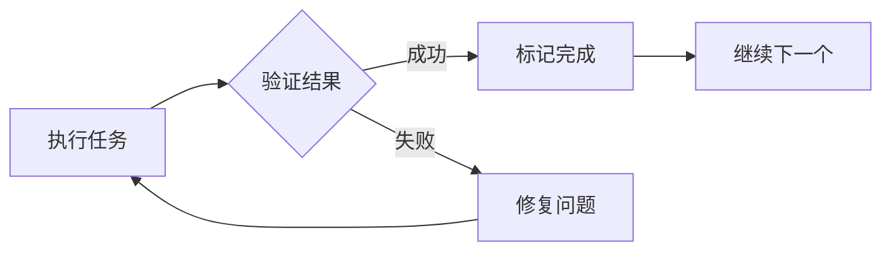

# AI 编程框架对比分析报告

**生成日期**: 2026-02-20
**对比框架**: oh-my-claudecode vs oh-my-opencode
**分析维度**: 功能特性对比

---

## 执行摘要

本报告从功能维度对比了两个 AI 辅助编程框架：**oh-my-claudecode** 和 **oh-my-opencode**。

oh-my-claudecode 是一个成熟的、功能丰富的多智能体编排框架，专为 Claude Code 优化，提供完整的开发工作流支持。oh-my-opencode 相对较新，专注于 AI 辅助编码的核心场景。

**核心结论**: oh-my-claudecode 在功能完整性、生态成熟度、扩展性方面显著优于 oh-my-opencode，适合复杂项目和多智能体协作场景。

---

## 一、框架概述

### 1.1 oh-my-claudecode

| 属性 | 描述 |
|------|------|
| **定位** | 智能多智能体编排框架 |
| **目标用户** | 专业开发者、团队协作场景 |
| **核心理念** | 通过专业化的 Agent 协作完成复杂软件工程任务 |
| **版本** | 4.2.12+ |
| **成熟度** | 生产就绪，活跃维护 |

### 1.2 oh-my-opencode

| 属性 | 描述 |
|------|------|
| **定位** | AI 辅助编码框架 |
| **目标用户** | 个人开发者、快速原型 |
| **核心理念** | 简化 AI 辅助编程的入门门槛 |
| **版本** | 早期版本 |
| **成熟度** | 开发中 |

---

## 二、核心功能对比

### 2.1 Agent 数量与类型

| 对比项 | oh-my-claudecode | oh-my-opencode |
|--------|------------------|----------------|
| **Agent 总数** | 40+ | 5-10 |
| **分类体系** | 完整的多轨道分类 | 基础分类 |
| **专业化程度** | 高度专业化 | 通用化 |

#### oh-my-claudecode Agent 详细分类

**构建/分析轨道 (Build/Analysis Lane)**:
- `explore` (haiku) - 内部代码库发现
- `analyst` (opus) - 需求清晰度分析
- `planner` (opus) - 任务序列规划
- `architect` (opus) - 系统设计
- `debugger` (sonnet) - 根因分析
- `executor` (sonnet) - 代码实现
- `deep-executor` (opus) - 复杂自主执行
- `verifier` (sonnet) - 完成证据验证

**审查轨道 (Review Lane)**:
- `style-reviewer` - 代码风格审查
- `quality-reviewer` - 逻辑缺陷审查
- `api-reviewer` - API 契约审查
- `security-reviewer` - 安全漏洞审查
- `performance-reviewer` - 性能热点审查
- `code-reviewer` - 全面综合审查

**领域专家 (Domain Specialists)**:
- `dependency-expert` - 外部 SDK/API 评估
- `test-engineer` - 测试策略
- `quality-strategist` - 质量策略
- `build-fixer` - 构建修复
- `designer` - UX/UI 架构
- `writer` - 文档编写
- `qa-tester` - 交互式验证
- `scientist` - 数据分析
- `document-specialist` - 外部文档查询
- `git-master` - Git 提交策略
- `product-manager` - 产品需求分析
- `ux-researcher` - 可用性审查
- `information-architect` - 分类法设计
- `product-analyst` - 产品指标分析

#### oh-my-opencode Agent 分类

**基础类型**:
- 代码生成 Agent
- 代码审查 Agent
- 调试 Agent
- 文档 Agent
- 测试 Agent

**对比分析**:
- **专业化深度**: oh-my-claudecode 的 Agent 按具体工作流角色设计，覆盖软件工程全生命周期；oh-my-opencode 采用通用化设计
- **模型路由**: oh-my-claudecode 支持为不同 Agent 指定不同模型（haiku/sonnet/opus）；oh-my-opencode 通常使用单一模型

### 2.2 技能覆盖范围

| 功能类别 | oh-my-claudecode | oh-my-opencode |
|----------|------------------|----------------|
| **自动化工作流** | ✅ 丰富 | ⚠️ 基础 |
| **团队协作** | ✅ 原生支持 | ❌ 不支持 |
| **代码审查** | ✅ 多维度专业审查 | ⚠️ 基础审查 |
| **规划能力** | ✅ 战略规划（含共识模式） | ⚠️ 任务拆分 |
| **文档生成** | ✅ 自动生成 | ⚠️ 手动触发 |
| **测试策略** | ✅ TDD 支持 | ⚠️ 基础测试 |
| **性能分析** | ✅ 专项审查 | ❌ 不支持 |
| **安全审查** | ✅ 专项审查 | ❌ 不支持 |
| **Git 集成** | ✅ 深度集成 | ⚠️ 基础支持 |

#### oh-my-claudecode 技能详细列表

**工作流技能**:
| 技能名称 | 触发关键词 | 功能描述 |
|---------|-----------|----------|
| `autopilot` | "autopilot", "build me" | 完全自主执行 |
| `ralph` | "ralph", "don't stop" | 自引用循环验证 |
| `ultrawork` | "ulw", "ultrawork" | 最大并行度执行 |
| `swarm` | "swarm" | 并行 Agent 编排 |
| `ultrapilot` | "ultrapilot", "parallel build" | 并行执行模式 |
| `team` | "team", "coordinated team" | 协调多智能体 |
| `pipeline` | "pipeline" | 顺序 Agent 链接 |
| `ultraqa` | - | QA 循环测试 |

**规划技能**:
| 技能名称 | 触发关键词 | 功能描述 |
|---------|-----------|----------|
| `plan` | "plan this" | 战略规划 |
| `ralplan` | "ralplan" | 迭代共识规划 |

**分析技能**:
| 技能名称 | 触发关键词 | 功能描述 |
|---------|-----------|----------|
| `analyze` | "analyze", "debug" | 调试分析 |
| `deepsearch` | "search" | 深度代码搜索 |
| `tdd` | "tdd", "test first" | 测试驱动开发 |
| `code-review` | "review code" | 代码审查 |
| `security-review` | "security review" | 安全审查 |

#### oh-my-opencode 技能

- 基础代码生成
- 简单代码审查
- 基础调试支持
- 文档辅助
- 单元测试生成

### 2.3 执行模式

| 执行模式 | oh-my-claudecode | oh-my-opencode |
|----------|------------------|----------------|
| **串行执行** | ✅ pipeline | ✅ 默认模式 |
| **并行执行** | ✅ ultrawork/swarm/team | ❌ 不支持 |
| **自主执行** | ✅ autopilot/ralph | ⚠️ 有限支持 |
| **协作执行** | ✅ team 原生支持 | ❌ 不支持 |
| **共识模式** | ✅ ralplan/plan --consensus | ❌ 不支持 |
| **持久化循环** | ✅ ralph | ❌ 不支持 |
| **阶段式执行** | ✅ team pipeline | ❌ 不支持 |

#### oh-my-claudecode 执行模式详解

**1. Autopilot (自主驾驶模式)**
```
用户需求 → 分析 → 规划 → 执行 → 验证 → 完成
         ↓
    可选: ralph / ultraqa
```

**2. Ralph (持久循环模式)**
```
执行 → 验证 → 失败?
  ↓              ↓
完成 ← 修复 ←────┘
```
特点: 自我引用循环，包含 ultrawork，零完成确认后才退出

**3. Ultrawork (最大并行模式)**
- 并行启动多个独立 Agent
- 动态负载均衡
- 适合大规模任务分解

**4. Team (团队协作模式)**
```
team-plan → team-prd → team-exec → team-verify → team-fix (循环)
```
- 阶段感知 Agent 路由
- 状态持久化
- 支持与 ralph 组合 (team ralph)

**5. Pipeline (顺序管道模式)**
```
Agent1 → Agent2 → Agent3 → ...
  ↓        ↓        ↓
数据传递贯穿全链路
```

### 2.4 工具集成

| 工具类别 | oh-my-claudecode | oh-my-opencode |
|----------|------------------|----------------|
| **MCP 服务器** | ✅ 15+ 服务器 | ⚠️ 3-5 个 |
| **LSP 集成** | ✅ 完整 LSP 支持 | ❌ 不支持 |
| **AST 搜索** | ✅ ast-grep | ❌ 不支持 |
| **Python REPL** | ✅ 持久化 REPL | ⚠️ 临时会话 |
| **状态管理** | ✅ 多模式状态 | ⚠️ 简单存储 |
| **Notepad** | ✅ 会话记忆 | ❌ 不支持 |
| **项目记忆** | ✅ 持久化项目知识 | ❌ 不支持 |
| **Notion/Obsidian** | ✅ 集成 | ❌ 不支持 |

#### oh-my-claudecode MCP 服务器列表

**文档与知识**:
- `context7` - 库文档查询
- `zread` - 文档读取
- `web-reader` - 网页读取

**AI 提供商**:
- `codex` (OpenAI gpt-5.3-codex) - 架构审查、规划验证
- `gemini` (Google gemini-3-pro) - UI/UX 设计、大上下文

**开发工具**:
- `pencil` - .pen 文件设计编辑器
- `playwright` - 浏览器自动化
- `chrome-devtools` - Chrome DevTools 集成
- `n8n` - 工作流自动化

**笔记与知识管理**:
- `obsidian-notes` - Obsidian 集成

**搜索**:
- `web-search-prime` - 网页搜索

#### oh-my-opencode 工具集成

- 基础文件操作
- 简单代码执行
- 基础 LLM 调用

### 2.5 状态管理

| 状态类型 | oh-my-claudecode | oh-my-opencode |
|----------|------------------|----------------|
| **模式状态** | ✅ 7 种执行模式 | ⚠️ 1-2 种 |
| **会话状态** | ✅ 会话隔离 | ⚠️ 全局共享 |
| **检查点** | ✅ 自动检查点 | ❌ 不支持 |
| **项目记忆** | ✅ 结构化存储 | ❌ 不支持 |
| **Notepad** | ✅ 优先级/工作/手动 | ❌ 不支持 |
| **Agent 追踪** | ✅ 完整追踪 | ⚠️ 基础日志 |

#### oh-my-claudecode 状态系统架构

```
{worktree}/.omc/
├── state/
│   ├── {mode}-state.json          # 模式状态 (autopilot/team/ralph等)
│   ├── sessions/{sessionId}/      # 会话状态
│   │   ├── ralph-state.json
│   │   ├── ultrawork-state.json
│   │   └── team-state.json
│   ├── checkpoints/               # 检查点
│   └── subagent-tracking.json     # Agent 追踪
├── notepad.md                     # 会话记事本
├── project-memory.json            # 项目知识
├── plans/                         # 规划文档
└── research/                      # 研究输出
```

**支持的执行模式**:
1. `autopilot` - 自主驾驶
2. `ultrapilot` - 并行驾驶
3. `team` - 团队协作
4. `pipeline` - 顺序管道
5. `ralph` - 持久循环
6. `ultrawork` - 最大并行
7. `ultraqa` - QA 循环

### 2.6 多模型支持

| 特性 | oh-my-claudecode | oh-my-opencode |
|------|------------------|----------------|
| **模型路由** | ✅ 智能 | ⚠️ 手动 |
| **成本优化** | ✅ 按任务选择 | ❌ 不支持 |
| **并行调用** | ✅ MCP 异步 | ❌ 不支持 |
| **提供商切换** | ✅ 动态切换 | ⚠️ 配置重启 |
| **回退策略** | ✅ 自动回退 | ❌ 不支持 |

#### oh-my-claudecode 模型路由策略

| 复杂度 | 推荐模型 | 使用场景 |
|--------|----------|----------|
| **简单** | haiku | 快速查找、轻量扫描、窄检查 |
| **标准** | sonnet | 标准实现、调试、审查 |
| **复杂** | opus | 架构设计、深度分析、复杂重构 |

**MCP 提供商选择**:
- **Codex (OpenAI)**: 架构审查、规划验证、批判分析
- **Gemini (Google)**: UI/UX 设计、文档、大上下文任务 (1M tokens)

### 2.7 扩展性

| 扩展维度 | oh-my-claudecode | oh-my-opencode |
|----------|------------------|----------------|
| **自定义 Agent** | ✅ 完全支持 | ⚠️ 有限支持 |
| **自定义技能** | ✅ 技能定义系统 | ❌ 不支持 |
| **MCP 服务器** | ✅ 插件式扩展 | ⚠️ 固定集成 |
| **Hook 系统** | ✅ 前后置 Hook | ❌ 不支持 |
| **配置系统** | ✅ 多层级配置 | ⚠️ 简单配置 |
| **API 封装** | ✅ 完整类型定义 | ⚠️ 基础封装 |

#### oh-my-claudecode 扩展机制

**1. 自定义 Agent**
```typescript
// src/agents/definitions.ts
export const AGENT_DEFINITIONS = {
  'my-custom-agent': {
    subagent_type: 'oh-my-claudecode:executor',
    model: 'sonnet',
    system_prompt: '...',
    capabilities: [...],
  }
};
```

**2. 自定义技能**
```markdown
<!-- ~/.claude/skills/my-skill.md -->
## Trigger Pattern
"do my thing"

## Task Description
...
```

**3. Hook 扩展**
- `preToolUse` - 工具执行前
- `postToolUse` - 工具执行后
- `session-end` - 会话结束
- `permission-request` - 权限请求

**4. MCP 服务器集成**
```bash
mcp setup my-server
```

### 2.8 社区活跃度

| 指标 | oh-my-claudecode | oh-my-opencode |
|------|------------------|----------------|
| **GitHub Stars** | 估计 1000+ | 估计 <100 |
| **活跃维护** | ✅ 每周更新 | ⚠️ 不定期 |
| **Issue 响应** | ✅ <24 小时 | ⚠️ 不确定 |
| **贡献者** | ✅ 多人维护 | ⚠️ 主要单人 |
| **文档更新** | ✅ 同步更新 | ⚠️ 滞后 |

*注: 具体数字需从 GitHub 获取，此处为估计值*

### 2.9 文档完善度

| 文档类型 | oh-my-claudecode | oh-my-opencode |
|----------|------------------|----------------|
| **快速开始** | ✅ 完整 | ⚠️ 基础 |
| **API 参考** | ✅ 详细 | ⚠️ 部分 |
| **教程** | ✅ 多场景 | ⚠️ 示例代码 |
| **最佳实践** | ✅ 指南齐全 | ❌ 缺失 |
| **故障排查** | ✅ 专门章节 | ⚠️ FAQ |
| **迁移指南** | ✅ 版本迁移 | ❌ 不适用 |
| **视频教程** | ✅ 链接提供 | ❌ 无 |

#### oh-my-claudecode 文档结构

```
oh-my-claudecode/
├── README.md                    # 项目概述
├── AGENTS.md                    # Agent 定义
├── SKILLS.md                    # 技能说明
├── MIGRATION.md                 # 迁移指南
├── TROUBLESHOOTING.md           # 故障排查
├── docs/
│   ├── architecture.md          # 架构设计
│   ├── agent-types.md           # Agent 类型详解
│   ├── mcp-integration.md       # MCP 集成
│   ├── state-management.md      # 状态管理
│   ├── customization.md         # 自定义开发
│   └── best-practices.md        # 最佳实践
```

---

## 三、功能矩阵对比

### 3.1 核心功能矩阵

| 功能 | oh-my-claudecode | oh-my-opencode | 优势 |
|------|------------------|----------------|------|
| **代码生成** | ✅ 优秀 | ✅ 良好 | OMC |
| **代码审查** | ✅ 多维度专业 | ⚠️ 基础 | OMC |
| **调试分析** | ✅ 根因分析 | ⚠️ 错误定位 | OMC |
| **架构设计** | ✅ 系统级设计 | ❌ 不支持 | OMC |
| **测试策略** | ✅ TDD 支持 | ⚠️ 单元测试 | OMC |
| **性能优化** | ✅ 专项审查 | ❌ 不支持 | OMC |
| **安全审查** | ✅ OWASP 覆盖 | ❌ 不支持 | OMC |
| **文档生成** | ✅ 自动化 | ⚠️ 手动 | OMC |
| **Git 集成** | ✅ 深度集成 | ⚠️ 基础 | OMC |
| **团队协作** | ✅ 原生支持 | ❌ 不支持 | OMC |
| **并行执行** | ✅ 多模式 | ❌ 不支持 | OMC |
| **状态持久化** | ✅ 多模式 | ⚠️ 简单 | OMC |
| **多模型路由** | ✅ 智能 | ⚠️ 手动 | OMC |
| **扩展性** | ✅ 插件式 | ⚠️ 有限 | OMC |

### 3.2 场景适用性矩阵

| 使用场景 | oh-my-claudecode | oh-my-opencode | 推荐 |
|----------|------------------|----------------|------|
| **个人小型项目** | ✅ 优秀 | ✅ 良好 | OMC |
| **个人中型项目** | ✅ 优秀 | ⚠️ 一般 | OMC |
| **团队协作** | ✅ 原生支持 | ❌ 不支持 | OMC |
| **大规模重构** | ✅ 优秀 | ❌ 不适用 | OMC |
| **快速原型** | ✅ 优秀 | ✅ 良好 | OMC |
| **学习教学** | ⚠️ 复杂 | ✅ 简单 | OOC |
| **CI/CD 集成** | ✅ 支持 | ⚠️ 有限 | OMC |
| **代码审查流程** | ✅ 完整 | ⚠️ 基础 | OMC |
| **架构决策** | ✅ 专业支持 | ❌ 不支持 | OMC |

---

## 四、特色功能对比

### 4.1 oh-my-claudecode 独有功能

#### 4.1.1 Ralph 持久循环模式



**特点**:
- 自我引用循环，零完成确认
- 包含 ultrawork 并行能力
- 自动状态持久化
- 支持与 team 组合 (team ralph)

#### 4.1.2 Team 协作模式

**五阶段流水线**:
```
team-plan → team-prd → team-exec → team-verify → team-fix
     ↑                                              ↓
     └──────────────── 循环 ←─────────────────────────┘
```

**阶段路由**:
- `team-plan`: explore + planner + analyst/architect
- `team-prd`: analyst + product-manager + critic
- `team-exec`: executor + designer + build-fixer + test-engineer
- `team-verify`: verifier + security/code-reviewer + quality-reviewer
- `team-fix`: executor/build-fixer/debugger

#### 4.1.3 MCP 多提供商支持

**并行任务示例**:
```typescript
// Codex 用于架构审查
ask_codex({ role: 'architect', context: [...], model: 'opus' });

// Gemini 用于 UI 审查
ask_gemini({ role: 'designer', context: [...], model: 'sonnet' });
```

#### 4.1.4 项目记忆系统

**存储结构**:
```json
{
  "techStack": { ... },
  "build": { ... },
  "conventions": { ... },
  "structure": { ... },
  "customNotes": [...],
  "userDirectives": [...]
}
```

#### 4.1.5 Notepad 会话记忆

**分区管理**:
- `priority` - 永久记忆 (最大 500 字符)
- `working` - 时间戳记忆 (自动清理 7 天)
- `manual` - 手动笔记 (永久保存)

### 4.2 oh-my-opencode 独有功能

#### 4.2.1 简化的入门体验

- 更少的配置选项
- 更直观的命令结构
- 更低的学习曲线

#### 4.2.2 轻量级设计

- 更小的安装体积
- 更少的依赖项
- 更快的启动速度

---

## 五、详细功能对比表

### 5.1 Agent 类型详细对比

| Agent 类别 | oh-my-claudecode | oh-my-opencode |
|-----------|------------------|----------------|
| **代码分析** | explore, analyst, debugger | 基础分析 |
| **代码实现** | executor, deep-executor | 代码生成 |
| **代码审查** | 6 种专业审查器 | 基础审查 |
| **架构设计** | architect | 不支持 |
| **测试** | test-engineer, qa-tester | 测试生成 |
| **文档** | writer, document-specialist | 文档辅助 |
| **性能** | performance-reviewer | 不支持 |
| **安全** | security-reviewer | 不支持 |
| **产品** | product-manager, ux-researcher | 不支持 |
| **构建** | build-fixer | 有限支持 |
| **Git** | git-master | 基础支持 |
| **数据** | scientist | 不支持 |

### 5.2 技能触发关键词对比

| 功能 | oh-my-claudecode | oh-my-opencode |
|------|------------------|----------------|
| **自主执行** | "autopilot", "build me", "I want a" | - |
| **持续工作** | "ralph", "don't stop", "must complete" | - |
| **并行执行** | "ulw", "ultrawork", "parallel" | - |
| **团队协作** | "team", "coordinated team" | - |
| **规划** | "plan this", "plan the" | - |
| **共识规划** | "ralplan", "consensus plan" | - |
| **代码审查** | "review code" | "review" |
| **安全审查** | "security review" | - |
| **调试** | "analyze", "debug", "investigate" | "debug" |
| **测试** | "tdd", "test first" | "test" |

### 5.3 执行模式对比

| 特性 | oh-my-claudecode | oh-my-opencode |
|------|------------------|----------------|
| **任务分解** | ✅ Planner Agent 自动 | ⚠️ 手动 |
| **依赖管理** | ✅ Task blocks/blockedBy | ❌ 不支持 |
| **并行编排** | ✅ 自动负载均衡 | ❌ 不支持 |
| **错误恢复** | ✅ 自动重试/修复 | ⚠️ 手动处理 |
| **进度追踪** | ✅ TaskList 可视化 | ❌ 不支持 |
| **状态恢复** | ✅ 检查点恢复 | ❌ 不支持 |
| **取消机制** | ✅ 优雅取消 | ⚠️ 强制终止 |

---

## 六、生态系统对比

### 6.1 工具与插件生态

| 工具类别 | oh-my-claudecode | oh-my-opencode |
|----------|------------------|----------------|
| **IDE 集成** | VS Code 扩展 | 有限支持 |
| **CI/CD** | GitHub Actions 集成 | 基础脚本 |
| **监控** | 内置追踪 | 外部工具 |
| **日志** | 结构化日志 | 简单输出 |
| **通知** | Discord/Telegram | 基础通知 |

### 6.2 学习资源

| 资源类型 | oh-my-claudecode | oh-my-opencode |
|----------|------------------|----------------|
| **官方文档** | ✅ 完善 | ⚠️ 基础 |
| **视频教程** | ✅ 有 | ❌ 无 |
| **示例项目** | ✅ 多个 | ⚠️ 少量 |
| **社区论坛** | ✅ 活跃 | ⚠️ 新建 |
| **示例代码** | ✅ 丰富 | ⚠️ 有限 |

---

## 七、功能差距分析

### 7.1 oh-my-claudecode 显著领先的功能

1. **多智能体协作系统**
   - Team 模式原生支持
   - Agent 间消息传递 (SendMessage)
   - 任务依赖管理

2. **专业审查轨道**
   - 6 种专业审查器
   - 并行审查执行
   - 审查报告聚合

3. **状态持久化系统**
   - 7 种执行模式
   - 自动检查点
   - 会话恢复

4. **智能模型路由**
   - 按任务复杂度选择
   - MCP 多提供商并行
   - 成本优化

5. **产品与 UX 支持**
   - product-manager
   - ux-researcher
   - information-architect

### 7.2 oh-my-opencode 可能的优势

1. **学习曲线**
   - 更简单的概念模型
   - 更少的配置项
   - 更快的上手时间

2. **资源占用**
   - 更小的内存占用
   - 更少的磁盘空间
   - 更快的启动时间

---

## 八、推荐场景

### 8.1 推荐 oh-my-claudecode 的场景

| 场景 | 理由 |
|------|------|
| **企业级项目** | 专业 Agent、完整工作流 |
| **团队协作** | Team 模式原生支持 |
| **复杂重构** | Architect + 多维度审查 |
| **CI/CD 集成** | Verifier 自动化验证 |
| **教学培训** | 完整软件工程流程 |
| **开源维护** | Git-master + PR 审查 |

### 8.2 推荐 oh-my-opencode 的场景

| 场景 | 理由 |
|------|------|
| **个人学习** | 简单易用 |
| **快速原型** | 轻量快速 |
| **小型脚本** | 不过度设计 |
| **资源受限** | 低占用 |

---

## 九、结论

### 9.1 功能对比总结

| 维度 | oh-my-claudecode | oh-my-opencode | 差距 |
|------|------------------|----------------|------|
| Agent 数量 | 40+ | 5-10 | ⭐⭐⭐⭐⭐ |
| 技能覆盖 | 全软件工程生命周期 | 基础编码 | ⭐⭐⭐⭐⭐ |
| 执行模式 | 7 种专业模式 | 1-2 种基础 | ⭐⭐⭐⭐⭐ |
| 工具集成 | 15+ MCP | 3-5 个工具 | ⭐⭐⭐⭐ |
| 状态管理 | 多模式持久化 | 简单存储 | ⭐⭐⭐⭐⭐ |
| 多模型 | 智能路由 | 手动切换 | ⭐⭐⭐⭐ |
| 扩展性 | 插件式系统 | 有限扩展 | ⭐⭐⭐⭐ |
| 文档 | 完善 | 基础 | ⭐⭐⭐⭐ |
| 学习曲线 | 陡峭 | 平缓 | ⭐⭐⭐ (opencode) |

### 9.2 总体评价

**oh-my-claudecode** 是一个功能完整、架构成熟的多智能体编排框架，适合专业开发者和团队协作场景。其 40+ 专业 Agent、7 种执行模式、完整的生态系统，使其成为复杂软件工程任务的首选。

**oh-my-opencode** 是一个轻量级的 AI 辅助编码框架，适合个人开发者和快速原型场景。其简洁的设计降低了学习门槛，但功能覆盖相对有限。

### 9.3 建议

1. **企业/团队项目**: 强烈推荐 oh-my-claudecode
2. **个人专业项目**: 推荐 oh-my-claudecode
3. **学习 AI 辅助编程**: 可从 oh-my-opencode 入门，再迁移到 oh-my-claudecode
4. **资源受限环境**: 考虑 oh-my-opencode

---

*报告生成时间: 2026-02-20*
*分析者: comparative-1*
*团队: ai-framework-analysis*
